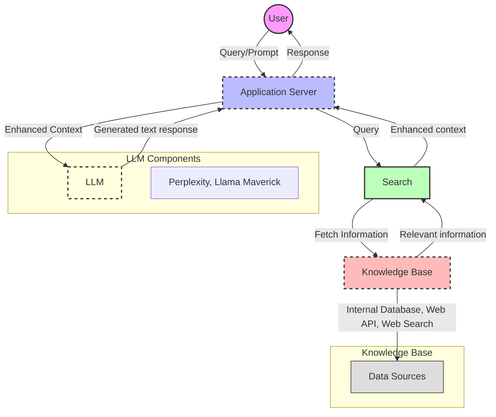
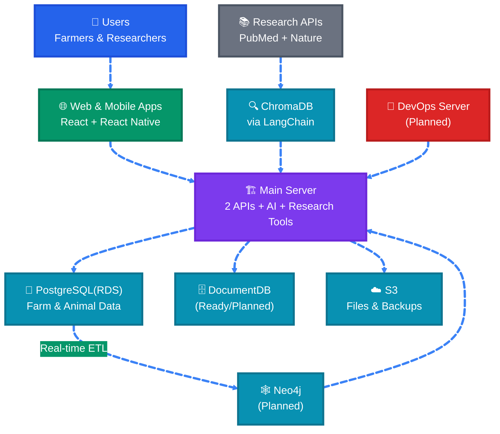

# Genetic Researcher Platform - Emilia AI Agent

  
  
  
  
  
   
  
  
  
   
  
  
  

## Introduction

The **Animal Genetics Research Platform** is a transformative cloud ecosystem designed to bridge the critical gap between advanced genomic science and practical livestock management. Our mission is to democratize access to cutting-edge genetic research, empowering farmers and researchers to collaborate in accelerating genetic gain, enhancing animal welfare, and driving sustainable agricultural production.

At the heart of the platform is **Emilia AI**, a RAG-powered (Retrieval-Augmented Generation) AI agent. Unlike standard models, Emilia provides **grounded responses** by orchestrating natural language queries across peer-reviewed literature (arXiv, PubMed, Nature) and real-time internal databases. This ensures that every breeding recommendation and research insight is anchored in scientific truth.

### Core Pillars
-   **Seamless Collaboration**: Uniting Farmers, Researchers, and Students in a shared data environment.
-   **Intelligent Assistance**: Leveraging LLMs and LangChain for natural language data exploration and literature summarization.
-   **Advanced Analytics**: Professional-grade tools for genomic analysis, mating simulations, and heritability calculations.
-   **Educational Pathway**: Providing hands-on experience with real-world datasets for the next generation of animal scientists.

## Tech Stack

- **Frontend**: React (TypeScript) with TailwindCSS, Vite, and Lucide Icons. Deployed via **AWS Amplify**.
- **Main Backend (AI)**: FastAPI (Python) orchestrating **LangChain**, **ChatGPT (OpenAI)**, **ChromaDB**, and **Neo4j** (Planned).
  - **Service Connectivity & Protocols**:
    - **LLM Orchestration**: Uses **LangChain** (`ChatOpenAI`, `create_sql_agent`) to manage complex reasoning, tool-calling, and structured data summarization.
    - **Literature Retrieval**:
      - **Live Fetching**: Real-time integration with **arXiv** (SDK), **PubMed** (Biopython), and **Nature** (REST) to ensure data freshness.
      - **Vector Store**: **ChromaDB** is integrated for persistent semantic indexing and RAG-based retrieval of local research documents.
    - **Database Access**: `SQLAlchemy` for PostgreSQL; `neo4j` driver for graph-based knowledge retrieval.
- **User Backend**: Bun.js (TypeScript) handling core user and farm data services.
  - **Database Connectivity**: Native `MongoClient` for DocumentDB/MongoDB; `supabase-js` for PostgreSQL interactions.
- **Databases**: 
  - **User Data**: **Supabase** (PostgreSQL) for current implementation (cost-optimized), with code architecture fully ready for **Amazon DocumentDB**.
  - **Research Data**: PostgreSQL (RDS), **Neo4j** (Planned), and **ChromaDB** (Vector).
  - **Object Storage**: AWS S3.
- **Infrastructure**: AWS (ECS Fargate, Copilot,CloudFormation,CloudFront, API Gateway, VPC Links, ACM, Amplify).
- **Data Pipeline**:
  - **Offline Ingestion**: **Apache Airflow** orchestrating scheduled literature harvesting and database migrations.
  - **Live Retrieval & RAG**: Real-time API integration within the FastAPI service:
    - **LangChain Orchestrator**: Manages the flow between user intent, literature retrieval, and final LLM refinement.
    - **Source Connectors**: `arxiv` SDK, `Bio.Entrez` (PubMed), and `requests` (Nature).
    - **Vector Management**: **ChromaDB** stores embeddings for retrieved content to enable semantic re-ranking and local knowledge retrieval.

## Features

### Implemented Features
- **Emilia AI Co-pilot**: A RAG-powered AI agent for breeding advice and research insights.
- **Advanced Authentication**: Secure user access via **Supabase Auth** supporting:
  - **Multi-method Login**: Email/Password and **Web3/MetaMask** wallet authentication.
  - **Role-Based Access Control (RBAC)**: Specific interfaces for Researchers, Farmers, and Students.
  - **Secure Sessions**: Managed via Supabase with protected routes in the React frontend.
- **Multi-Source RAG**: Retrieval of peer-reviewed research from PubMed, arXiv, and Nature using **ChromaDB** and **Neo4j** (Planned).
- **Intelligent SQL Agent**: Dynamic generation of complex genetic queries for PostgreSQL with automated schema analysis.
- **Interactive Artifacts**: Real-time generation of **Plotly charts** and formatted data tables, handled via a frontend-backend artifact protocol.
- **Conversational History**: Persistent, user-specific chat sessions and message history stored in Supabase.

### Future Planning & Roadmap
*Extracted from @[docs/architecture/arch-overview.md] and project evolution plans:*

- **Breeding & Mating Engine**: Advanced predictive models for animal pairing optimization and genetic gain analysis.
- **Research Environment**: Integrated **RStudio** and **JupyterHub** workspaces for deep statistical data analysis.
- **Unified Dashboard**: Comprehensive real-time KPIs and analytics for farmers and scientists.
- **Species Expansion**: Extending genomic models beyond sheep to other livestock species (cattle, goats, etc.).
- **Enhanced Automation**: Automated data collection pipelines and AI-driven breeding optimization.
- **Edge Capabilities**: Offline-first data entry for remote farm environments with cloud synchronization.

### Emilia AI Architecture & Data Pipeline

The chat system in the **Main Backend** implements a sophisticated multi-step pipeline for processing researcher and farmer queries, supporting both synchronous and long-running asynchronous execution:

1.  **Intent Analysis**: Every query is analyzed by an intelligent agent (`analyze_query_intent`) using a **Zero-shot LLM Prompt** to determine if it requires **Research** (literature-based RAG) or **Database** (structured SQL) processing.
2.  **Dual-Path Execution**:
    -   **Research Queries**: Orchestrates a RAG pipeline (`retrieve_literature_for_question`) that performs parallel searches across **arXiv**, **PubMed**, and **Nature** APIs, merging results into a grounded context.
    -   **Database Queries**: Invokes an **Intelligent SQL Agent** (`create_sql_agent` with `openai-tools`) that dynamically inspects the PostgreSQL schema, generates optimized SQL, and extracts structured data for visualization.
3.  **Connectivity & Orchestration**:
    -   **API Integration**: Uses the `OpenAI` client for answer refinement and synthetic dataset generation.
    -   **State Management**: Persistent job tracking via a custom `job_store` service to manage long-running async tasks.
4.  **Sync/Async Model**: 
    -   Standard queries are processed via a synchronous `/chat` endpoint.
    -   Complex analyses use an **Async Job Store** (`/chat/async`) with background task execution and frontend polling for job results.
4.  **Artifact Generation**: Results are processed into a standard payload (`ChatArtifacts`) containing interactive **Plotly Charts** and **Formatted Tables**.
5.  **LLM Summarization**: Uses **LangChain** and **ChatGPT** to provide grounded, natural language insights based on the retrieved artifacts and literature.

#### AI Processing Flow

#### System Architecture:
> **Note:** Components marked as **(Planned)** (e.g., **Neo4j**, **DevOps Server**) are part of the strategic roadmap. While the **DocumentDB** architecture is fully implemented and tested, the platform currently utilizes **Supabase** for cost-optimization during this phase.

## Code Flow & API Connectivity

The platform implements a **Hybrid Sync/Async API Architecture** to manage high-latency AI operations:

1.  **Request Initiation**: The **React Frontend** communicates with services via environment-driven endpoints (`VITE_FASTAPI_URL`, `VITE_USER_BACKEND_URL`).
2.  **API Gateway & VPC**: Requests are routed through **AWS API Gateway** and **VPC Links**, ensuring secure internal communication to ECS-hosted containers.
3.  **Chat Execution Patterns**:
    -   **Synchronous Path**: For simple queries, the frontend calls `/chat` (POST), waiting for a direct JSON response.
    -   **Asynchronous Path**: For complex DB/Research queries (determined by `isLikelyDbQuery`), the frontend calls `/chat/async`.
    -   **Job Polling**: Upon receiving a `job_id`, the frontend enters a polling loop via `/chat/async/{job_id}`, retrieving the final `ChatArtifacts` once the background task completes.
4.  **Service Interoperability**:
    -   **Main Backend ↔ User Backend**: Services share a common **Supabase** instance for persistent state while maintaining isolation for AI-specific workloads.
    -   **Backend ↔ External APIs**: All literature and LLM calls are orchestrated through the **FastAPI Service Layer** using the connectivity methods defined in the Tech Stack.
5.  **Data Persistence**: Chat history and artifacts are persisted to **Supabase** (PostgreSQL) using the `appendMessage` workflow in the `chatStore`.

## Usage Demonstration

*(GIF of Emilia AI usage will be placed here)*

---
