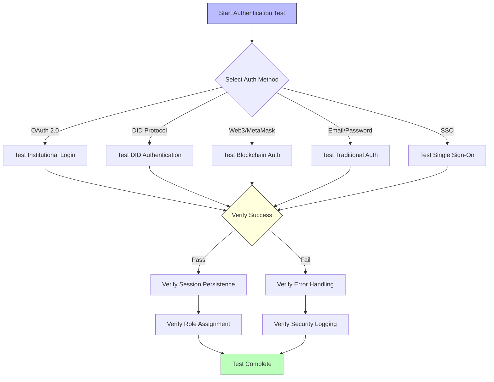
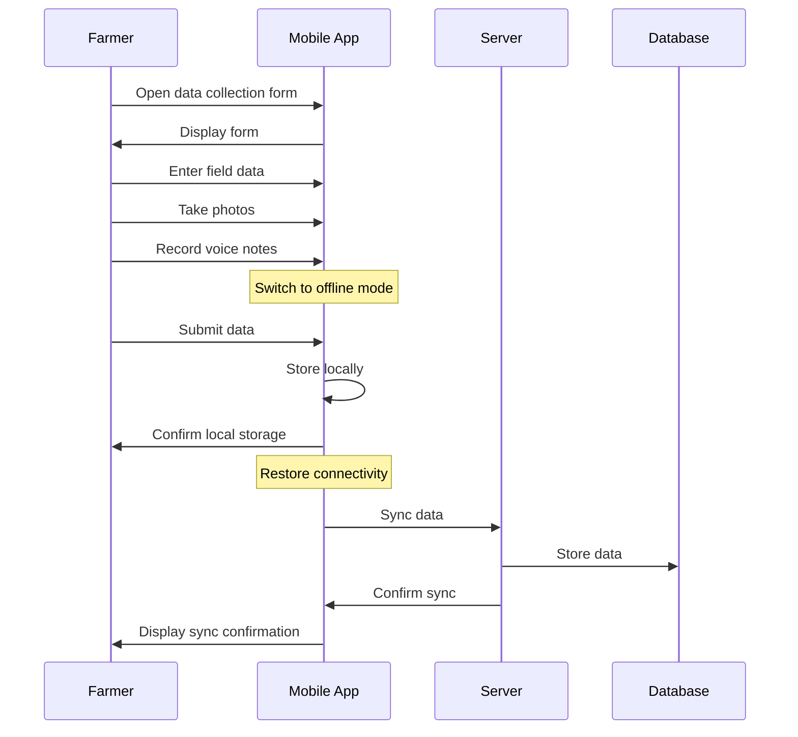
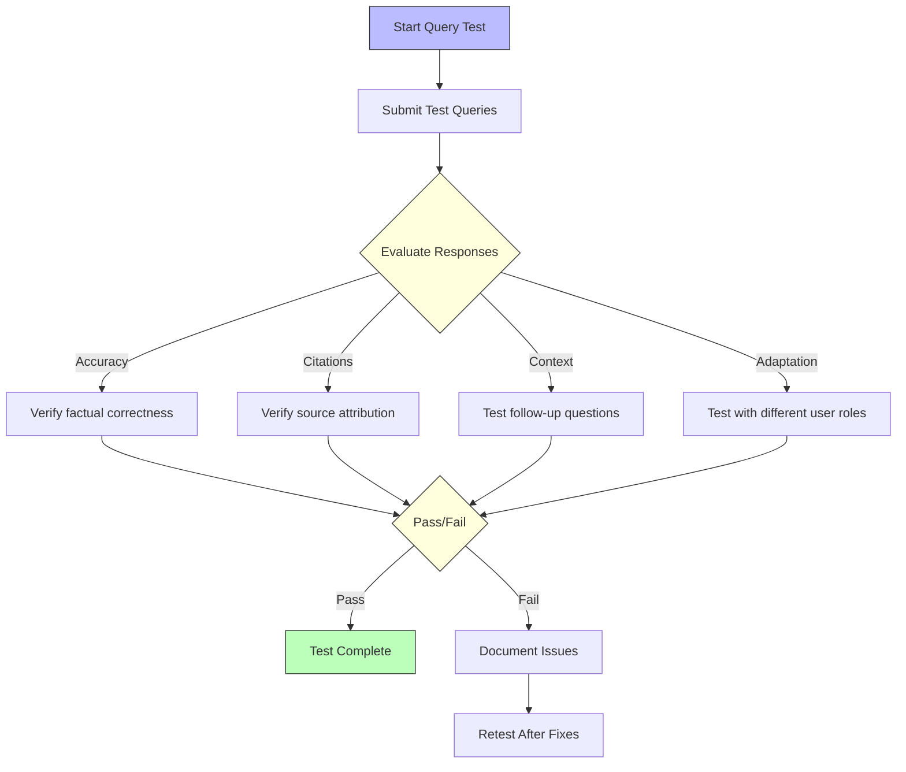

# Feature Acceptance Criteria

## Overview

This section defines the specific acceptance criteria for key features of the Agricultural Research Platform. Each feature's acceptance criteria are mapped to functional requirements and include detailed test scenarios to validate successful implementation.

## Acceptance Criteria Structure

Each feature's acceptance criteria follow this structure:

1. **Feature Description**: Brief overview of the feature's purpose and functionality
2. **Related Requirements**: List of functional requirements implemented by the feature
3. **User Personas**: Primary user personas who will interact with the feature
4. **Acceptance Criteria**: Specific, measurable criteria that must be met for acceptance
5. **Test Scenarios**: Step-by-step procedures to validate the acceptance criteria
6. **Expected Results**: Clear definition of expected outcomes for each test scenario

## Authentication and User Management Features

### Multi-Method Authentication

**Feature Description**: The system provides multiple authentication methods to accommodate different user needs and security requirements.

**Related Requirements**: FR-AUTH-01, FR-AUTH-02, FR-AUTH-03, FR-AUTH-04, FR-AUTH-05

**User Personas**: All personas

**Acceptance Criteria**:
1. Users can successfully authenticate using OAuth 2.0 with institutional credentials
2. Users can successfully authenticate using DID protocol
3. Users can successfully authenticate using Web3/MetaMask
4. Users can successfully authenticate using email/password with MFA
5. Institutional users can authenticate via SSO
6. Authentication state persists appropriately across sessions
7. Failed authentication attempts are properly handled and logged

**Test Scenarios**:

**Expected Results**:
- All authentication methods function correctly
- Users are assigned appropriate roles based on their identity
- Authentication failures provide clear error messages
- Security events are properly logged
- Session management follows security best practices

### Role-Based Access Control

**Feature Description**: The system implements comprehensive role-based access control to ensure users can only access appropriate features and data.

**Related Requirements**: FR-USER-01, FR-USER-02, FR-USER-03, FR-USER-04, FR-USER-05, FR-USER-06

**User Personas**: All personas, with Administrator as primary manager

**Acceptance Criteria**:
1. The system correctly enforces access restrictions based on user roles
2. Administrators can create and manage custom roles with granular permissions
3. Users can only access data and features appropriate to their role
4. Role changes take effect immediately across the system
5. Permission conflicts are resolved according to the principle of least privilege
6. Role assignments are properly logged for audit purposes

**Test Scenarios**:
1. Verify each standard role (Farmer, Researcher, Student, Administrator) has appropriate access
2. Create custom role and verify permission enforcement
3. Attempt to access unauthorized resources with each role
4. Change user's role and verify immediate access changes
5. Assign conflicting permissions and verify resolution
6. Review audit logs for role management activities

**Expected Results**:
- Access controls are consistently enforced across all system components
- Custom roles function as defined with precise permission boundaries
- Unauthorized access attempts are blocked and logged
- Role changes propagate immediately throughout the system
- Audit trail provides complete visibility into role management activities

## Farmer-Specific Features

### Farmer Insights Dashboard

**Feature Description**: A comprehensive dashboard providing farmers with data-driven insights about their operations, research findings, and recommendations.

**Related Requirements**: FR-FARM-01, FR-FARM-02, FR-FARM-03, FR-FARM-04, FR-FARM-05, FR-FARM-06, FR-FARM-07

**User Personas**: Farmer

**Acceptance Criteria**:
1. Dashboard displays relevant performance metrics for the farmer's crops
2. Visualization tools effectively present historical data and trends
3. Research findings are presented in accessible, non-technical language
4. Seasonal recommendations are contextually relevant to the farmer's location and crops
5. Performance comparisons with regional benchmarks are accurate and meaningful
6. Notification system delivers relevant research updates
7. ROI calculators provide accurate projections based on input parameters

**Test Scenarios**:
1. Load dashboard with test farmer account and verify all components display correctly
2. Interact with visualization tools to display different time periods and metrics
3. Verify simplified research findings against original technical content
4. Change seasonal context and verify recommendation relevance
5. Compare benchmark calculations with reference data
6. Trigger and verify notification delivery
7. Test ROI calculator with various input scenarios and verify calculations

**Expected Results**:
- Dashboard loads within performance requirements (<2 seconds)
- All visualizations render correctly and respond to user interaction
- Research summaries maintain accuracy while using accessible language
- Recommendations adapt appropriately to seasonal and geographic context
- Benchmark comparisons reflect accurate statistical analysis
- Notifications are timely and relevant
- ROI calculations match expected outcomes based on input parameters

### Mobile Field Data Collection

**Feature Description**: Mobile-optimized tools for farmers to collect and submit field data, including offline functionality and multimedia support.

**Related Requirements**: FR-DATA-01, FR-DATA-02, FR-DATA-04, FR-DATA-05, FR-DATA-08, FR-MOB-01, FR-MOB-02, FR-MOB-03

**User Personas**: Farmer

**Acceptance Criteria**:
1. Data collection forms function correctly on mobile devices (iOS and Android)
2. Forms work offline with data synchronization upon connectivity restoration
3. Location tagging accurately captures field positions
4. Image upload and management functions properly
5. Voice-to-text accurately transcribes field notes
6. All collected data synchronizes correctly to the central database
7. Data validation prevents submission of incomplete or invalid data

**Test Scenarios**:

**Expected Results**:
- Forms render correctly on various mobile devices and screen sizes
- Offline functionality works seamlessly with proper synchronization
- Location data is accurate within GPS limitations
- Images are properly compressed, uploaded, and associated with correct records
- Voice-to-text transcription is accurate for common agricultural terminology
- All synchronized data appears correctly in the central system
- Invalid data submissions are prevented with clear error messages

## Researcher-Specific Features

### Research Environment Deployment

**Feature Description**: On-demand deployment of preconfigured research environments (RStudio and JupyterHub) with agricultural research tools and libraries.

**Related Requirements**: FR-RES-01, FR-RES-02, FR-RES-03, FR-ENV-01, FR-ENV-02, FR-ENV-03, FR-ENV-04, FR-ENV-05

**User Personas**: Researcher, Student

**Acceptance Criteria**:
1. Users can successfully deploy RStudio environments with required libraries
2. Users can successfully deploy JupyterHub environments with Python and R kernels
3. Environments provide access to high-performance computing resources when needed
4. Autosave functionality properly preserves work in progress
5. Users can access authorized datasets directly from the environments
6. Package versions are consistent and reproducible across deployments
7. Resource allocation aligns with user roles and requirements

**Test Scenarios**:
1. Deploy RStudio environment and verify all required libraries are available
2. Deploy JupyterHub environment and verify kernel functionality
3. Execute computationally intensive analysis and verify performance
4. Test autosave by simulating connection interruption
5. Access datasets from within the environment and verify permissions
6. Deploy multiple environments and verify package version consistency
7. Test resource limits for different user roles

**Expected Results**:
- Environments deploy within specified time limits (<30 seconds)
- All required libraries and tools are properly installed and configured
- High-performance computing resources are available when authorized
- Work is automatically saved at appropriate intervals
- Dataset access controls are properly enforced
- Package versions remain consistent across deployments
- Resource allocation respects defined limits for each user role

### Breeding Engine

**Feature Description**: Comprehensive suite of tools for designing, tracking, and analyzing breeding experiments with genomic selection capabilities.

**Related Requirements**: FR-BREED-R-01, FR-BREED-R-02, FR-BREED-R-03, FR-BREED-R-04, FR-BREED-R-05, FR-BREED-R-06, FR-BREED-R-07, FR-BREED-R-08

**User Personas**: Researcher

**Acceptance Criteria**:
1. Users can design and configure breeding experiments with multiple variables
2. Genomic selection tools accurately process marker data
3. Breeding outcome simulations produce statistically valid results
4. Germplasm and pedigree management functions correctly
5. Field trial planning tools generate valid experimental designs
6. Environmental data integration works correctly for G×E analysis
7. AI-assisted prediction provides reasonable crossbreeding recommendations
8. QTL analysis and GWAS tools produce valid statistical results

**Test Scenarios**:
1. Create breeding experiment with test dataset and verify configuration
2. Run genomic selection analysis and compare results to reference implementation
3. Execute breeding simulation and validate statistical properties of results
4. Create and manage test germplasm collection with pedigree relationships
5. Generate field trial designs with various parameters and verify statistical validity
6. Import environmental datasets and run G×E analysis
7. Test AI prediction with known outcomes and evaluate accuracy
8. Run QTL and GWAS analyses on reference datasets and compare to expected results

**Expected Results**:
- Experiment design tools create valid configurations
- Genomic selection results match reference implementations within acceptable margins
- Simulations produce statistically valid distributions of outcomes
- Germplasm and pedigree data maintains integrity across operations
- Field trial designs meet statistical requirements for experimental validity
- G×E analysis correctly identifies environmental interactions
- AI predictions achieve minimum accuracy thresholds on test datasets
- QTL and GWAS results identify known markers in reference datasets

## Emilia AI Features

### Natural Language Research Queries

**Feature Description**: AI-powered natural language interface for querying agricultural research knowledge and data.

**Related Requirements**: FR-AI-01, FR-AI-02, FR-AI-03, FR-AI-04, FR-AI-05, FR-AI-06

**User Personas**: All personas

**Acceptance Criteria**:
1. System correctly interprets natural language queries about agricultural topics
2. Responses are accurate and based on reliable sources
3. Citations to scientific literature are provided when appropriate
4. Context is maintained across conversation sessions
5. Multi-modal inputs (text, images) are properly processed
6. Responses are appropriately tailored to the user's role and technical expertise

**Test Scenarios**:

**Expected Results**:
- Queries are interpreted correctly across a range of agricultural topics
- Responses contain accurate information with appropriate detail level
- Scientific claims include proper citations to credible sources
- Conversation context is maintained for related follow-up questions
- Images are correctly analyzed when included in queries
- Technical depth adjusts appropriately based on user role

### Research Assistant Features

**Feature Description**: AI capabilities specifically designed to assist researchers with literature review, hypothesis formulation, and methodology selection.

**Related Requirements**: FR-AI-R-01, FR-AI-R-02, FR-AI-R-03, FR-AI-R-04, FR-AI-R-05, FR-AI-R-06, FR-AI-R-07

**User Personas**: Researcher, Student

**Acceptance Criteria**:
1. Literature summaries accurately capture key findings and methodologies
2. Hypothesis suggestions are scientifically sound and based on existing literature
3. Statistical approach recommendations are appropriate for the research context
4. Complex research findings are accurately interpreted and explained
5. Generated methods sections follow scientific standards and conventions
6. Troubleshooting assistance resolves common analytical issues
7. Journal recommendations are appropriate for the research topic and scope

**Test Scenarios**:
1. Request literature summaries for test research topics and evaluate accuracy
2. Submit research context and evaluate hypothesis suggestions
3. Present experimental designs and evaluate statistical recommendations
4. Submit complex research findings and evaluate interpretations
5. Generate methods sections and evaluate against scientific standards
6. Present common analytical problems and evaluate troubleshooting guidance
7. Submit research abstracts and evaluate journal recommendations

**Expected Results**:
- Literature summaries maintain accuracy while condensing key information
- Hypothesis suggestions are logically derived from existing knowledge
- Statistical recommendations follow best practices for the given context
- Interpretations maintain scientific accuracy while improving clarity
- Methods sections follow appropriate scientific conventions and formatting
- Troubleshooting guidance resolves common issues effectively
- Journal recommendations match the scope and impact factor expectations

## Collaborative Features

### Researcher-Farmer Collaboration

**Feature Description**: Tools and workflows enabling direct collaboration between researchers and farmers for field trials and knowledge exchange.

**Related Requirements**: FR-COLLAB-01, FR-COLLAB-02, FR-COLLAB-03, FR-COLLAB-04, FR-COLLAB-05

**User Personas**: Researcher, Farmer

**Acceptance Criteria**:
1. Communication channels function effectively between researchers and farmers
2. Researchers can create and share simplified summaries of findings
3. Collaborative field trials can be designed with structured data collection protocols
4. Feedback mechanisms capture variety performance data effectively
5. Knowledge sharing forums support moderated discussions and resource sharing

**Test Scenarios**:
1. Establish test communication between researcher and farmer accounts
2. Create research summary and verify rendering for farmer audience
3. Design collaborative field trial with data collection protocol
4. Submit and review variety performance feedback
5. Create forum discussion and test moderation capabilities

**Expected Results**:
- Communication is clear and effective across user roles
- Research summaries maintain accuracy while using accessible language
- Field trial protocols are clear and generate structured data
- Feedback mechanisms capture all required performance metrics
- Forums support productive discussion with appropriate moderation tools

## Data Management Features

### Data Privacy and Sharing

**Feature Description**: Controls and workflows for managing data privacy, anonymization, and sharing with appropriate permissions and agreements.

**Related Requirements**: FR-DATA-P-01, FR-DATA-P-02, FR-DATA-P-03, FR-DATA-P-04, FR-DATA-P-05

**User Personas**: All personas, with Administrator as primary manager

**Acceptance Criteria**:
1. Permission controls effectively restrict data access to authorized users
2. Data anonymization functions correctly for sensitive information
3. Data sharing agreements can be created and managed within the platform
4. System complies with relevant data protection regulations
5. Open data licensing options are correctly implemented and enforced

**Test Scenarios**:
1. Set various permission levels and verify access enforcement
2. Apply anonymization to test datasets and verify sensitive data protection
3. Create data sharing agreement and verify enforcement
4. Verify compliance with GDPR and CCPA requirements
5. Apply different open data licenses and verify attribution requirements

**Expected Results**:
- Access controls are consistently enforced across all data types
- Anonymization effectively protects sensitive information while maintaining data utility
- Data sharing agreements are properly recorded and enforced
- All data handling complies with relevant regulations
- Open data licensing correctly manages attribution and usage rights

## Performance Acceptance Criteria

For detailed performance acceptance criteria, including response times, throughput, and scalability metrics, see the [Performance Acceptance Thresholds](performance-thresholds.md) section.

## Security and Compliance Acceptance Criteria

For detailed security and compliance acceptance criteria, including authentication, authorization, and data protection requirements, see the [Security & Compliance Validation](security-compliance.md) section.
