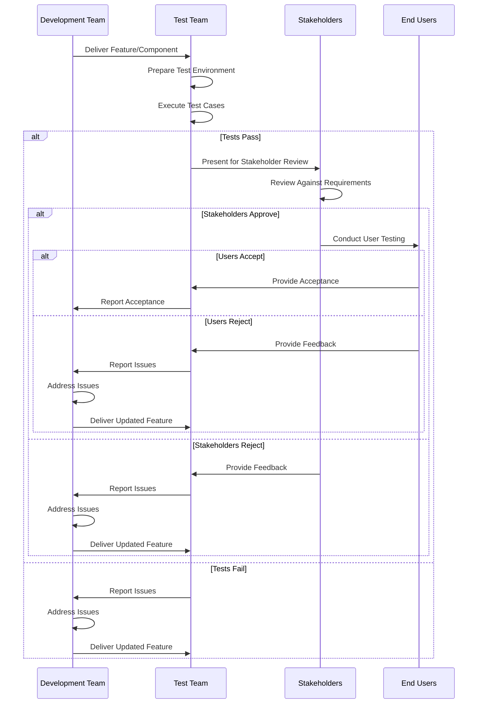
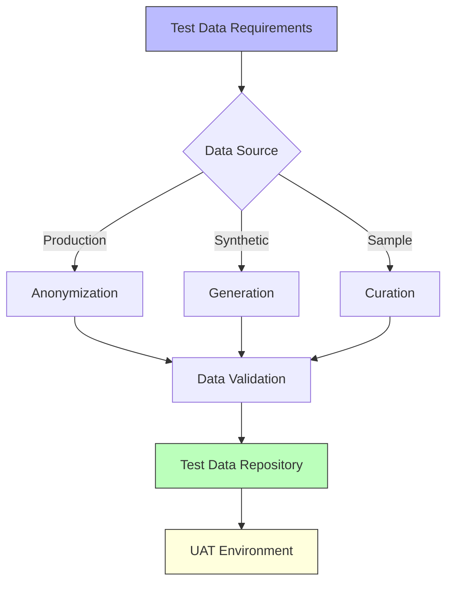
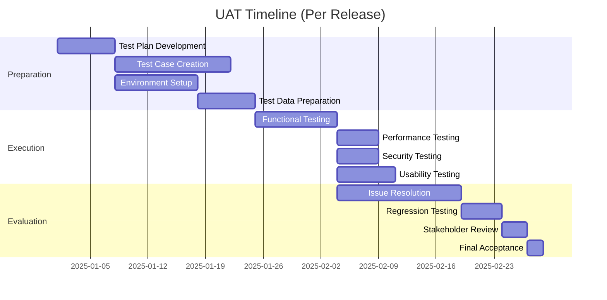
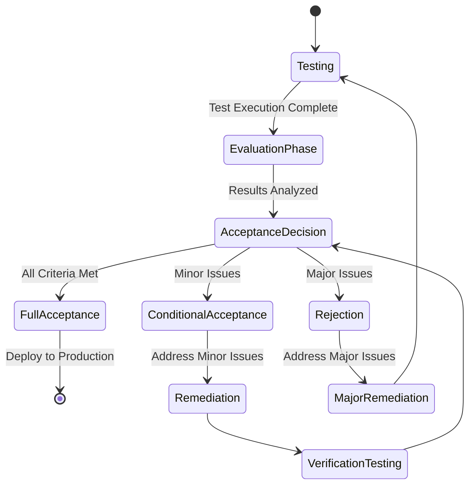

# User Acceptance Testing Overview

## Introduction

User Acceptance Testing (UAT) is a critical phase in the development of the Agricultural Research Platform, ensuring that the system meets the needs and expectations of all user personas. This section outlines the comprehensive acceptance testing framework, including criteria, methodologies, and success metrics.

## Acceptance Testing Approach

```mermaid

graph TD
    A[User Acceptance Testing] --> B[Feature Acceptance]
    A --> C[Performance Acceptance]
    A --> D[Security & Compliance]
    A --> E[Usability Acceptance]
    
    B --> B1[Functional Requirements Validation]
    B --> B2[User Story Completion]
    B --> B3[Integration Testing]
    
    C --> C1[Response Time Validation]
    C --> C2[Throughput Testing]
    C --> C3[Scalability Verification]
    
    D --> D1[Security Controls Testing]
    D --> D2[Compliance Verification]
    D --> D3[Data Protection Validation]
    
    E --> E1[User Experience Testing]
    E --> E2[Accessibility Validation]
    E --> E3[Cross-Platform Testing]
    
    style A fill:#f9f,stroke:#333,stroke-width:2px
    style B fill:#bbf,stroke:#333,stroke-width:1px
    style C fill:#bfb,stroke:#333,stroke-width:1px
    style D fill:#fbb,stroke:#333,stroke-width:1px
    style E fill:#ffd,stroke:#333,stroke-width:1px

```

## UAT Principles

The Agricultural Research Platform's acceptance testing is guided by the following principles:

1. **User-Centered Validation**: All acceptance criteria are derived from user needs and expectations
2. **Persona-Based Testing**: Acceptance tests are designed for each user persona's specific requirements
3. **Measurable Criteria**: All acceptance criteria are objective and measurable
4. **Comprehensive Coverage**: Testing covers all functional and non-functional requirements
5. **Iterative Refinement**: Acceptance testing informs continuous improvement
6. **Collaborative Process**: Stakeholders from all user groups participate in acceptance testing

## UAT Process Flow

## UAT Roles and Responsibilities

| Role | Responsibilities |
|------|-----------------|
| **UAT Manager** | Overall coordination of UAT process, reporting to stakeholders |
| **Test Engineers** | Execution of test cases, documentation of results |
| **Stakeholder Representatives** | Review of test results, business validation |
| **End User Testers** | Persona-based testing, real-world scenario validation |
| **Development Team** | Issue resolution, technical support during testing |
| **Product Owner** | Final acceptance decision, prioritization of issues |

## UAT Environment

The UAT environment will be configured to closely mirror the production environment, including:

1. **Infrastructure**: Equivalent cloud resources and configurations
2. **Data**: Representative datasets for all user scenarios
3. **Integrations**: Connections to all external systems and APIs
4. **Security**: Implementation of all security controls and policies
5. **Monitoring**: Full monitoring and logging capabilities

## Test Data Management

## UAT Documentation

The following documentation will be maintained throughout the UAT process:

1. **Test Plan**: Overall strategy, scope, and approach
2. **Test Cases**: Detailed scenarios and steps for each requirement
3. **Traceability Matrix**: Mapping of requirements to test cases
4. **Test Results**: Outcomes of test execution with evidence
5. **Issue Log**: Tracking of identified issues and resolutions
6. **Acceptance Report**: Final documentation of acceptance decisions

## UAT Metrics

The following metrics will be tracked to measure UAT effectiveness:

| Metric | Target | Purpose |
|--------|--------|---------|
| **Test Coverage** | 100% of requirements | Ensure all requirements are validated |
| **Pass Rate** | > 95% first-time pass | Measure quality of delivered features |
| **Defect Density** | < 0.5 defects per feature | Assess overall quality |
| **User Satisfaction** | > 4/5 rating | Measure user perception of quality |
| **UAT Duration** | < 3 weeks per release | Ensure efficient testing process |
| **Defect Resolution Time** | < 48 hours (average) | Measure development responsiveness |

## UAT Timeline

## Acceptance Decision Process

The final acceptance decision will follow this process:

## Risk Management in UAT

Potential risks in the UAT process will be managed through:

1. **Early Identification**: Proactive risk assessment before testing begins
2. **Mitigation Planning**: Strategies to address potential issues
3. **Contingency Plans**: Alternative approaches for high-impact risks
4. **Continuous Monitoring**: Tracking of risk indicators throughout testing
5. **Escalation Procedures**: Clear paths for addressing emerging risks

## Continuous Improvement

The UAT process will be continuously improved through:

1. **Post-UAT Reviews**: Analysis of process effectiveness after each cycle
2. **Metrics Analysis**: Identification of trends and opportunities
3. **Feedback Collection**: Input from all participants in the UAT process
4. **Process Refinement**: Regular updates to testing approaches and tools
5. **Knowledge Sharing**: Documentation of lessons learned and best practices

For detailed acceptance criteria for specific features, see the [Feature Acceptance Criteria](feature-criteria.md) section.
