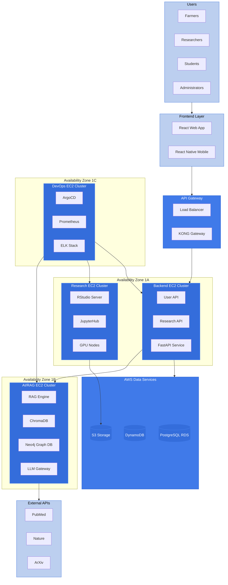
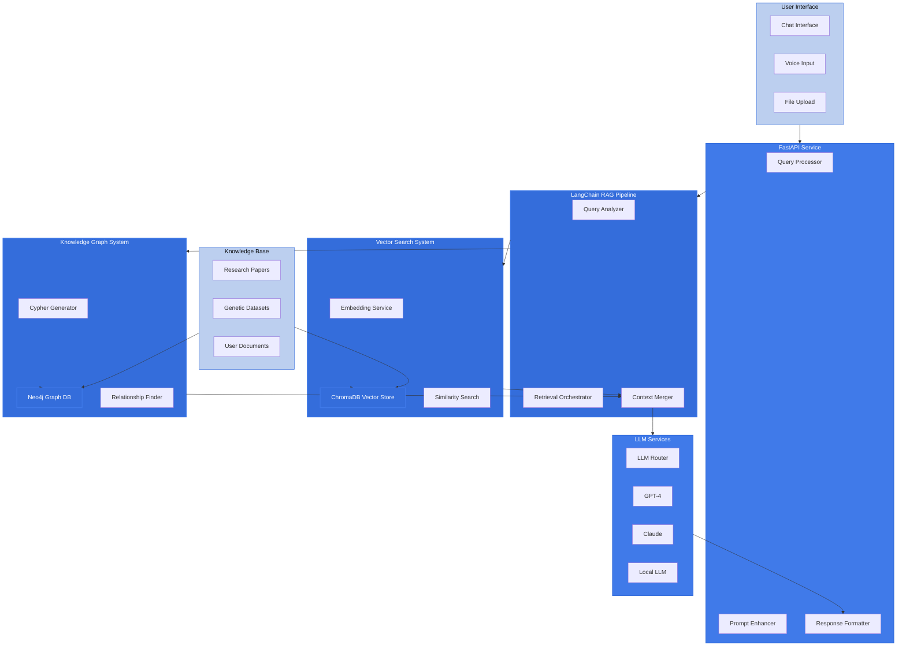
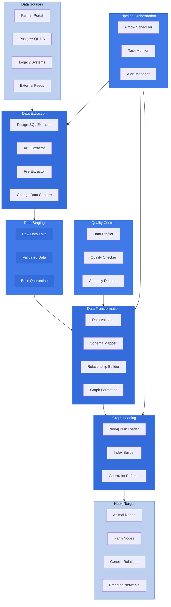

# AI-Powered Research Platform Architecture Diagrams
## Comprehensive Three-Part High-Level Architecture Overview

This document presents simplified architecture diagrams for an AI-powered research platform deployed on AWS EC2 with containerized infrastructure, featuring intelligent document retrieval and analysis capabilities.

> **Note**: These diagrams use simplified Mermaid flowchart syntax optimized for both light and dark mode viewing with consistent color theming.

---

## Part 1: Overall System Architecture

### AWS EC2 Containerized Infrastructure Overview

---

## Part 2: Emilia AI Architecture

### LangChain RAG Implementation with Dual Search Strategy

---

## Part 3: ETL Pipeline for Neo4j

### Data Transformation from PostgreSQL to Graph Database

---

## Architecture Summary

### Key Components Overview

#### **Part 1 - Overall Architecture:**
- **Multi-AZ Deployment**: Three availability zones with dedicated EC2 clusters
- **Containerized Services**: Kubernetes orchestration across all clusters
- **API Gateway Layer**: Load balancing and API management with KONG
- **Data Services**: PostgreSQL RDS, DynamoDB, and S3 storage
- **External Integration**: Research APIs (PubMed, Nature, ArXiv)

#### **Part 2 - Emilia AI System:**
- **LangChain RAG Pipeline**: Advanced retrieval augmented generation
- **Dual Search Strategy**: Vector similarity + Knowledge graph traversal
- **Multi-LLM Support**: GPT-4, Claude, and local LLM options
- **Knowledge Base**: Research papers, genetic datasets, user documents
- **Real-time Processing**: Query analysis, context merging, response formatting

#### **Part 3 - ETL Pipeline:**
- **Multi-Source Extraction**: PostgreSQL, APIs, files, and change data capture
- **Data Quality Control**: Validation, profiling, and anomaly detection
- **Graph Transformation**: Schema mapping and relationship building
- **Bulk Loading**: Optimized Neo4j loading with indexing and constraints
- **Pipeline Orchestration**: Apache Airflow for workflow management

### Technology Stack

- **Container Platform**: Kubernetes on AWS EC2
- **AI Framework**: LangChain for RAG implementation
- **Vector Database**: ChromaDB for semantic search
- **Graph Database**: Neo4j for relationship modeling
- **Workflow Engine**: Apache Airflow for ETL orchestration
- **Monitoring**: Prometheus, Grafana, and ELK stack

### Data Flow

1. **User Requests** → Frontend → API Gateway → Backend Services
2. **AI Queries** → FastAPI → RAG Pipeline → Vector/Graph Search → LLM Services
3. **Data Pipeline** → Extraction → Staging → Transformation → Quality Control → Neo4j Loading

This simplified architecture provides clear separation of concerns while maintaining scalability and reliability for the AI-powered genetics research platform.