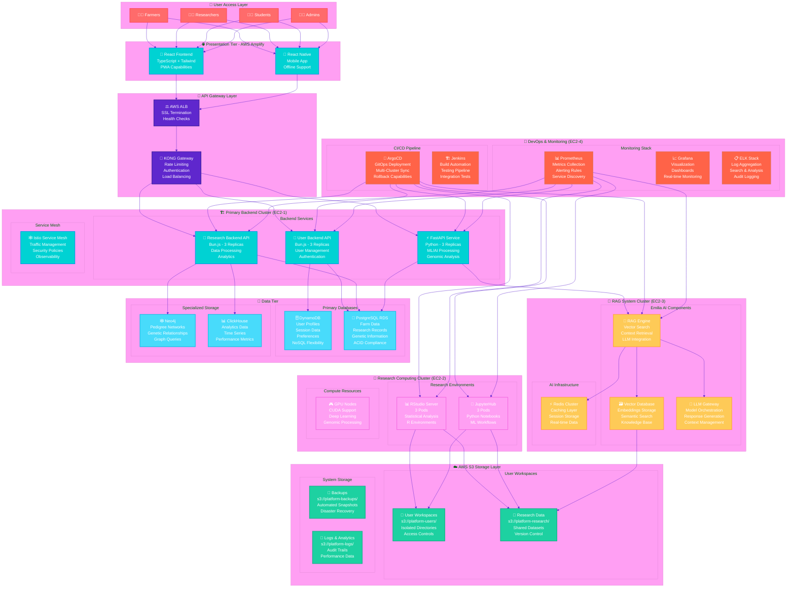
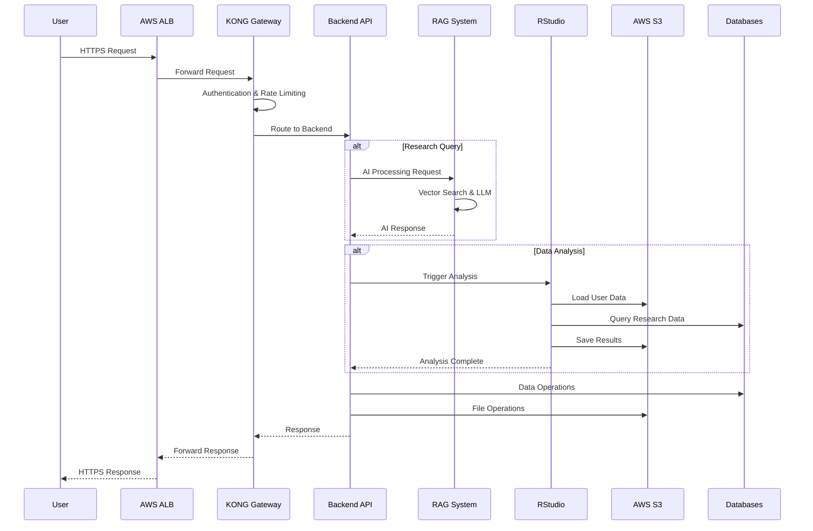
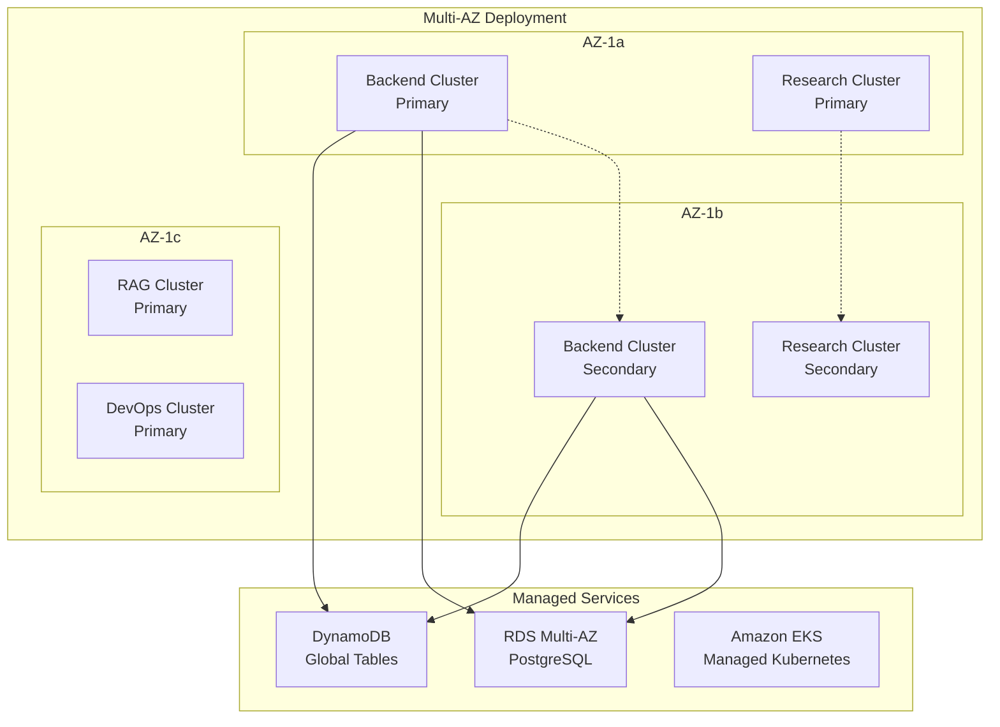
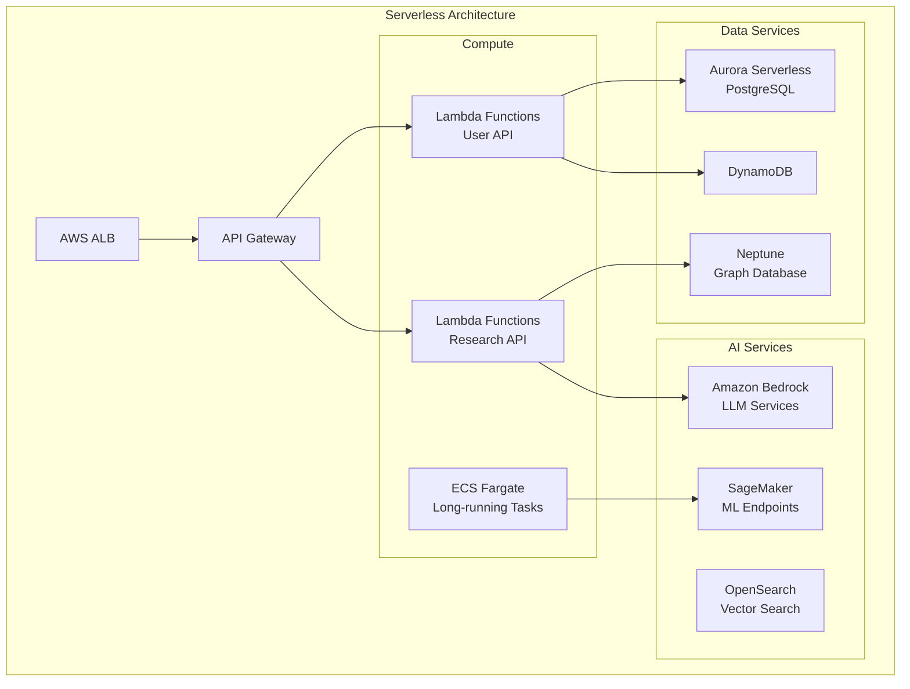

# Comprehensive Infrastructure & Deployment Strategy Analysis
## Animal Genetics Research Platform - Multi-Tier Architecture

### Executive Summary

This document provides a comprehensive analysis of the proposed multi-tier architecture for the Animal Genetics Research Platform, featuring distributed Kubernetes clusters, advanced RAG processing, and cloud-native storage solutions. The analysis covers cluster organization, service mesh configuration, load balancing strategies, and inter-cluster communication patterns.

---

## 1. Enhanced Architecture Overview

### 1.1 Multi-Tier Architecture Components

The proposed architecture consists of four primary tiers with specialized cluster deployments:



### 1.2 Cluster Organization Strategy

#### **Cluster 1: Primary Backend Services (EC2-1)**
- **Purpose**: Core application logic and user-facing APIs
- **Components**: 
  - User Backend API (Bun.js) - 3 replicas
  - Research Backend API (Bun.js) - 3 replicas  
  - FastAPI Service (Python) - 3 replicas
  - Istio Service Mesh for traffic management
- **Resource Allocation**: 
  - Instance Type: `c5.2xlarge` (8 vCPU, 16 GB RAM)
  - Auto-scaling: 3-9 replicas per service
  - Load balancing via Istio and KONG Gateway

#### **Cluster 2: Research Computing (EC2-2)**
- **Purpose**: Computational environments for researchers and students
- **Components**:
  - RStudio Server - 3 pods with persistent volumes
  - JupyterHub - 3 pods with GPU access
  - Specialized genomic analysis tools
- **Resource Allocation**:
  - Instance Type: `r5.4xlarge` (16 vCPU, 128 GB RAM)
  - GPU Support: `p3.2xlarge` for ML workloads
  - Persistent storage via EBS volumes

#### **Cluster 3: RAG System & AI Processing (EC2-3)**
- **Purpose**: Emilia AI server-side processing and knowledge management
- **Components**:
  - RAG Engine with vector search capabilities
  - Vector Database (Pinecone/Weaviate)
  - LLM Gateway for model orchestration
  - Redis cluster for caching
- **Resource Allocation**:
  - Instance Type: `m5.4xlarge` (16 vCPU, 64 GB RAM)
  - High-memory instances for vector processing
  - SSD storage for fast vector retrieval

#### **Cluster 4: DevOps & Monitoring (EC2-4)**
- **Purpose**: CI/CD, monitoring, and operational management
- **Components**:
  - ArgoCD for GitOps deployment
  - Prometheus/Grafana monitoring stack
  - ELK stack for logging
  - Jenkins for CI/CD pipelines
- **Resource Allocation**:
  - Instance Type: `m5.2xlarge` (8 vCPU, 32 GB RAM)
  - Dedicated monitoring and alerting
---

## 2. Service Mesh Configuration

### 2.1 Istio Service Mesh Implementation

```yaml
# Istio Configuration for Multi-Cluster Setup
apiVersion: install.istio.io/v1alpha1
kind: IstioOperator
metadata:
  name: control-plane
spec:
  values:
    global:
      meshID: genetics-platform
      multiCluster:
        clusterName: primary-backend
      network: network1
  components:
    pilot:
      k8s:
        env:
          - name: PILOT_ENABLE_WORKLOAD_ENTRY_AUTOREGISTRATION
            value: true
          - name: PILOT_ENABLE_CROSS_CLUSTER_WORKLOAD_ENTRY
            value: true
```

### 2.2 Traffic Management Policies

#### **Load Balancing Strategy**
```yaml
apiVersion: networking.istio.io/v1beta1
kind: DestinationRule
metadata:
  name: user-backend-dr
spec:
  host: user-backend-api
  trafficPolicy:
    loadBalancer:
      simple: LEAST_CONN
    connectionPool:
      tcp:
        maxConnections: 100
      http:
        http1MaxPendingRequests: 50
        maxRequestsPerConnection: 10
    circuitBreaker:
      consecutiveErrors: 3
      interval: 30s
      baseEjectionTime: 30s
```

#### **Cross-Cluster Communication**
```yaml
apiVersion: networking.istio.io/v1beta1
kind: ServiceEntry
metadata:
  name: rag-system-entry
spec:
  hosts:
  - rag-engine.rag-cluster.local
  ports:
  - number: 8080
    name: http
    protocol: HTTP
  location: MESH_EXTERNAL
  resolution: DNS
```

---

## 3. Load Balancing Strategies

### 3.1 Multi-Layer Load Balancing

#### **Layer 1: AWS Application Load Balancer (ALB)**
- **SSL Termination**: Handles TLS certificates and encryption
- **Health Checks**: Monitors backend service health
- **Geographic Routing**: Routes traffic based on user location
- **WAF Integration**: Web Application Firewall protection

#### **Layer 2: KONG API Gateway**
- **Rate Limiting**: Per-user and per-endpoint limits
- **Authentication**: JWT validation and OAuth integration
- **Request Transformation**: Header manipulation and payload transformation
- **Circuit Breaker**: Prevents cascade failures

#### **Layer 3: Istio Service Mesh**
- **Intelligent Routing**: Based on request headers and user context
- **Canary Deployments**: Gradual rollout of new versions
- **Fault Injection**: Testing resilience and error handling
- **Observability**: Distributed tracing and metrics

### 3.2 Load Balancing Configuration

```yaml
# KONG Gateway Configuration
apiVersion: configuration.konghq.com/v1
kind: KongPlugin
metadata:
  name: rate-limiting-plugin
config:
  minute: 100
  hour: 1000
  policy: local
  fault_tolerant: true
---
apiVersion: configuration.konghq.com/v1
kind: KongPlugin
metadata:
  name: circuit-breaker-plugin
config:
  max_failures: 5
  timeout: 60
  recovery_timeout: 30
```

---

## 4. Inter-Cluster Communication Patterns

### 4.1 Communication Architecture



### 4.2 Service Discovery and Registration

#### **Consul Service Discovery**
```yaml
apiVersion: v1
kind: ConfigMap
metadata:
  name: consul-config
data:
  consul.json: |
    {
      "datacenter": "genetics-platform",
      "data_dir": "/consul/data",
      "log_level": "INFO",
      "server": true,
      "bootstrap_expect": 3,
      "bind_addr": "0.0.0.0",
      "client_addr": "0.0.0.0",
      "retry_join": ["consul-0.consul", "consul-1.consul", "consul-2.consul"],
      "ui_config": {
        "enabled": true
      },
      "connect": {
        "enabled": true
      }
    }
```

### 4.3 Cross-Cluster Networking

#### **VPC Peering Configuration**
```yaml
# Terraform configuration for VPC peering
resource "aws_vpc_peering_connection" "cluster_peering" {
  count       = length(var.cluster_vpcs)
  peer_vpc_id = var.cluster_vpcs[count.index]
  vpc_id      = var.main_vpc_id
  auto_accept = true

  tags = {
    Name = "genetics-platform-peering-${count.index}"
  }
}

resource "aws_route" "cluster_routes" {
  count                     = length(var.cluster_vpcs)
  route_table_id            = var.route_table_ids[count.index]
  destination_cidr_block    = var.peer_cidr_blocks[count.index]
  vpc_peering_connection_id = aws_vpc_peering_connection.cluster_peering[count.index].id
}
```
---

## 5. AWS S3 Integration Strategy

### 5.1 User-Specific Workspace Design

#### **S3 Bucket Structure**
```
s3://genetics-platform-storage/
├── users/
│   ├── {user-id}/
│   │   ├── workspace/
│   │   │   ├── notebooks/
│   │   │   ├── datasets/
│   │   │   ├── results/
│   │   │   └── temp/
│   │   ├── shared/
│   │   └── backups/
├── research/
│   ├── public-datasets/
│   ├── collaborative-projects/
│   └── reference-genomes/
├── system/
│   ├── logs/
│   ├── monitoring/
│   └── backups/
└── ai-knowledge/
    ├── embeddings/
    ├── documents/
    └── models/
```

### 5.2 Access Control and Security

#### **IAM Policies for User Isolation**
```json
{
  "Version": "2012-10-17",
  "Statement": [
    {
      "Effect": "Allow",
      "Action": [
        "s3:GetObject",
        "s3:PutObject",
        "s3:DeleteObject"
      ],
      "Resource": [
        "arn:aws:s3:::genetics-platform-storage/users/${aws:userid}/*"
      ]
    },
    {
      "Effect": "Allow",
      "Action": [
        "s3:ListBucket"
      ],
      "Resource": [
        "arn:aws:s3:::genetics-platform-storage"
      ],
      "Condition": {
        "StringLike": {
          "s3:prefix": [
            "users/${aws:userid}/*"
          ]
        }
      }
    }
  ]
}
```

### 5.3 S3 Integration with Kubernetes

#### **CSI Driver Configuration**
```yaml
apiVersion: storage.k8s.io/v1
kind: StorageClass
metadata:
  name: s3-csi-driver
provisioner: s3.csi.aws.com
parameters:
  mounter: geesefs
  options: "--memory-limit 1000 --dir-mode 0755 --file-mode 0644"
reclaimPolicy: Delete
volumeBindingMode: Immediate
```

#### **Persistent Volume Claims**
```yaml
apiVersion: v1
kind: PersistentVolumeClaim
metadata:
  name: user-workspace-pvc
spec:
  accessModes:
    - ReadWriteMany
  resources:
    requests:
      storage: 100Gi
  storageClassName: s3-csi-driver
```

---

## 6. Comprehensive Recommendations

### 6.1 Architecture Strengths

#### **✅ Positive Aspects**
1. **Clear Separation of Concerns**: Each cluster has a specific purpose and responsibility
2. **Scalability Design**: Multiple replicas and auto-scaling capabilities
3. **Technology Alignment**: Bun.js and FastAPI provide good performance characteristics
4. **AI Integration**: Dedicated RAG cluster for specialized AI processing
5. **Storage Strategy**: S3 integration provides scalable and cost-effective storage

### 6.2 Critical Architecture Gaps

#### **🚨 High Priority Issues**

1. **Single Points of Failure**
   - **Issue**: Single EC2 instances per cluster create availability risks
   - **Impact**: Complete service outage if an instance fails
   - **Recommendation**: Implement multi-AZ deployment with at least 2 instances per cluster

2. **Network Security Concerns**
   - **Issue**: Inter-cluster communication security not clearly defined
   - **Impact**: Potential data breaches and unauthorized access
   - **Recommendation**: Implement VPC security groups, NACLs, and service mesh mTLS

3. **Database Architecture Mismatch**
   - **Issue**: DynamoDB + PostgreSQL doesn't align with documented multi-database strategy
   - **Impact**: Missing graph database for pedigree relationships, no analytics database
   - **Recommendation**: Add Neo4j for genetic relationships and ClickHouse for analytics

4. **Monitoring and Observability Gaps**
   - **Issue**: Limited cross-cluster monitoring and distributed tracing
   - **Impact**: Difficult troubleshooting and performance optimization
   - **Recommendation**: Implement comprehensive observability stack with Jaeger tracing

### 6.3 Infrastructure Optimization Recommendations

#### **🏗️ Enhanced Architecture Design**



#### **🔧 Specific Improvements**

1. **Replace Self-Managed K8s with Amazon EKS**
   ```yaml
   # EKS Cluster Configuration
   apiVersion: eksctl.io/v1alpha5
   kind: ClusterConfig
   metadata:
     name: genetics-platform
     region: us-west-2
   
   nodeGroups:
   - name: backend-nodes
     instanceType: c5.2xlarge
     desiredCapacity: 6
     minSize: 3
     maxSize: 12
     availabilityZones: ["us-west-2a", "us-west-2b"]
   
   - name: research-nodes
     instanceType: r5.4xlarge
     desiredCapacity: 4
     minSize: 2
     maxSize: 8
     availabilityZones: ["us-west-2a", "us-west-2b"]
   
   - name: ai-nodes
     instanceType: m5.4xlarge
     desiredCapacity: 4
     minSize: 2
     maxSize: 8
     availabilityZones: ["us-west-2c"]
   ```

2. **Implement Database Clustering**
   ```yaml
   # PostgreSQL RDS Configuration
   resource "aws_rds_cluster" "genetics_db" {
     cluster_identifier      = "genetics-platform-cluster"
     engine                 = "aurora-postgresql"
     engine_version         = "13.7"
     availability_zones     = ["us-west-2a", "us-west-2b", "us-west-2c"]
     database_name          = "genetics_platform"
     master_username        = "postgres"
     backup_retention_period = 7
     preferred_backup_window = "07:00-09:00"
     
     db_cluster_parameter_group_name = aws_rds_cluster_parameter_group.genetics_db.name
     
     tags = {
       Name = "genetics-platform-cluster"
     }
   }
   ```

3. **Enhanced Security Configuration**
   ```yaml
   # Network Security Groups
   resource "aws_security_group" "backend_sg" {
     name_prefix = "genetics-backend-"
     vpc_id      = var.vpc_id
   
     ingress {
       from_port   = 3000
       to_port     = 3000
       protocol    = "tcp"
       cidr_blocks = [var.vpc_cidr]
     }
   
     egress {
       from_port   = 0
       to_port     = 0
       protocol    = "-1"
       cidr_blocks = ["0.0.0.0/0"]
     }
   
     tags = {
       Name = "genetics-backend-sg"
     }
   }
   ```

### 6.4 Cost Optimization Strategy

#### **💰 Cost Analysis and Recommendations**

1. **Current Estimated Monthly Costs**
   - EC2 Instances (4 x c5.2xlarge): ~$1,200
   - RDS PostgreSQL (Multi-AZ): ~$400
   - DynamoDB (On-demand): ~$200-500
   - S3 Storage (1TB): ~$25
   - **Total Estimated**: ~$1,825-2,125/month

2. **Optimized Cost Structure**
   - EKS Managed Nodes (Reserved): ~$800
   - Aurora Serverless v2: ~$200-400
   - DynamoDB (Provisioned): ~$150
   - S3 with Intelligent Tiering: ~$20
   - **Optimized Total**: ~$1,170-1,370/month
   - **Savings**: ~$655-755/month (35-40% reduction)

### 6.5 Alternative Architecture Recommendations

#### **🚀 Cloud-Native Alternative**



#### **Benefits of Serverless Approach**
- **Cost Efficiency**: Pay only for actual usage
- **Auto-scaling**: Automatic scaling based on demand
- **Reduced Operational Overhead**: Managed services reduce maintenance
- **High Availability**: Built-in redundancy and fault tolerance

---

## 7. Implementation Roadmap

### 7.1 Phase 1: Foundation (Months 1-2)
- [ ] Set up VPC with multi-AZ configuration
- [ ] Deploy EKS clusters with proper node groups
- [ ] Implement basic CI/CD pipeline with ArgoCD
- [ ] Set up monitoring with Prometheus/Grafana

### 7.2 Phase 2: Core Services (Months 3-4)
- [ ] Deploy backend APIs with proper load balancing
- [ ] Implement authentication and authorization
- [ ] Set up database clusters and data migration
- [ ] Configure S3 storage with proper access controls

### 7.3 Phase 3: Advanced Features (Months 5-6)
- [ ] Deploy RAG system and AI components
- [ ] Implement research computing environments
- [ ] Set up comprehensive monitoring and alerting
- [ ] Perform security audits and penetration testing

### 7.4 Phase 4: Optimization (Months 7-8)
- [ ] Performance tuning and optimization
- [ ] Cost optimization and right-sizing
- [ ] Disaster recovery testing
- [ ] Documentation and training

---

## 8. Conclusion

The proposed multi-tier architecture provides a solid foundation for the Animal Genetics Research Platform, but requires significant enhancements to meet production requirements. Key recommendations include:

1. **Adopt managed services** (EKS, Aurora, etc.) for better reliability and reduced operational overhead
2. **Implement multi-AZ deployment** to eliminate single points of failure
3. **Enhance security** with proper network segmentation and encryption
4. **Add comprehensive monitoring** for better observability and troubleshooting
5. **Consider serverless alternatives** for cost optimization and scalability

The enhanced architecture will provide better scalability, reliability, and cost-effectiveness while maintaining the core functionality required for the genetics research platform.