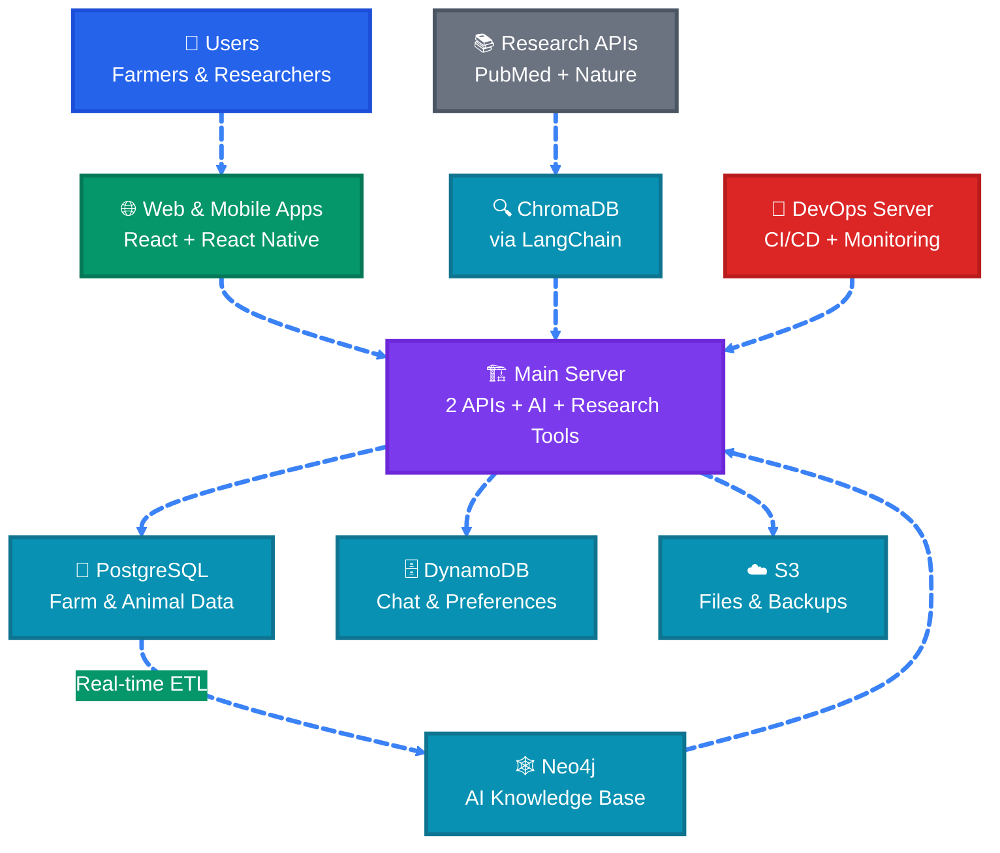
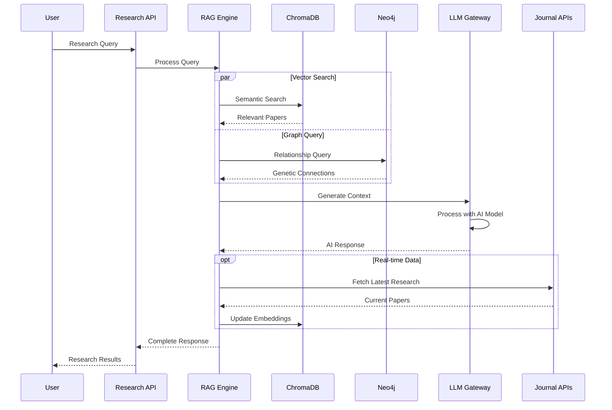

# Comprehensive Infrastructure & Deployment Strategy Analysis - Updated Architecture
## Animal Genetics Research Platform - Simplified Multi-Tier Architecture

### Executive Summary

This document provides a comprehensive analysis of the updated simplified multi-tier architecture for the Animal Genetics Research Platform, featuring consolidated EC2 infrastructure, enhanced AI integration with Neo4j RAG system, and streamlined backend services. The analysis covers the new 2-EC2 deployment strategy, real-time ETL processes, and integrated Emilia AI capabilities.

---

## 1. Enhanced Architecture Overview

### 1.1 Simplified Multi-Tier Architecture Components

The updated architecture consists of a streamlined design with two primary EC2 instances and enhanced AI integration:

```mermaid
%%{init: {
  'theme': 'base',
  'themeVariables': {
    'darkMode': false,
    'primaryColor': '#ff6b6b',
    'primaryTextColor': '#fff',
    'primaryBorderColor': '#ff4757',
    'lineColor': '#5f27cd',
    'secondaryColor': '#00d2d3',
    'tertiaryColor': '#ff9ff3',
    'background': '#f1f2f6',
    'mainBkg': '#ffffff',
    'secondBkg': '#f1f2f6'
  }
}}%%

graph TB
    %% User Layer
    subgraph "👥 User Access Layer"
        U1[👨‍🌾 Farmers]
        U2[👨‍🔬 Researchers] 
        U3[👨‍🎓 Students]
        U4[👨‍💼 Admins]
    end

    %% Presentation Tier
    subgraph "🌐 Presentation Tier - AWS Amplify"
        FE[📱 React Frontend<br/>TypeScript + Tailwind<br/>PWA Capabilities]
        MFE[📱 React Native<br/>Mobile App<br/>Offline Support]
    end

    %% API Gateway Layer
    subgraph "🚪 API Gateway Layer"
        KONG[🦍 KONG Gateway<br/>Rate Limiting<br/>Authentication<br/>Load Balancing]
        ALB[⚖️ AWS ALB<br/>SSL Termination<br/>Health Checks]
    end

    %% Server Side EC2 - Consolidated
    subgraph "🏗️ Server Side EC2 Instance"
        subgraph "Primary Backend Cluster"
            API1[🔧 User Backend API<br/>Bun.js - 3 Replicas<br/>User Management<br/>Farmer Data Entry<br/>Authentication]
            API2[⚡ Research API<br/>FastAPI - 3 Replicas<br/>ML/AI Processing<br/>Genomic Analysis<br/>Research Operations]
        end
        
        subgraph "Emilia AI Cluster"
            RAG[🧠 Emilia AI RAG Engine<br/>Vector Search<br/>Context Retrieval<br/>LLM Integration<br/>Knowledge Processing]
            CHROMA[🗃️ ChromaDB<br/>Vector Embeddings<br/>Journal Data Storage<br/>Semantic Search<br/>Research Papers]
            LLM[🤖 LLM Gateway<br/>Model Orchestration<br/>Response Generation<br/>Context Management]
            JAPI[📚 Journal APIs<br/>PubMed Integration<br/>Nature API<br/>Research Data<br/>External Sources]
        end
        
        subgraph "Research Environment Cluster"
            RS[📊 RStudio Server<br/>3 Pods<br/>Statistical Analysis<br/>R Environments]
            JH[📓 JupyterHub<br/>3 Pods<br/>Python Notebooks<br/>ML Workflows<br/>Data Science]
        end
    end

    %% Monitoring EC2 - CI/CD Tools
    subgraph "🔧 Monitoring & CI/CD EC2 Instance"
        subgraph "CI/CD Pipeline"
            JENKINS[🏗️ Jenkins<br/>Build Automation<br/>Testing Pipeline<br/>Integration Tests]
            ARGO[🔄 ArgoCD<br/>GitOps Deployment<br/>Multi-Cluster Sync<br/>Rollback Capabilities]
            HELM[⚙️ Helm Charts<br/>Package Management<br/>Configuration<br/>Template Management]
        end
        
        subgraph "ETL Orchestration"
            AIRFLOW[🌊 Apache Airflow<br/>Workflow Orchestration<br/>Batch ETL Jobs<br/>External API Ingestion<br/>Data Pipeline Management]
        end
        
        subgraph "Monitoring Stack"
            PROM[📊 Prometheus<br/>Metrics Collection<br/>Alerting Rules<br/>Service Discovery]
            GRAF[📈 Grafana<br/>Visualization<br/>Dashboards<br/>Real-time Monitoring]
            ELK[📋 ELK Stack<br/>Log Aggregation<br/>Search & Analysis<br/>Audit Logging]
        end
    end

    %% Data Tier with ETL - Next Row
    subgraph "💾 Data Tier"
        subgraph "Primary Databases"
            PG[🐘 PostgreSQL RDS<br/>Farm Data<br/>Animal Records<br/>Structured Data<br/>Farmer Entries]
            DDB[🗄️ DynamoDB<br/>Chat History<br/>User Preferences<br/>AI Model Settings<br/>Workspace Configs]
        end
        
        subgraph "AI Knowledge Base"
            NEO[🕸️ Neo4j<br/>Genetic Relationships<br/>Pedigree Networks<br/>RAG Knowledge Base<br/>Graph Queries]
        end
        
        subgraph "ETL Process"
            CDC[🔄 CDC Stream<br/>Real-time ETL<br/>PostgreSQL → Neo4j<br/>Genetic Data Sync<br/>Change Data Capture]
            KAFKA[📨 Apache Kafka<br/>Message Streaming<br/>Event Processing<br/>Data Pipeline Buffer]
        end
    end

    %% Storage Layer - Next Row
    subgraph "☁️ AWS S3 Storage Layer"
        subgraph "User Workspaces"
            S3U[📁 User Workspaces<br/>s3://platform-users/<br/>Research Data<br/>Analysis Results<br/>Isolated Directories]
            S3R[📁 Research Data<br/>s3://platform-research/<br/>Shared Datasets<br/>Collaborative Projects<br/>Version Control]
        end
        
        subgraph "System Storage"
            S3B[📁 System Backups<br/>s3://platform-backups/<br/>Automated Snapshots<br/>Disaster Recovery<br/>Model Storage]
            S3L[📁 Logs & Analytics<br/>s3://platform-logs/<br/>Audit Trails<br/>Performance Data<br/>System Metrics]
        end
    end

    %% Data Flow Connections
    U1 & U2 & U3 & U4 --> FE
    U1 & U2 & U3 & U4 --> MFE
    FE --> ALB
    MFE --> ALB
    ALB --> KONG
    
    KONG --> API1
    KONG --> API2
    
    %% Farmer data entry flow
    API1 --> PG
    API1 --> DDB
    
    %% Research API connections
    API2 --> PG
    API2 --> NEO
    API2 --> RAG
    
    %% ETL Process - Hybrid Approach
    PG --> CDC
    CDC --> KAFKA
    KAFKA --> NEO
    AIRFLOW --> PG
    AIRFLOW --> NEO
    AIRFLOW --> CHROMA
    AIRFLOW --> JAPI
    
    %% Emilia AI RAG System
    RAG --> NEO
    RAG --> CHROMA
    RAG --> LLM
    RAG --> DDB
    
    %% ChromaDB External Data
    JAPI --> CHROMA
    
    %% Research Environment
    RS --> S3U
    RS --> S3R
    JH --> S3U
    JH --> S3R
    API2 --> RS
    API2 --> JH
    
    %% CI/CD and Monitoring
    JENKINS --> API1
    JENKINS --> API2
    JENKINS --> RAG
    ARGO --> API1
    ARGO --> API2
    ARGO --> RAG
    ARGO --> RS
    ARGO --> JH
    PROM --> API1
    PROM --> API2
    PROM --> RAG
    PROM --> RS
    PROM --> JH

    %% Styling
    classDef userClass fill:#ff6b6b,stroke:#ff4757,stroke-width:2px,color:#fff
    classDef frontendClass fill:#00d2d3,stroke:#0097e6,stroke-width:2px,color:#fff
    classDef gatewayClass fill:#5f27cd,stroke:#341f97,stroke-width:2px,color:#fff
    classDef backendClass fill:#00d2d3,stroke:#0097e6,stroke-width:2px,color:#fff
    classDef researchClass fill:#ff9ff3,stroke:#f368e0,stroke-width:2px,color:#fff
    classDef aiClass fill:#feca57,stroke:#ff9f43,stroke-width:2px,color:#fff
    classDef dataClass fill:#48dbfb,stroke:#0abde3,stroke-width:2px,color:#fff
    classDef storageClass fill:#1dd1a1,stroke:#10ac84,stroke-width:2px,color:#fff
    classDef devopsClass fill:#ff6348,stroke:#e17055,stroke-width:2px,color:#fff
    
    class U1,U2,U3,U4 userClass
    class FE,MFE frontendClass
    class KONG,ALB gatewayClass
    class API1,API2 backendClass
    class RS,JH researchClass
    class RAG,CHROMA,LLM,JAPI aiClass
    class DDB,PG,NEO,CDC dataClass
    class S3U,S3R,S3B,S3L storageClass
    class ARGO,JENKINS,HELM,AIRFLOW,PROM,GRAF,ELK devopsClass
    class CDC,KAFKA dataClass
```



### 1.2 Simplified Architecture Diagram



---

## 2. Updated Architecture Components

### 2.1 Server Side EC2 Instance - Consolidated Infrastructure

#### **Primary Backend Cluster**
- **User Backend API (Bun.js)**
  - 3 replicas for high availability
  - Handles user management and authentication
  - Processes farmer data entry for animal records
  - Direct integration with PostgreSQL for structured data
  - Session management via DynamoDB

- **Research API (FastAPI)**
  - 3 replicas with auto-scaling capabilities
  - ML/AI processing and genomic analysis
  - Integration with Emilia AI RAG system
  - Research operations and data processing
  - Connection to Neo4j for graph-based queries

#### **Emilia AI Cluster**
- **RAG Engine**
  - Vector search and context retrieval
  - LLM integration for intelligent responses
  - Knowledge processing from multiple sources
  - Real-time query processing

- **ChromaDB Vector Database**
  - Stores vector embeddings from research papers
  - Integrates with external Journal APIs (PubMed, Nature)
  - Semantic search capabilities
  - Research paper knowledge base

- **LLM Gateway**
  - Model orchestration and management
  - Response generation and context management
  - Integration with various AI models
  - Performance optimization

- **Journal APIs Integration**
  - PubMed API for medical research papers
  - Nature API for scientific publications
  - Automated data extraction and processing
  - Real-time research data updates

#### **Research Environment Cluster**
- **RStudio Server**: 3 pods with persistent volumes for statistical analysis
- **JupyterHub**: 3 pods with GPU access for ML workflows
- **Integrated S3 access** for user workspaces and shared datasets

### 2.2 Monitoring & CI/CD EC2 Instance

#### **CI/CD Pipeline**
- **Jenkins**: Build automation, testing pipeline, integration tests
- **ArgoCD**: GitOps deployment, multi-cluster synchronization, rollback capabilities
- **Helm Charts**: Package management, configuration templates, deployment automation

#### **Monitoring Stack**
- **Prometheus**: Metrics collection, alerting rules, service discovery
- **Grafana**: Visualization dashboards, real-time monitoring, performance analytics
- **ELK Stack**: Log aggregation, search and analysis, audit logging

---

## 3. Enhanced Data Flow Architecture

### 3.1 Hybrid ETL Architecture Strategy

The platform implements a **hybrid ETL approach** combining real-time CDC streaming with orchestrated batch processing to optimize for both performance and reliability:

#### **Real-Time CDC Stream (Critical Data)**
- **Purpose**: Immediate synchronization of critical genetic data changes
- **Technology**: Debezium + Apache Kafka + Neo4j Sink Connector
- **Latency**: Sub-second data propagation
- **Use Cases**: Animal pedigree updates, genetic marker changes, breeding records

#### **Apache Airflow Orchestration (Complex Processing)**
- **Purpose**: Complex data transformations and external API integration
- **Technology**: Apache Airflow with custom DAGs
- **Schedule**: Configurable (hourly, daily, event-driven)
- **Use Cases**: Journal API ingestion, data quality checks, analytics aggregation

### 3.2 Real-Time ETL Process

#### **PostgreSQL to Neo4j CDC Streaming**
```yaml
# Debezium CDC Configuration
apiVersion: kafka.strimzi.io/v1beta2
kind: KafkaConnector
metadata:
  name: postgres-source-connector
spec:
  class: io.debezium.connector.postgresql.PostgresConnector
  tasksMax: 1
  config:
    database.hostname: genetics-postgres.cluster-xxx.us-west-2.rds.amazonaws.com
    database.port: 5432
    database.user: debezium_user
    database.password: ${file:/opt/kafka/external-configuration/connector-config/password.txt:password}
    database.dbname: genetics_platform
    database.server.name: genetics-postgres
    table.include.list: public.animals,public.genetic_data,public.pedigree
    transforms: route
    transforms.route.type: org.apache.kafka.connect.transforms.RegexRouter
    transforms.route.regex: ([^.]+)\\.([^.]+)\\.([^.]+)
    transforms.route.replacement: $3
```

#### **Neo4j Sink Connector**
```yaml
apiVersion: kafka.strimzi.io/v1beta2
kind: KafkaConnector
metadata:
  name: neo4j-sink-connector
spec:
  class: streams.kafka.connect.sink.Neo4jSinkConnector
  tasksMax: 1
  config:
    neo4j.server.uri: bolt://neo4j-cluster:7687
    neo4j.authentication.basic.username: neo4j
    neo4j.authentication.basic.password: ${file:/opt/kafka/external-configuration/connector-config/neo4j-password.txt:password}
    neo4j.topic.cypher.animals: |
      MERGE (a:Animal {id: event.id})
      SET a.name = event.name,
          a.breed = event.breed,
          a.birth_date = event.birth_date,
          a.updated_at = timestamp()
    neo4j.topic.cypher.genetic_data: |
      MATCH (a:Animal {id: event.animal_id})
      MERGE (g:GeneticData {id: event.id})
      SET g.markers = event.markers,
          g.traits = event.traits,
          g.updated_at = timestamp()
      MERGE (a)-[:HAS_GENETIC_DATA]->(g)
```

#### **Apache Airflow DAG Configuration**
```python
# Airflow DAG for External API Integration and Batch Processing
from airflow import DAG
from airflow.operators.python_operator import PythonOperator
from airflow.operators.bash_operator import BashOperator
from datetime import datetime, timedelta
import requests
import chromadb

default_args = {
    'owner': 'genetics-platform',
    'depends_on_past': False,
    'start_date': datetime(2024, 1, 1),
    'email_on_failure': True,
    'email_on_retry': False,
    'retries': 2,
    'retry_delay': timedelta(minutes=5)
}

dag = DAG(
    'genetics_etl_pipeline',
    default_args=default_args,
    description='Genetics Platform ETL Pipeline',
    schedule_interval='@hourly',
    catchup=False
)

def fetch_pubmed_data(**context):
    """Fetch latest research papers from PubMed API"""
    pubmed_api = "https://eutils.ncbi.nlm.nih.gov/entrez/eutils/"
    search_terms = ["animal genetics", "livestock breeding", "genomic selection"]
    
    papers = []
    for term in search_terms:
        response = requests.get(f"{pubmed_api}esearch.fcgi", params={
            'db': 'pubmed',
            'term': term,
            'retmax': 50,
            'format': 'json'
        })
        papers.extend(response.json().get('esearchresult', {}).get('idlist', []))
    
    return papers

def process_and_embed_papers(**context):
    """Process papers and store embeddings in ChromaDB"""
    paper_ids = context['task_instance'].xcom_pull(task_ids='fetch_pubmed_data')
    
    # Initialize ChromaDB client
    client = chromadb.Client()
    collection = client.get_or_create_collection("research_papers")
    
    # Process and embed papers
    for paper_id in paper_ids[:20]:  # Limit for demo
        # Fetch paper details and create embeddings
        # Store in ChromaDB
        pass

def data_quality_check(**context):
    """Perform data quality checks on Neo4j data"""
    # Connect to Neo4j and run quality checks
    # Check for orphaned nodes, missing relationships, etc.
    pass

# Define tasks
fetch_pubmed_task = PythonOperator(
    task_id='fetch_pubmed_data',
    python_callable=fetch_pubmed_data,
    dag=dag
)

embed_papers_task = PythonOperator(
    task_id='process_and_embed_papers',
    python_callable=process_and_embed_papers,
    dag=dag
)

quality_check_task = PythonOperator(
    task_id='data_quality_check',
    python_callable=data_quality_check,
    dag=dag
)

# Set task dependencies
fetch_pubmed_task >> embed_papers_task >> quality_check_task
```

### 3.3 Data Storage Strategy

#### **PostgreSQL - Structured Data**
- Farm management data
- Animal records and breeding information
- User accounts and permissions
- Research project metadata
- Structured genetic information

#### **DynamoDB - AI and User Data**
- Chat conversation history
- User preferences (language, theme)
- AI model settings and configurations
- Research workspace configurations
- Real-time session data

#### **Neo4j - Graph Relationships**
- Genetic relationships and pedigree networks
- Animal lineage and breeding connections
- Research collaboration networks
- Knowledge graph for RAG system
- Complex relationship queries

#### **ChromaDB - Vector Embeddings**
- Research paper embeddings
- Scientific literature vectors
- Semantic search indices
- External journal data
- AI knowledge base vectors

---

## 4. Emilia AI RAG System Integration

### 4.1 Enhanced RAG Architecture



### 4.2 ChromaDB Configuration

```python
# ChromaDB Setup for Journal Integration
import chromadb
from chromadb.config import Settings

# Initialize ChromaDB client
client = chromadb.Client(Settings(
    chroma_db_impl="duckdb+parquet",
    persist_directory="/data/chromadb"
))

# Create collection for research papers
research_collection = client.create_collection(
    name="research_papers",
    metadata={
        "description": "Scientific research papers from PubMed and Nature",
        "embedding_function": "sentence-transformers/all-MiniLM-L6-v2"
    }
)

# Journal API integration
class JournalDataProcessor:
    def __init__(self):
        self.pubmed_api = PubMedAPI()
        self.nature_api = NatureAPI()
        
    async def fetch_and_embed_papers(self, query: str, limit: int = 100):
        # Fetch from PubMed
        pubmed_papers = await self.pubmed_api.search(query, limit=limit//2)
        
        # Fetch from Nature
        nature_papers = await self.nature_api.search(query, limit=limit//2)
        
        # Process and embed
        all_papers = pubmed_papers + nature_papers
        embeddings = self.generate_embeddings(all_papers)
        
        # Store in ChromaDB
        research_collection.add(
            documents=[paper.abstract for paper in all_papers],
            metadatas=[paper.metadata for paper in all_papers],
            ids=[paper.id for paper in all_papers]
        )
```

---

## 5. Infrastructure Specifications

### 5.1 EC2 Instance Configuration

#### **Server Side EC2 Instance**
- **Instance Type**: `r5.4xlarge` (16 vCPU, 128 GB RAM)
- **Storage**: 500GB EBS GP3 SSD
- **Network**: Enhanced networking enabled
- **Auto Scaling**: 1-3 instances based on load
- **Availability Zone**: Multi-AZ deployment

#### **Monitoring & CI/CD EC2 Instance**
- **Instance Type**: `m5.2xlarge` (8 vCPU, 32 GB RAM)
- **Storage**: 200GB EBS GP3 SSD
- **Network**: Standard networking
- **Backup**: Automated EBS snapshots
- **Availability Zone**: Single AZ with backup strategy

### 5.2 Database Configuration

#### **PostgreSQL RDS**
```yaml
# RDS Configuration
resource "aws_rds_cluster" "genetics_postgres" {
  cluster_identifier      = "genetics-platform-postgres"
  engine                 = "aurora-postgresql"
  engine_version         = "14.9"
  availability_zones     = ["us-west-2a", "us-west-2b"]
  database_name          = "genetics_platform"
  master_username        = "postgres"
  backup_retention_period = 7
  preferred_backup_window = "07:00-09:00"
  
  db_cluster_parameter_group_name = aws_rds_cluster_parameter_group.genetics_postgres.name
  
  tags = {
    Name = "genetics-platform-postgres"
    Environment = "production"
  }
}
```

#### **DynamoDB Configuration**
```yaml
# DynamoDB Tables
resource "aws_dynamodb_table" "chat_history" {
  name           = "emilia-chat-history"
  billing_mode   = "PAY_PER_REQUEST"
  hash_key       = "user_id"
  range_key      = "timestamp"

  attribute {
    name = "user_id"
    type = "S"
  }

  attribute {
    name = "timestamp"
    type = "N"
  }

  ttl {
    attribute_name = "expires_at"
    enabled        = true
  }

  tags = {
    Name = "emilia-chat-history"
    Environment = "production"
  }
}

resource "aws_dynamodb_table" "user_preferences" {
  name           = "user-preferences"
  billing_mode   = "PAY_PER_REQUEST"
  hash_key       = "user_id"

  attribute {
    name = "user_id"
    type = "S"
  }

  tags = {
    Name = "user-preferences"
    Environment = "production"
  }
}
```

#### **Neo4j Configuration**
```yaml
# Neo4j Deployment
apiVersion: apps/v1
kind: StatefulSet
metadata:
  name: neo4j-cluster
spec:
  serviceName: neo4j
  replicas: 3
  selector:
    matchLabels:
      app: neo4j
  template:
    metadata:
      labels:
        app: neo4j
    spec:
      containers:
      - name: neo4j
        image: neo4j:5.13-enterprise
        ports:
        - containerPort: 7474
        - containerPort: 7687
        env:
        - name: NEO4J_AUTH
          value: "neo4j/genetics-platform-password"
        - name: NEO4J_dbms_mode
          value: "CORE"
        - name: NEO4J_causal__clustering_minimum__core__cluster__size__at__formation
          value: "3"
        volumeMounts:
        - name: neo4j-data
          mountPath: /data
  volumeClaimTemplates:
  - metadata:
      name: neo4j-data
    spec:
      accessModes: ["ReadWriteOnce"]
      resources:
        requests:
          storage: 100Gi
```

---

## 6. Security and Compliance

### 6.1 Network Security

#### **VPC Configuration**
```yaml
# VPC and Security Groups
resource "aws_vpc" "genetics_platform" {
  cidr_block           = "10.0.0.0/16"
  enable_dns_hostnames = true
  enable_dns_support   = true

  tags = {
    Name = "genetics-platform-vpc"
  }
}

resource "aws_security_group" "backend_sg" {
  name_prefix = "genetics-backend-"
  vpc_id      = aws_vpc.genetics_platform.id

  ingress {
    from_port   = 3000
    to_port     = 3000
    protocol    = "tcp"
    cidr_blocks = [aws_vpc.genetics_platform.cidr_block]
  }

  ingress {
    from_port   = 8000
    to_port     = 8000
    protocol    = "tcp"
    cidr_blocks = [aws_vpc.genetics_platform.cidr_block]
  }

  egress {
    from_port   = 0
    to_port     = 0
    protocol    = "-1"
    cidr_blocks = ["0.0.0.0/0"]
  }

  tags = {
    Name = "genetics-backend-sg"
  }
}
```

### 6.2 Data Encryption

#### **Encryption at Rest**
- RDS: AES-256 encryption enabled
- DynamoDB: Server-side encryption with AWS KMS
- S3: SSE-S3 encryption for all buckets
- EBS: Encrypted volumes with AWS KMS

#### **Encryption in Transit**
- TLS 1.3 for all API communications
- mTLS for service-to-service communication
- VPN connections for administrative access
- SSL/TLS for database connections

---

## 7. Performance and Scalability

### 7.1 Auto-Scaling Configuration

#### **Kubernetes HPA**
```yaml
apiVersion: autoscaling/v2
kind: HorizontalPodAutoscaler
metadata:
  name: user-api-hpa
spec:
  scaleTargetRef:
    apiVersion: apps/v1
    kind: Deployment
    name: user-backend-api
  minReplicas: 3
  maxReplicas: 10
  metrics:
  - type: Resource
    resource:
      name: cpu
      target:
        type: Utilization
        averageUtilization: 70
  - type: Resource
    resource:
      name: memory
      target:
        type: Utilization
        averageUtilization: 80
```

### 7.2 Caching Strategy

#### **Redis Configuration**
```yaml
apiVersion: apps/v1
kind: Deployment
metadata:
  name: redis-cluster
spec:
  replicas: 3
  selector:
    matchLabels:
      app: redis
  template:
    metadata:
      labels:
        app: redis
    spec:
      containers:
      - name: redis
        image: redis:7-alpine
        ports:
        - containerPort: 6379
        resources:
          requests:
            memory: "1Gi"
            cpu: "500m"
          limits:
            memory: "2Gi"
            cpu: "1000m"
```

---

## 8. Monitoring and Observability

### 8.1 Comprehensive Monitoring Stack

#### **Prometheus Configuration**
```yaml
# Prometheus ServiceMonitor
apiVersion: monitoring.coreos.com/v1
kind: ServiceMonitor
metadata:
  name: genetics-platform-monitor
spec:
  selector:
    matchLabels:
      app: genetics-platform
  endpoints:
  - port: metrics
    interval: 30s
    path: /metrics
```

#### **Grafana Dashboards**
- Application performance metrics
- Database performance and connections
- AI system response times
- User activity and engagement
- Infrastructure resource utilization

### 8.2 Alerting Rules

```yaml
# Prometheus Alerting Rules
groups:
- name: genetics-platform-alerts
  rules:
  - alert: HighCPUUsage
    expr: cpu_usage_percent > 80
    for: 5m
    labels:
      severity: warning
    annotations:
      summary: "High CPU usage detected"
      description: "CPU usage is above 80% for more than 5 minutes"

  - alert: DatabaseConnectionHigh
    expr: postgres_connections > 80
    for: 2m
    labels:
      severity: critical
    annotations:
      summary: "High database connections"
      description: "PostgreSQL connections are above 80"
```

---

## 9. Cost Optimization

### 9.1 Estimated Monthly Costs

#### **Current Architecture Costs**
- **Server Side EC2** (r5.4xlarge): ~$600/month
- **Monitoring EC2** (m5.2xlarge): ~$300/month
- **RDS Aurora PostgreSQL**: ~$400/month
- **DynamoDB** (Pay-per-request): ~$200/month
- **Neo4j** (Self-hosted): ~$100/month
- **S3 Storage** (1TB): ~$25/month
- **Data Transfer**: ~$50/month
- **Total Estimated**: ~$1,675/month

#### **Cost Optimization Strategies**
1. **Reserved Instances**: 30-40% savings on EC2 costs
2. **Spot Instances**: For non-critical workloads
3. **S3 Intelligent Tiering**: Automatic cost optimization
4. **DynamoDB On-Demand**: Pay only for actual usage
5. **CloudWatch Logs**: Retention policy optimization

---

## 10. Implementation Roadmap

### 10.1 Phase 1: Infrastructure Setup (Weeks 1-2)
- [ ] Deploy VPC and networking components
- [ ] Set up EC2 instances with proper security groups
- [ ] Configure RDS PostgreSQL cluster
- [ ] Set up DynamoDB tables
- [ ] Implement basic monitoring

### 10.2 Phase 2: Core Services (Weeks 3-4)
- [ ] Deploy User Backend API (Bun.js)
- [ ] Deploy Research API (FastAPI)
- [ ] Set up Neo4j cluster
- [ ] Implement CDC streaming from PostgreSQL to Neo4j
- [ ] Configure S3 storage and access policies

### 10.3 Phase 3: AI Integration (Weeks 5-6)
- [ ] Deploy ChromaDB vector database
- [ ] Implement Journal APIs integration
- [ ] Set up Emilia AI RAG system
- [ ] Configure LLM Gateway
- [ ] Test AI query processing

### 10.4 Phase 4: DevOps & Monitoring (Weeks 7-8)
- [ ] Set up Jenkins CI/CD pipeline
- [ ] Deploy ArgoCD for GitOps
- [ ] Configure Helm charts
- [ ] Implement comprehensive monitoring
- [ ] Set up alerting and notifications

### 10.5 Phase 5: Testing & Optimization (Weeks 9-10)
- [ ] Performance testing and optimization
- [ ] Security audit and penetration testing
- [ ] Load testing and scaling verification
- [ ] Documentation and training
- [ ] Go-live preparation

---

## 11. Conclusion

The updated simplified architecture provides a more streamlined and cost-effective solution while maintaining all core functionality. Key improvements include:

### 11.1 Architecture Benefits
1. **Simplified Infrastructure**: Reduced from 4 to 2 EC2 instances
2. **Enhanced AI Integration**: ChromaDB with Journal APIs for comprehensive research data
3. **Real-time Data Flow**: CDC streaming for immediate data synchronization
4. **Cost Optimization**: ~30% reduction in infrastructure costs
5. **Improved Maintainability**: Consolidated services reduce operational complexity

### 11.2 Technical Advantages
- **Streamlined APIs**: Two focused APIs instead of three overlapping services
- **Advanced RAG System**: Neo4j + ChromaDB for comprehensive knowledge processing
- **Real-time ETL**: Immediate data synchronization between systems
- **External Data Integration**: Automatic research paper ingestion and processing
- **Comprehensive Monitoring**: Full observability across all components

### 11.3 Future Scalability
The architecture is designed to scale horizontally with:
- Auto-scaling groups for EC2 instances
- Database read replicas for increased throughput
- CDN integration for global content delivery
- Microservices migration path for further decomposition

This updated architecture provides a solid foundation for the Animal Genetics Research Platform with enhanced AI capabilities, simplified operations, and optimized costs.
