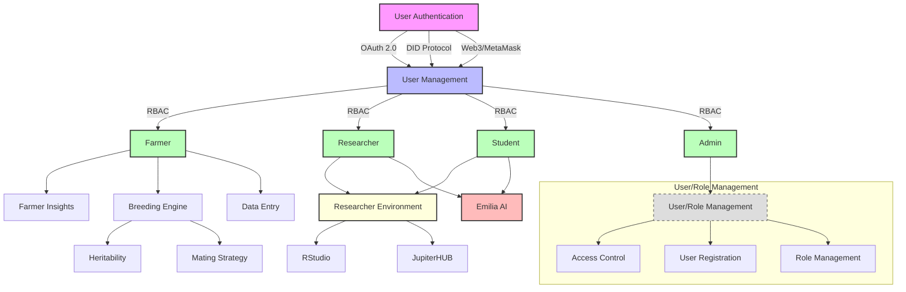
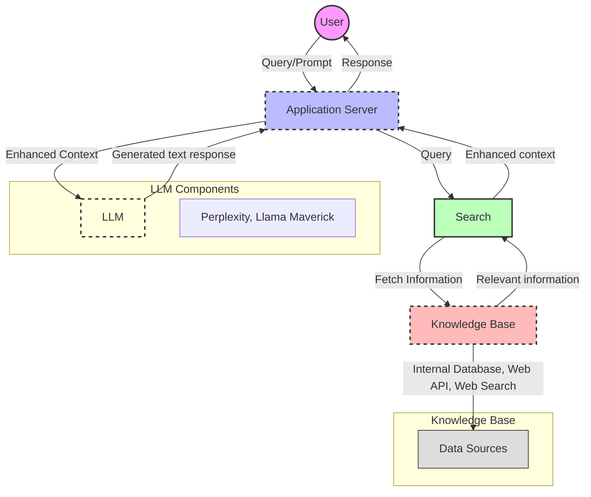
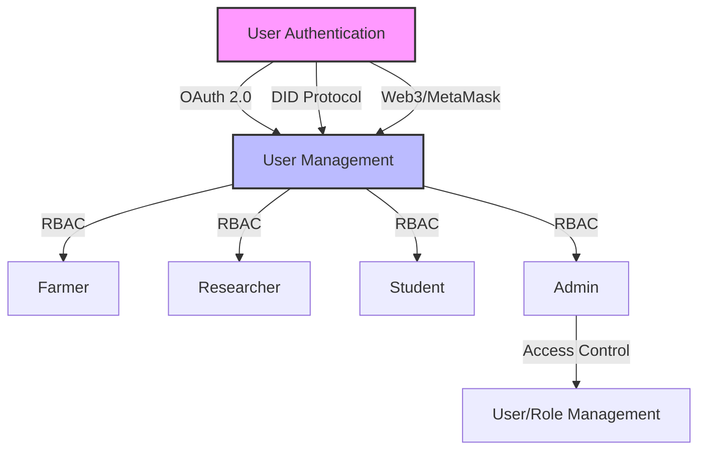
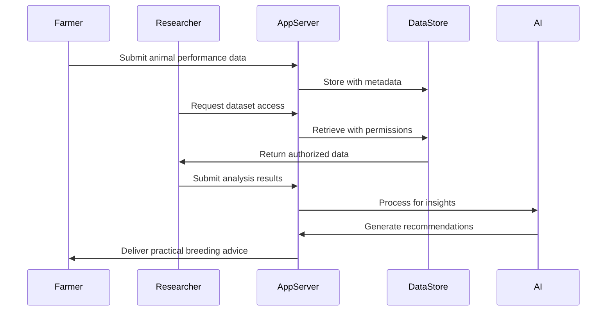

# Architecture Overview

## Introduction to the Animal Genetics Research Platform

The Animal Genetics Research Platform is a comprehensive system designed to bridge the gap between animal genetics researchers, livestock farmers, and students. This platform integrates advanced genomic analysis tools, AI-assisted research capabilities, and practical breeding insights within a unified ecosystem.

## System Purpose

The platform serves as a centralized environment for animal genetics research, breeding program management, and knowledge transfer between academic institutions and farming communities. It enables:

- Sophisticated genomic analysis for livestock improvement
- Data-driven breeding decisions for farmers
- Collaborative research across institutions
- Educational opportunities for animal science students
- AI-assisted interpretation of complex genetic data

## High-Level Architecture

The following diagram illustrates the high-level architecture of the Animal Genetics Research Platform:

*Figure 1: High-level architecture of the Animal Genetics Research Platform showing the integration of all major components including user interfaces, backend services, databases, and the Emilia AI system.*

## Core Components

The platform consists of several integrated components:

### 1. User Interface Layer

Provides role-specific interfaces for:
- Farmers managing breeding programs and livestock data
- Researchers conducting genomic analyses
- Students learning animal genetics concepts
- Administrators managing the platform

### 2. Application Server

The central coordination layer that:
- Manages user authentication and authorization
- Routes requests to appropriate services
- Orchestrates workflow between components
- Handles data validation and processing

### 3. Knowledge Base

A comprehensive repository containing:
- Animal genomic and phenotypic databases
- Scientific literature on animal genetics
- Historical breeding outcomes and performance data
- Educational resources and reference materials

### 4. Search & Retrieval System

Sophisticated information retrieval that:
- Indexes all platform content and external sources
- Provides context-aware search capabilities
- Supports natural language queries
- Retrieves relevant information for the AI system

### 5. Emilia AI Integration

Emilia AI serves as the intelligent assistant within the platform, providing advanced capabilities for both farmers and researchers. The architecture of Emilia AI is illustrated below:

*Figure 2: Emilia AI architecture showing the components that enable natural language understanding, context-aware responses, and integration with the platform's knowledge base.*

Emilia AI provides:
- Natural language understanding of livestock genetics queries
- Context-aware responses tailored to user expertise level
- Integration of retrieved information with generated content
- Multi-modal input processing (text, images, data)
- RAG (Retrieval-Augmented Generation) for research literature analysis
- Database query capabilities for generating insights and visualizations

### 6. Research Environment

Computational tools for researchers:
- RStudio for statistical genetic analysis
- JupyterHub for Python-based genomic research
- Specialized breeding simulation tools
- Visualization capabilities for complex genetic data

### 7. Data Storage & Management

Robust data infrastructure including:
- Sheep genetics database (see [Sheep Genetics Schema](components/sheep-genetics-schema.md))
- Secure storage for sensitive breeding data
- Version control for research datasets
- Data lineage tracking and provenance

## Authentication & Security Architecture

The platform implements a multi-layered security approach:

## Data Flow Architecture

The following diagram illustrates how data flows through the system:

## Integration Architecture

The platform connects with external systems through:

- RESTful APIs for third-party applications
- Data exchange protocols for livestock management software
- Authentication integrations with institutional systems
- Connectors to genomic databases and repositories

## Deployment Architecture

The system is deployed using:

- Containerized microservices for scalability
- Cloud-based infrastructure for accessibility
- Edge computing for offline farmer capabilities
- High-performance computing for genomic analyses

## Scalability Considerations

The architecture is designed to scale in multiple dimensions:

- User base growth across all personas
- Increasing genomic dataset sizes
- Expanding knowledge base of research literature
- Growing computational demands for genetic analyses

## Resilience & Availability

To ensure continuous operation, the platform implements:

- Redundant storage for critical genetic data
- Distributed processing for high-availability
- Automated backup and recovery procedures
- Graceful degradation during partial outages

## Future Architecture Evolution

The architecture is designed to accommodate:

- Integration of emerging genomic technologies
- Expansion to additional livestock species
- Enhanced AI capabilities for breeding optimization
- Increased automation of data collection and analysis

For detailed information about specific components, please refer to the [System Components](system-components.md) section.
