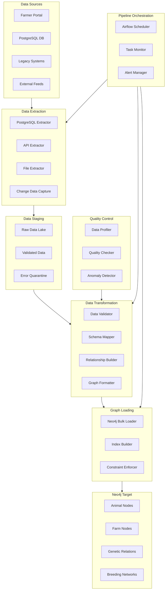
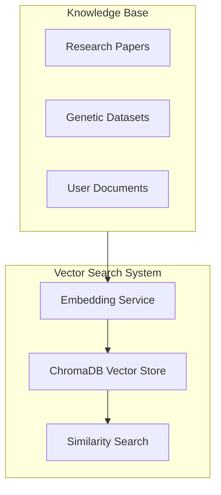
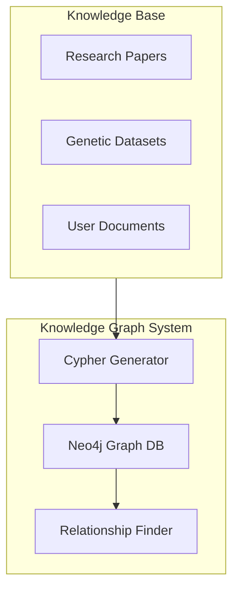

# Data Flow & Integration

## Introduction

The Animal Genetics Research Platform implements a sophisticated data flow and integration architecture that combines real-time streaming, batch processing, and external API integration. This document details the platform's data movement patterns, integration points, and orchestration mechanisms that ensure data consistency, timeliness, and reliability across all system components.

## Data Flow Architecture Overview

The platform employs a hybrid data flow architecture that balances the need for real-time updates with complex data transformations and external integrations. This approach ensures that:

1. Critical genetic data changes propagate immediately to analytical systems
2. Complex transformations maintain data quality and consistency
3. External research data is regularly integrated and made available
4. All data flows are monitored, logged, and recoverable

### High-Level Data Flow Diagram



## Hybrid ETL Architecture

The platform implements a hybrid ETL approach combining real-time CDC streaming with orchestrated batch processing to optimize for both performance and reliability:

### 1. Real-Time CDC Stream (Critical Data)

The Change Data Capture (CDC) stream ensures immediate synchronization of critical genetic data changes:

#### Purpose:
- Immediate synchronization of critical genetic data changes
- Maintaining consistency between operational and analytical systems
- Supporting real-time decision making

#### Technology Stack:
- **Debezium**: For change data capture from PostgreSQL
- **Apache Kafka**: For reliable message streaming
- **Neo4j Sink Connector**: For loading data into Neo4j

#### Data Flow:
1. Changes in PostgreSQL tables are captured by Debezium
2. Change events are published to Kafka topics
3. Neo4j Sink Connector consumes events and updates Neo4j
4. Confirmation events are published back to Kafka

#### Configuration Example:

```yaml
# Debezium CDC Configuration
apiVersion: kafka.strimzi.io/v1beta2
kind: KafkaConnector
metadata:
  name: postgres-source-connector
spec:
  class: io.debezium.connector.postgresql.PostgresConnector
  tasksMax: 1
  config:
    database.hostname: genetics-postgres.cluster-xxx.us-west-2.rds.amazonaws.com
    database.port: 5432
    database.user: debezium_user
    database.password: ${file:/opt/kafka/external-configuration/connector-config/password.txt:password}
    database.dbname: genetics_platform
    database.server.name: genetics-postgres
    table.include.list: public.animals,public.genetic_data,public.pedigree
    transforms: route
    transforms.route.type: org.apache.kafka.connect.transforms.RegexRouter
    transforms.route.regex: ([^.]+)\\.([^.]+)\\.([^.]+)
    transforms.route.replacement: $3
```

#### Neo4j Sink Configuration:

```yaml
apiVersion: kafka.strimzi.io/v1beta2
kind: KafkaConnector
metadata:
  name: neo4j-sink-connector
spec:
  class: streams.kafka.connect.sink.Neo4jSinkConnector
  tasksMax: 1
  config:
    neo4j.server.uri: bolt://neo4j-cluster:7687
    neo4j.authentication.basic.username: neo4j
    neo4j.authentication.basic.password: ${file:/opt/kafka/external-configuration/connector-config/neo4j-password.txt:password}
    neo4j.topic.cypher.animals: |
      MERGE (a:Animal {id: event.id})
      SET a.name = event.name,
          a.breed = event.breed,
          a.birth_date = event.birth_date,
          a.updated_at = timestamp()
    neo4j.topic.cypher.genetic_data: |
      MATCH (a:Animal {id: event.animal_id})
      MERGE (g:GeneticData {id: event.id})
      SET g.markers = event.markers,
          g.traits = event.traits,
          g.updated_at = timestamp()
      MERGE (a)-[:HAS_GENETIC_DATA]->(g)
```

### 2. Apache Airflow Orchestration (Complex Processing)

Apache Airflow handles complex data transformations and external API integration:

#### Purpose:
- Complex data transformations and external API integration
- Data quality validation and error handling
- Scheduled and event-driven processing
- Monitoring and alerting for data pipelines

#### Technology Stack:
- **Apache Airflow**: For workflow orchestration
- **Custom DAGs**: For defining workflow logic
- **Operators**: For task execution
- **Sensors**: For event detection

#### Data Flow:
1. Airflow scheduler triggers DAGs based on schedule or events
2. Tasks extract data from sources (PostgreSQL, APIs, files)
3. Transformation tasks process and validate data
4. Loading tasks insert data into target systems
5. Monitoring tasks track pipeline health and performance

#### Airflow DAG Example:

```python
# Airflow DAG for External API Integration and Batch Processing
from airflow import DAG
from airflow.operators.python_operator import PythonOperator
from airflow.operators.bash_operator import BashOperator
from datetime import datetime, timedelta
import requests
import chromadb

default_args = {
    'owner': 'genetics-platform',
    'depends_on_past': False,
    'start_date': datetime(2024, 1, 1),
    'email_on_failure': True,
    'email_on_retry': False,
    'retries': 2,
    'retry_delay': timedelta(minutes=5)
}

dag = DAG(
    'genetics_etl_pipeline',
    default_args=default_args,
    description='Genetics Platform ETL Pipeline',
    schedule_interval='@hourly',
    catchup=False
)

def fetch_pubmed_data(**context):
    """Fetch latest research papers from PubMed API"""
    pubmed_api = "https://eutils.ncbi.nlm.nih.gov/entrez/eutils/"
    search_terms = ["animal genetics", "livestock breeding", "genomic selection"]
    
    papers = []
    for term in search_terms:
        response = requests.get(f"{pubmed_api}esearch.fcgi", params={
            'db': 'pubmed',
            'term': term,
            'retmax': 50,
            'format': 'json'
        })
        papers.extend(response.json().get('esearchresult', {}).get('idlist', []))
    
    return papers

def process_and_embed_papers(**context):
    """Process papers and store embeddings in ChromaDB"""
    paper_ids = context['task_instance'].xcom_pull(task_ids='fetch_pubmed_data')
    # Processing logic here
    # Store in ChromaDB
    return True

# Task definitions
fetch_papers = PythonOperator(
    task_id='fetch_pubmed_data',
    python_callable=fetch_pubmed_data,
    provide_context=True,
    dag=dag
)

process_papers = PythonOperator(
    task_id='process_and_embed_papers',
    python_callable=process_and_embed_papers,
    provide_context=True,
    dag=dag
)

# Task dependencies
fetch_papers >> process_papers
```

## Integration Points

The platform features several key integration points that enable data flow between components:

### 1. PostgreSQL to Neo4j Integration

#### Purpose:
- Transform relational animal and genetic data into graph representation
- Enable relationship-based queries and network analysis
- Support the RAG system with structured knowledge

#### Integration Method:
- Real-time CDC for critical tables
- Batch processing for historical data and complex transformations
- Bidirectional validation to ensure consistency

#### Data Mapping:
| PostgreSQL Entity | Neo4j Representation | Integration Method |
|-------------------|----------------------|-------------------|
| Animal Records | Animal Nodes | CDC Stream |
| Genetic Markers | GeneticData Nodes | CDC Stream |
| Pedigree Relationships | HAS_PARENT Relationships | CDC Stream |
| Breeding Records | BRED_WITH Relationships | Airflow DAG |
| Farm Data | Farm Nodes | Airflow DAG |
| Research Projects | Project Nodes | Airflow DAG |

### 2. External Research API Integration

#### Purpose:
- Incorporate latest research papers into the knowledge base
- Enrich the platform with external scientific knowledge
- Support the RAG system with up-to-date research

#### Integration Method:
- Scheduled Airflow DAGs for regular updates
- Event-driven processing for specific research areas
- Incremental updates to minimize API usage

#### External Sources:
- **PubMed API**: Medical and biological research
- **Nature API**: Scientific publications
- **ArXiv API**: Preprint research papers
- **Specialized Genetic Databases**: Domain-specific genetic information

#### Processing Pipeline:
1. Extract metadata and content from APIs
2. Generate embeddings for vector search
3. Extract entities and relationships for knowledge graph
4. Store in ChromaDB and Neo4j
5. Update search indices and relationships

### 3. Research Environment Integration

#### Purpose:
- Enable researchers to access platform data
- Allow research results to be incorporated back into the platform
- Support collaborative research workflows

#### Integration Method:
- S3-based data exchange
- API-based data access
- Containerized research environments

#### Data Flow:
1. Researchers access data via Research API
2. Analysis is performed in RStudio or JupyterHub
3. Results are stored in S3 workspaces
4. Selected results are incorporated into the platform via Airflow DAGs

## Data Quality Management

The platform implements comprehensive data quality management across all data flows:

### 1. Validation Rules

- **Schema Validation**: Ensures data conforms to expected structure
- **Business Rule Validation**: Enforces domain-specific constraints
- **Referential Integrity**: Maintains relationships between entities
- **Format Validation**: Checks data format compliance

### 2. Error Handling

- **Error Quarantine**: Isolates problematic data for review
- **Retry Mechanisms**: Attempts to recover from transient failures
- **Fallback Strategies**: Provides alternative processing paths
- **Notification System**: Alerts administrators to critical issues

### 3. Data Quality Monitoring

- **Data Profiling**: Analyzes data characteristics and patterns
- **Quality Metrics**: Tracks data quality over time
- **Anomaly Detection**: Identifies unusual data patterns
- **Reconciliation Checks**: Verifies consistency across systems

## Emilia AI Data Integration

The Emilia AI system integrates data from multiple sources to provide intelligent responses:

### 1. Vector Search Integration



#### Data Flow:
1. Documents from various sources are processed
2. Embeddings are generated using language models
3. Vectors are stored in ChromaDB
4. Similarity search retrieves relevant context for queries

### 2. Knowledge Graph Integration



#### Data Flow:
1. Entities and relationships are extracted from documents
2. Graph structures are created in Neo4j
3. Cypher queries retrieve relationship-based context
4. Results are merged with vector search results

## Data Lifecycle Management

The platform manages data throughout its lifecycle:

### 1. Data Creation and Ingestion

- **User Input**: Data entered through web and mobile interfaces
- **API Integration**: Data from external research sources
- **Batch Import**: Historical data loading
- **Real-time Capture**: Streaming data from operational systems

### 2. Data Processing and Storage

- **Transformation**: Converting between data formats and models
- **Enrichment**: Adding context and metadata
- **Indexing**: Creating search and retrieval structures
- **Storage**: Persisting in appropriate database systems

### 3. Data Access and Usage

- **API Access**: Structured data retrieval via APIs
- **Research Environments**: Data analysis in RStudio and JupyterHub
- **AI Integration**: Context retrieval for RAG system
- **Reporting**: Aggregated data for dashboards and reports

### 4. Data Archival and Retention

- **Tiered Storage**: Moving less-accessed data to cost-effective storage
- **Retention Policies**: Defining how long different data types are kept
- **Archival Process**: Preserving historical data for compliance
- **Purging Protocols**: Secure deletion of obsolete data

## Integration Monitoring and Observability

The platform provides comprehensive monitoring of all data flows and integrations:

### 1. Metrics Collection

- **Throughput**: Volume of data processed over time
- **Latency**: Time taken for data to flow through the system
- **Error Rates**: Frequency and types of processing failures
- **Data Quality**: Metrics on data validity and completeness

### 2. Logging and Tracing

- **Data Flow Logs**: Records of data movement between systems
- **Transformation Logs**: Details of data changes during processing
- **Error Logs**: Information about processing failures
- **Distributed Tracing**: End-to-end visibility of data flows

### 3. Alerting and Notification

- **Threshold Alerts**: Notifications when metrics exceed thresholds
- **Failure Alerts**: Immediate notification of critical failures
- **SLA Monitoring**: Tracking of service level agreement compliance
- **Trend Analysis**: Alerts based on unusual patterns or trends

## Conclusion

The Animal Genetics Research Platform's data flow and integration architecture provides a robust foundation for managing complex data across multiple systems. By combining real-time streaming with orchestrated batch processing, the platform ensures that data is available when and where it's needed, while maintaining quality and consistency. The integration of external research sources and the sophisticated Emilia AI system creates a comprehensive knowledge ecosystem that supports advanced genetic research and farm management.
