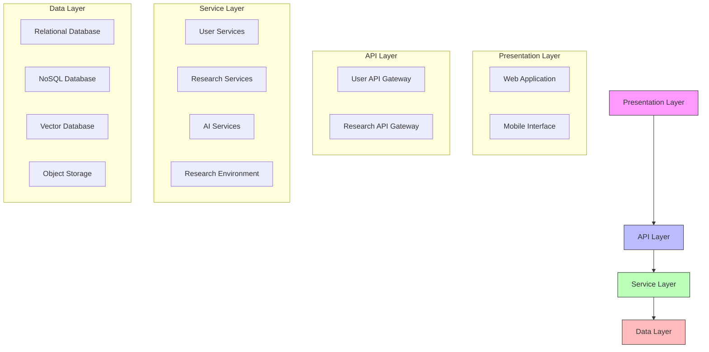
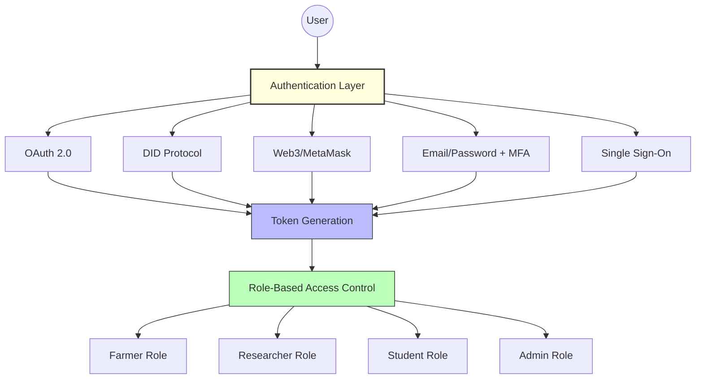
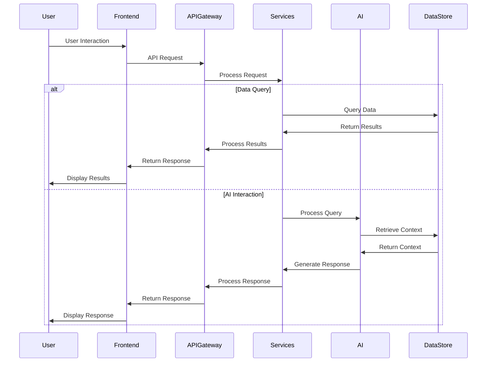
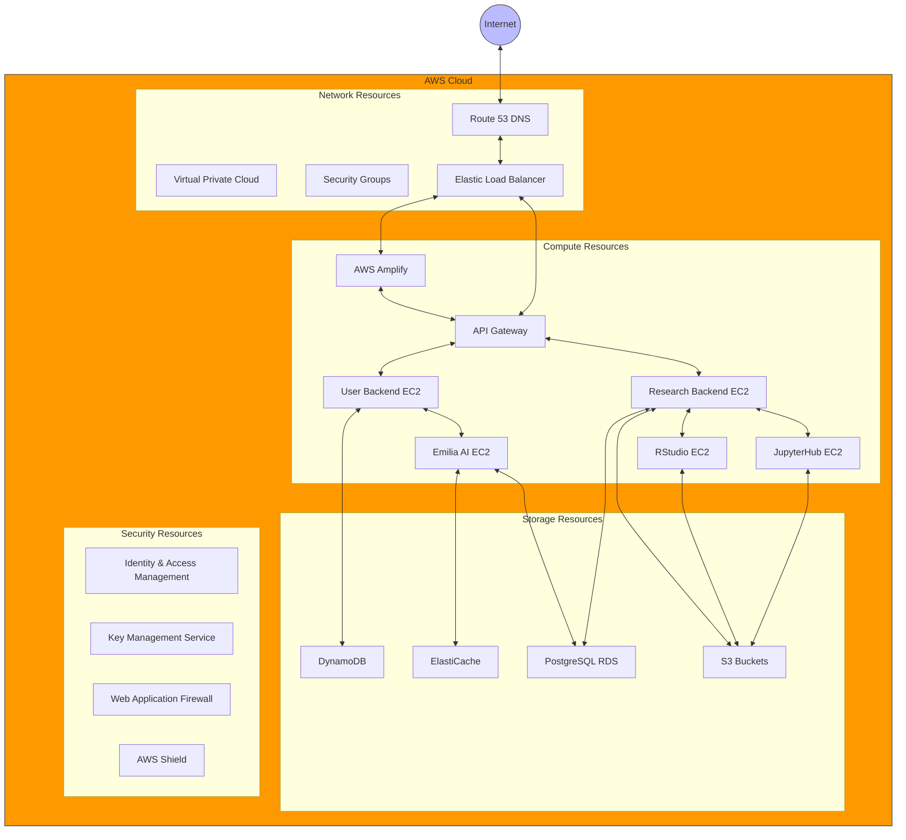
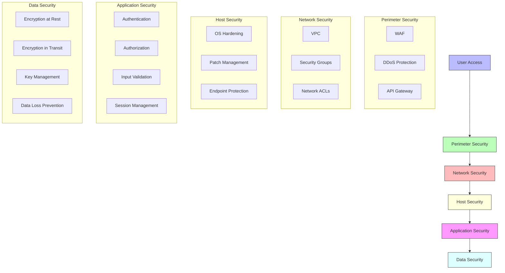
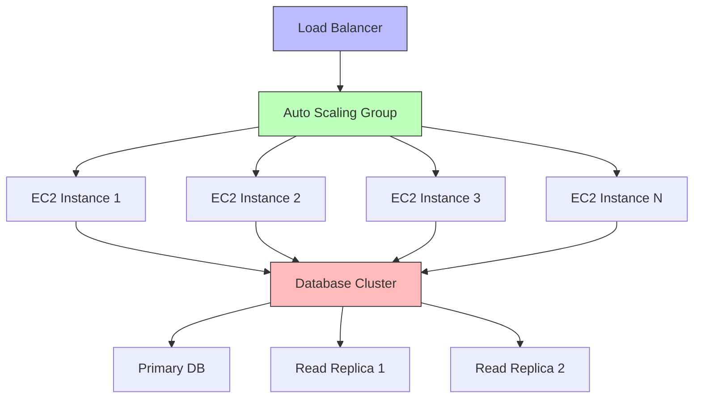

# Architecture Overview

## Introduction

The Agricultural Research Platform with Emilia AI integration is designed as a modern, cloud-native system that combines robust research capabilities with intuitive user experiences. This section provides a comprehensive overview of the system architecture, including key components, integration points, data flows, and design principles.

## Architectural Vision

The architecture is designed to achieve the following objectives:

1. **Scalability**: Support growth in users, data volume, and computational demands
2. **Flexibility**: Accommodate evolving research methodologies and technologies
3. **Security**: Protect sensitive research data and user information
4. **Performance**: Deliver responsive experiences across diverse usage scenarios
5. **Maintainability**: Enable efficient development and operations
6. **Interoperability**: Integrate with external systems and data sources

## High-Level Architecture

The following diagram illustrates the high-level architecture of the Agricultural Research Platform:

```mermaid
flowchart TD
    %% User Interaction
    User((User fa:fa-user)) <--> Frontend

    %% Frontend
    subgraph Frontend_AWS["Frontend (AWS Amplify)"]
        Frontend[React/Next.js Application fa:fa-react]
    end
    
    %% API Gateways
    Frontend <--> UAPI[User API Gateway fa:fa-network-wired]
    Frontend <--> RAPI[Research API Gateway fa:fa-network-wired]
    
    %% Backend Services
    subgraph UserBackend["User Backend (EC2 - Bun.js)"]
        UAPI --> AuthService[Authentication Service fa:fa-key]
        UAPI --> UserService[User Management fa:fa-users]
        UAPI --> SessionService[Session Management fa:fa-clock]
        UAPI --> EmiliaService[Emilia AI Orchestrator fa:fa-robot]
    end
    
    subgraph ResearchBackend["Research Backend (EC2 - FastAPI)"]
        RAPI --> FarmerService[Farmer Data Service fa:fa-leaf]
        RAPI --> BreedingService[Breeding Engine fa:fa-dna]
        RAPI --> ResearchService[Research Data Service fa:fa-flask]
        RAPI --> AnalyticsService[Analytics Service fa:fa-chart-line]
    end
    
    %% Researcher Environment
    subgraph ResearcherEnv["Researcher Environment"]
        RAPI --> RStudioEC2[RStudio Server EC2 fa:fa-chart-bar]
        RAPI --> JupyterEC2[JupyterHub EC2 fa:fa-code]
        
        RStudioEC2 --> WorkspaceManager[Workspace Manager fa:fa-folder]
        JupyterEC2 --> WorkspaceManager
        
        WorkspaceManager --> AutosaveService[Autosave Service fa:fa-save]
    end
    
    %% Emilia AI Components - Separate EC2
    subgraph EmiliaEC2["Emilia AI (EC2)"]
        EmiliaService --> AppServer[Application Server fa:fa-server]
        AppServer --> LLMService[LLM Service fa:fa-brain]
        AppServer --> SearchService[Search Service fa:fa-search]
        
        %% LLM Integration
        LLMService --> Perplexity[Perplexity fa:fa-comment-dots]
        LLMService --> LlamaMaverick[Llama Maverick fa:fa-comment-dots]
        
        %% Knowledge Base
        SearchService --> KnowledgeBase[Knowledge Base fa:fa-database]
        KnowledgeBase --> ChromaDB[ChromaDB fa:fa-layer-group]
        KnowledgeBase --> DirectDB[Direct DB Access fa:fa-plug]
        KnowledgeBase --> JournalAPI[Journal APIs fa:fa-book]
    end
    
    %% Storage Services
    WorkspaceManager --- UserDDB[(DynamoDB\nUser Data & Workspace Metadata fa:fa-table)]
    AutosaveService --- UserContentS3[(S3 Bucket\nUser Uploads & Workspaces fa:fa-file-archive)]
    
    %% Other Databases
    AuthService --> UserDDB
    UserService --> UserDDB
    SessionService --> UserDDB
    EmiliaService --> UserDDB
    
    FarmerService --> PostgreSQL[(PostgreSQL RDS\nResearch Data fa:fa-database)]
    BreedingService --> PostgreSQL
    ResearchService --> PostgreSQL
    AnalyticsService --> PostgreSQL
    
    DirectDB --> PostgreSQL
    ChromaDB --> VectorDB[(Vector Database\nScientific Literature fa:fa-bookmark)]
    
    %% Styling
    classDef frontend fill:#f9f,stroke:#333,stroke-width:1px
    classDef backend fill:#bbf,stroke:#333,stroke-width:1px
    classDef db fill:#bfb,stroke:#333,stroke-width:1px
    classDef ai fill:#fbb,stroke:#333,stroke-width:1px
    classDef auth fill:#ffd,stroke:#333,stroke-width:1px
    classDef role fill:#dff,stroke:#333,stroke-width:1px
    classDef research fill:#e9d5ff,stroke:#333,stroke-width:1px
    classDef storage fill:#d1fae5,stroke:#333,stroke-width:1px
    
    class Frontend frontend
    class AuthService,UserService,SessionService,EmiliaService,FarmerService,BreedingService,ResearchService,AnalyticsService backend
    class UserDDB,PostgreSQL,VectorDB db
    class AppServer,LLMService,SearchService,KnowledgeBase,ChromaDB,DirectDB,JournalAPI,Perplexity,LlamaMaverick ai
    class OAuth,DID,Web3,AuthService auth
    class RStudioEC2,JupyterEC2,WorkspaceManager,AutosaveService research
    class UserContentS3 storage
```

## Architectural Layers

The system is organized into the following architectural layers:

### Presentation Layer

The presentation layer provides user interfaces for different personas and devices:

- **Web Application**: React/Next.js application hosted on AWS Amplify
- **Mobile Interface**: Responsive web design optimized for mobile devices
- **Research Environments**: RStudio and JupyterHub interfaces for data analysis

### API Layer

The API layer manages communication between frontend applications and backend services:

- **User API Gateway**: Handles authentication, user management, and AI interactions
- **Research API Gateway**: Manages research data, breeding engine, and analytics services

### Service Layer

The service layer contains the core business logic of the platform:

- **User Services**: Authentication, user management, session management
- **Research Services**: Farmer data, breeding engine, research data, analytics
- **AI Services**: Emilia AI orchestration, LLM integration, knowledge base
- **Research Environment**: RStudio, JupyterHub, workspace management

### Data Layer

The data layer manages persistent storage of system data:

- **Relational Database**: PostgreSQL RDS for structured research data
- **NoSQL Database**: DynamoDB for user data and workspace metadata
- **Vector Database**: For embedding-based retrieval of scientific literature
- **Object Storage**: S3 for user uploads and workspace content

## Key Components

### Frontend Application

The frontend is built using React and Next.js, providing a responsive and interactive user interface. Key features include:

- **Role-Based UI**: Tailored interfaces for each user persona
- **Responsive Design**: Support for desktop and mobile devices
- **Progressive Web App**: Offline capabilities for field data collection
- **Component Architecture**: Reusable UI components for consistency

### API Gateways

The system uses separate API gateways for user management and research functionality:

- **User API Gateway**: Manages authentication, user profiles, and AI interactions
- **Research API Gateway**: Handles research data, breeding tools, and analytics

This separation allows for independent scaling and deployment of these distinct functional areas.

### User Backend Services

User-related services are implemented using Bun.js for performance and efficiency:

- **Authentication Service**: Manages multiple authentication methods
- **User Management**: Handles user profiles and role-based access control
- **Session Management**: Manages user sessions and state
- **Emilia AI Orchestrator**: Coordinates AI interactions and context management

### Research Backend Services

Research-focused services are implemented using FastAPI for performance and type safety:

- **Farmer Data Service**: Manages farm data collection and insights
- **Breeding Engine**: Implements genomic selection and breeding tools
- **Research Data Service**: Handles scientific datasets and experiments
- **Analytics Service**: Provides data analysis and visualization capabilities

### Researcher Environment

The researcher environment provides computational tools for agricultural research:

- **RStudio Server**: R-based statistical analysis environment
- **JupyterHub**: Python-based data science environment
- **Workspace Manager**: Manages user workspaces and resources
- **Autosave Service**: Ensures work is preserved automatically

### Emilia AI Components

Emilia AI provides intelligent assistance through:

- **Application Server**: Manages AI request handling and orchestration
- **LLM Service**: Integrates with language models (Perplexity, Llama Maverick)
- **Search Service**: Retrieves relevant information from knowledge sources
- **Knowledge Base**: Manages access to scientific literature and research data

### Storage Services

The platform uses multiple storage services for different data types:

- **DynamoDB**: NoSQL database for user data and workspace metadata
- **PostgreSQL RDS**: Relational database for research data
- **S3 Bucket**: Object storage for user uploads and workspace content
- **Vector Database**: Specialized storage for embedding-based retrieval

## Authentication Architecture

The platform supports multiple authentication methods to accommodate different user needs:

## Data Flow Architecture

The following diagram illustrates the key data flows within the system:

## Deployment Architecture

The system is deployed on AWS with the following architecture:

## Security Architecture

The security architecture implements defense in depth with multiple layers of protection:

## Scalability Architecture

The system is designed to scale horizontally and vertically to accommodate growing demand:

## Architectural Principles

The architecture adheres to the following principles:

1. **Microservices Architecture**: Decomposition into independently deployable services
2. **API-First Design**: Well-defined APIs for all service interactions
3. **Infrastructure as Code**: Automated deployment and configuration
4. **Immutable Infrastructure**: Replace rather than modify deployed resources
5. **Defense in Depth**: Multiple layers of security controls
6. **Observability**: Comprehensive logging, monitoring, and tracing
7. **Resilience**: Fault tolerance and graceful degradation
8. **Cloud-Native**: Leverage managed services where appropriate

## Architecture Decision Records

Key architectural decisions are documented in Architecture Decision Records (ADRs) to provide context and rationale:

1. **ADR-001**: Selection of React/Next.js for frontend development
2. **ADR-002**: Separation of User and Research API Gateways
3. **ADR-003**: Use of Bun.js for User Backend Services
4. **ADR-004**: Selection of FastAPI for Research Backend Services
5. **ADR-005**: Integration approach for LLM services
6. **ADR-006**: Data storage strategy and technology selection
7. **ADR-007**: Authentication methods and implementation
8. **ADR-008**: Deployment architecture on AWS

For detailed information on each component, see the [System Components](system-components.md) section.
