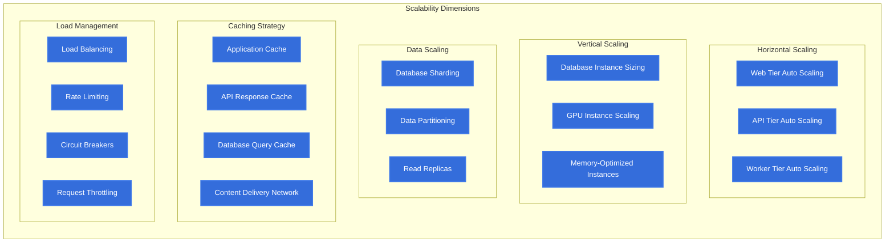

# Scalability & Performance

## Introduction

The Animal Genetics Research Platform is designed to handle varying workloads, from routine farm data entry to computationally intensive genetic analysis and AI-powered research queries. This document outlines the platform's scalability and performance architecture, detailing strategies for resource optimization, scaling mechanisms, performance monitoring, and resilience.

## Scalability Design Principles

The platform's scalability architecture is built on the following core principles:

1. **Horizontal Scalability**: Ability to scale out by adding more instances
2. **Vertical Scalability**: Strategic use of larger instances for specific workloads
3. **Elastic Resource Allocation**: Dynamic adjustment based on demand
4. **Stateless Services**: Enabling seamless scaling of application components
5. **Distributed Processing**: Parallel execution of computational workloads
6. **Caching Strategy**: Multi-level caching to reduce database load
7. **Asynchronous Processing**: Non-blocking operations for improved throughput

## Scalability Architecture Overview

The platform implements a multi-dimensional scaling architecture that addresses different types of workloads:



## 1. Compute Scaling Strategies

### 1.1 Horizontal Scaling

The platform implements horizontal scaling for stateless components:

#### Auto Scaling Groups

| Component | Min Instances | Max Instances | Scaling Trigger | Cooldown Period |
|-----------|---------------|---------------|-----------------|-----------------|
| User Backend API | 3 | 10 | CPU > 70%, Request Count > 1000/min | 60 seconds |
| Research API | 3 | 10 | CPU > 70%, Memory > 80% | 60 seconds |
| RAG Engine | 2 | 8 | Queue Length > 100, CPU > 60% | 120 seconds |
| RStudio Server | 3 | 10 | User Count > 20, Memory > 70% | 300 seconds |
| JupyterHub | 3 | 10 | User Count > 20, Memory > 70% | 300 seconds |

#### Scaling Implementation

```yaml
# Example Auto Scaling Configuration for Research API
apiVersion: autoscaling/v2
kind: HorizontalPodAutoscaler
metadata:
  name: research-api-hpa
spec:
  scaleTargetRef:
    apiVersion: apps/v1
    kind: Deployment
    name: research-api
  minReplicas: 3
  maxReplicas: 10
  metrics:
  - type: Resource
    resource:
      name: cpu
      target:
        type: Utilization
        averageUtilization: 70
  - type: Resource
    resource:
      name: memory
      target:
        type: Utilization
        averageUtilization: 80
  behavior:
    scaleDown:
      stabilizationWindowSeconds: 300
    scaleUp:
      stabilizationWindowSeconds: 60
```

### 1.2 Vertical Scaling

Strategic vertical scaling is applied to components that benefit from larger instances:

#### Instance Type Selection

| Component | Instance Type | vCPUs | Memory | Scaling Consideration |
|-----------|---------------|-------|--------|------------------------|
| PostgreSQL RDS | db.r6g.2xlarge | 8 | 64 GB | Memory-optimized for query performance |
| Neo4j | r6g.4xlarge | 16 | 128 GB | Memory-optimized for graph operations |
| JupyterHub GPU Nodes | g4dn.xlarge | 4 | 16 GB | GPU-enabled for ML workloads |
| ChromaDB | r6g.2xlarge | 8 | 64 GB | Memory-optimized for vector operations |

#### Vertical Scaling Automation

- **Scheduled Scaling**: Predictive scaling based on usage patterns
- **Performance-Based Scaling**: Monitoring-triggered instance type changes
- **Reserved Capacity**: Pre-provisioned capacity for critical workloads
- **Burst Capacity**: Ability to temporarily scale up for intensive operations

## 2. Database Scaling Strategies

### 2.1 PostgreSQL Scaling

The PostgreSQL database is scaled using:

- **Read Replicas**: 2-3 read replicas for distributing read traffic
- **Connection Pooling**: PgBouncer for efficient connection management
- **Query Optimization**: Regular query performance analysis and tuning
- **Partitioning**: Table partitioning for large datasets
- **Vertical Scaling**: Instance size increases for growing workloads

#### Read Replica Configuration

```yaml
# PostgreSQL Read Replica Configuration
apiVersion: postgresql.cnpg.io/v1
kind: Cluster
metadata:
  name: genetics-postgres-cluster
spec:
  instances: 3
  primaryUpdateStrategy: unsupervised
  storage:
    size: 500Gi
    storageClass: gp3
  bootstrap:
    recovery:
      source: genetics-postgres-primary
  replica:
    enabled: true
    count: 2
    source: genetics-postgres-primary
  monitoring:
    enablePodMonitor: true
```

### 2.2 Neo4j Scaling

The Neo4j graph database is scaled using:

- **Causal Clustering**: Core servers for write operations with read replicas
- **Read Routing**: Intelligent routing of read queries to appropriate instances
- **Cache Tuning**: Optimized memory allocation for graph caching
- **Query Optimization**: Cypher query optimization and indexing
- **Horizontal Read Scaling**: Additional read replicas for query-heavy workloads

#### Neo4j Cluster Configuration

```yaml
# Neo4j Cluster Configuration
apiVersion: neo4j.com/v1
kind: Neo4jCluster
metadata:
  name: genetics-neo4j
spec:
  minimumClusterSize: 3
  neo4j:
    resources:
      requests:
        cpu: "4"
        memory: "16Gi"
      limits:
        cpu: "8"
        memory: "64Gi"
  volumes:
    data:
      storage: 500Gi
      storageClassName: gp3
  readReplicas:
    count: 2
    resources:
      requests:
        cpu: "4"
        memory: "16Gi"
      limits:
        cpu: "8"
        memory: "32Gi"
```

### 2.3 ChromaDB Scaling

The ChromaDB vector database is scaled using:

- **Distributed Deployment**: Multiple nodes for horizontal scaling
- **Memory Optimization**: High-memory instances for vector operations
- **Index Partitioning**: Sharding of vector indices across nodes
- **Query Distribution**: Load balancing of similarity search queries
- **Caching Strategy**: In-memory caching of frequent queries

## 3. Caching Architecture

The platform implements a multi-level caching strategy:

### 3.1 Application-Level Caching

- **In-Memory Cache**: Redis for session data and frequent operations
- **Local Cache**: Node-local caching for API responses
- **Distributed Cache**: Shared cache for cross-node consistency
- **Cache Invalidation**: Event-based and time-based invalidation strategies

#### Redis Cache Configuration

```yaml
# Redis Cache Configuration
apiVersion: redis.redis.opstreelabs.in/v1beta1
kind: Redis
metadata:
  name: genetics-platform-cache
spec:
  kubernetesConfig:
    image: redis:7.0.5-alpine
    imagePullPolicy: IfNotPresent
    resources:
      requests:
        cpu: 100m
        memory: 128Mi
      limits:
        cpu: 500m
        memory: 512Mi
  storage:
    volumeClaimTemplate:
      spec:
        accessModes:
          - ReadWriteOnce
        resources:
          requests:
            storage: 5Gi
  redisExporter:
    enabled: true
    image: oliver006/redis_exporter:v1.43.0
  redisConfig:
    maxmemory: 400mb
    maxmemory-policy: allkeys-lru
```

### 3.2 API Response Caching

- **KONG Cache**: API Gateway level caching for repeated requests
- **Cache-Control Headers**: Client-side caching directives
- **Conditional Requests**: ETag and If-Modified-Since support
- **Vary Headers**: Context-specific cache variations

### 3.3 Content Delivery

- **Static Asset Caching**: Long-lived caching for static resources
- **Dynamic Content Caching**: Short-lived caching for semi-static content
- **Edge Caching**: Geographic distribution of cached content
- **Cache Warming**: Proactive caching of anticipated content

## 4. Performance Optimization

### 4.1 Database Performance

The platform optimizes database performance through:

- **Indexing Strategy**: Strategic indexes based on query patterns
- **Query Optimization**: Regular review and tuning of slow queries
- **Execution Plans**: Analysis of query execution plans
- **Connection Pooling**: Efficient management of database connections
- **Read/Write Splitting**: Routing queries to appropriate instances

#### PostgreSQL Performance Tuning

```ini
# PostgreSQL Performance Configuration
shared_buffers = 16GB
effective_cache_size = 48GB
maintenance_work_mem = 2GB
checkpoint_completion_target = 0.9
wal_buffers = 16MB
default_statistics_target = 100
random_page_cost = 1.1
effective_io_concurrency = 200
work_mem = 52MB
min_wal_size = 1GB
max_wal_size = 4GB
max_worker_processes = 8
max_parallel_workers_per_gather = 4
max_parallel_workers = 8
```

### 4.2 Application Performance

Application performance is optimized through:

- **Code Profiling**: Regular performance analysis of application code
- **Asynchronous Processing**: Non-blocking operations for I/O-bound tasks
- **Batch Processing**: Grouping of related operations
- **Resource Pooling**: Efficient management of connections and threads
- **Lazy Loading**: On-demand loading of resources

### 4.3 Network Performance

Network performance is optimized through:

- **Connection Reuse**: HTTP keep-alive and connection pooling
- **Compression**: Response compression for reduced bandwidth
- **Protocol Optimization**: HTTP/2 for multiplexed connections
- **Request Batching**: Combining multiple API calls
- **Proximity Routing**: Routing requests to geographically close instances

## 5. Load Management

### 5.1 Load Balancing

The platform implements sophisticated load balancing:

- **Application Load Balancer**: Layer 7 routing with path-based rules
- **Service Mesh**: Advanced traffic management with Istio
- **Health Checks**: Intelligent routing based on service health
- **Session Affinity**: Consistent routing for stateful operations
- **Weighted Routing**: Traffic distribution based on instance capacity

#### Load Balancer Configuration

```yaml
# AWS ALB Configuration
apiVersion: networking.k8s.io/v1
kind: Ingress
metadata:
  name: genetics-platform-ingress
  annotations:
    kubernetes.io/ingress.class: alb
    alb.ingress.kubernetes.io/scheme: internet-facing
    alb.ingress.kubernetes.io/target-type: ip
    alb.ingress.kubernetes.io/healthcheck-path: /health
    alb.ingress.kubernetes.io/listen-ports: '[{"HTTP": 80}, {"HTTPS": 443}]'
    alb.ingress.kubernetes.io/ssl-redirect: '443'
    alb.ingress.kubernetes.io/load-balancer-attributes: idle_timeout.timeout_seconds=60
spec:
  rules:
    - host: api.genetics-platform.example.com
      http:
        paths:
          - path: /user
            pathType: Prefix
            backend:
              service:
                name: user-api-service
                port:
                  number: 80
          - path: /research
            pathType: Prefix
            backend:
              service:
                name: research-api-service
                port:
                  number: 80
```

### 5.2 Rate Limiting and Throttling

The platform protects against overload through:

- **API Rate Limiting**: KONG Gateway limits on request frequency
- **Graduated Throttling**: Increasing restrictions as load grows
- **User-Based Quotas**: Different limits based on user role
- **Retry Backoff**: Exponential backoff for retries
- **Concurrency Limits**: Caps on simultaneous operations

#### Rate Limiting Configuration

```yaml
# KONG Rate Limiting Plugin Configuration
apiVersion: configuration.konghq.com/v1
kind: KongPlugin
metadata:
  name: rate-limiting
config:
  minute: 60
  hour: 1000
  limit_by: consumer
  policy: local
  fault_tolerant: true
  hide_client_headers: false
  redis_ssl: false
  redis_ssl_verify: false
```

### 5.3 Circuit Breaking

The platform implements circuit breaking to prevent cascading failures:

- **Service Circuit Breakers**: Isolation of failing services
- **Fallback Mechanisms**: Alternative paths when services fail
- **Health Monitoring**: Continuous service health evaluation
- **Gradual Recovery**: Controlled service restoration
- **Bulkhead Pattern**: Isolation of resource pools

## 6. Performance Monitoring and Optimization

### 6.1 Monitoring Infrastructure

The platform provides comprehensive performance monitoring:

- **Prometheus Metrics**: Collection of system and application metrics
- **Grafana Dashboards**: Visualization of performance data
- **Distributed Tracing**: End-to-end request tracking with Jaeger
- **Log Analysis**: Performance insights from application logs
- **Synthetic Monitoring**: Proactive testing of critical paths

#### Prometheus Monitoring Configuration

```yaml
# Prometheus ServiceMonitor Configuration
apiVersion: monitoring.coreos.com/v1
kind: ServiceMonitor
metadata:
  name: api-service-monitor
  labels:
    release: prometheus
spec:
  selector:
    matchLabels:
      app: genetics-api
  endpoints:
  - port: metrics
    interval: 15s
    path: /metrics
  namespaceSelector:
    matchNames:
    - genetics-platform
```

### 6.2 Performance Testing

The platform undergoes regular performance testing:

- **Load Testing**: Verification of system behavior under expected load
- **Stress Testing**: Evaluation of system limits
- **Endurance Testing**: Validation of long-term performance stability
- **Spike Testing**: Assessment of response to sudden load increases
- **Capacity Planning**: Proactive resource allocation based on growth projections

### 6.3 Performance Optimization Process

The platform follows a continuous performance optimization process:

1. **Measure**: Collect performance metrics
2. **Analyze**: Identify bottlenecks and optimization opportunities
3. **Improve**: Implement targeted optimizations
4. **Validate**: Verify performance improvements
5. **Iterate**: Continuous cycle of measurement and improvement

## 7. Resilience and Fault Tolerance

### 7.1 High Availability Architecture

The platform ensures high availability through:

- **Multi-AZ Deployment**: Distribution across availability zones
- **Redundant Components**: No single points of failure
- **Automated Failover**: Seamless transition during component failures
- **Self-Healing**: Automatic recovery from failures
- **Degraded Mode Operation**: Continued functionality during partial outages

#### High Availability Configuration

```yaml
# Kubernetes Deployment with Pod Anti-Affinity
apiVersion: apps/v1
kind: Deployment
metadata:
  name: research-api
spec:
  replicas: 3
  selector:
    matchLabels:
      app: research-api
  template:
    metadata:
      labels:
        app: research-api
    spec:
      affinity:
        podAntiAffinity:
          requiredDuringSchedulingIgnoredDuringExecution:
          - labelSelector:
              matchExpressions:
              - key: app
                operator: In
                values:
                - research-api
            topologyKey: "topology.kubernetes.io/zone"
      containers:
      - name: research-api
        image: genetics-platform/research-api:latest
        resources:
          requests:
            memory: "512Mi"
            cpu: "500m"
          limits:
            memory: "1Gi"
            cpu: "1"
        readinessProbe:
          httpGet:
            path: /health
            port: 8000
          initialDelaySeconds: 5
          periodSeconds: 10
        livenessProbe:
          httpGet:
            path: /health
            port: 8000
          initialDelaySeconds: 15
          periodSeconds: 20
```

### 7.2 Disaster Recovery

The platform implements comprehensive disaster recovery:

- **Regular Backups**: Automated backup of all critical data
- **Cross-Region Replication**: Data replication across AWS regions
- **Recovery Testing**: Regular validation of recovery procedures
- **RTO and RPO Targets**: Defined recovery time and point objectives
- **Disaster Recovery Runbooks**: Documented recovery procedures

### 7.3 Graceful Degradation

The platform is designed for graceful degradation:

- **Feature Toggles**: Ability to disable non-critical features
- **Tiered Service Levels**: Prioritization of critical functionality
- **Asynchronous Fallbacks**: Queuing of operations during high load
- **Static Fallbacks**: Pre-generated content for dynamic components
- **User Communication**: Clear messaging during degraded operation

## 8. Capacity Planning

### 8.1 Resource Modeling

The platform uses sophisticated resource modeling:

- **Workload Profiling**: Characterization of different usage patterns
- **Growth Projections**: Forecasting of user and data growth
- **Seasonal Variations**: Accounting for cyclical demand patterns
- **Resource Allocation**: Mapping of workloads to infrastructure
- **Cost Optimization**: Balancing performance and resource costs

### 8.2 Scaling Thresholds

The platform defines clear scaling thresholds:

| Resource | Warning Threshold | Scaling Threshold | Critical Threshold |
|----------|-------------------|-------------------|-------------------|
| CPU Utilization | 60% | 70% | 85% |
| Memory Utilization | 70% | 80% | 90% |
| Database Connections | 70% | 80% | 90% |
| Storage Utilization | 70% | 80% | 90% |
| Request Queue Length | 50 | 100 | 200 |
| Response Time | 200ms | 500ms | 1000ms |

### 8.3 Predictive Scaling

The platform implements predictive scaling:

- **Usage Pattern Analysis**: Identification of recurring patterns
- **Predictive Models**: Machine learning for load prediction
- **Proactive Scaling**: Resource allocation ahead of demand
- **Scheduled Scaling**: Time-based scaling for known events
- **Feedback Loop**: Continuous refinement of prediction models

## 9. Performance Benchmarks

### 9.1 API Performance Targets

| API Endpoint | Average Response Time | 95th Percentile | Max RPS |
|--------------|------------------------|-----------------|---------|
| User Authentication | < 200ms | < 500ms | 1000 |
| Farm Data Retrieval | < 300ms | < 700ms | 500 |
| Genetic Data Query | < 500ms | < 1s | 200 |
| AI-Assisted Research | < 2s | < 5s | 50 |
| Batch Processing | < 10s | < 30s | 10 |

### 9.2 Database Performance Targets

| Operation | Average Response Time | 95th Percentile | Throughput |
|-----------|------------------------|-----------------|------------|
| Simple Reads | < 10ms | < 50ms | 5000 qps |
| Complex Joins | < 100ms | < 500ms | 500 qps |
| Write Operations | < 20ms | < 100ms | 1000 qps |
| Graph Queries | < 200ms | < 1s | 200 qps |
| Vector Similarity | < 100ms | < 500ms | 100 qps |

### 9.3 Load Testing Results

The platform undergoes regular load testing with the following results:

- **Steady State Performance**: Stable under expected load
- **Peak Load Handling**: Successful management of 3x normal load
- **Scaling Effectiveness**: Linear scaling with added resources
- **Recovery Time**: < 60 seconds recovery from component failures
- **Resource Utilization**: Efficient use of allocated resources

## Conclusion

The Animal Genetics Research Platform's scalability and performance architecture provides a robust foundation for handling varying workloads while maintaining responsive user experiences. By combining horizontal and vertical scaling strategies with comprehensive caching, load management, and performance optimization, the platform can efficiently serve users from small farms to large research institutions. The continuous monitoring and optimization process ensures that the platform evolves to meet changing demands while maintaining performance targets.


