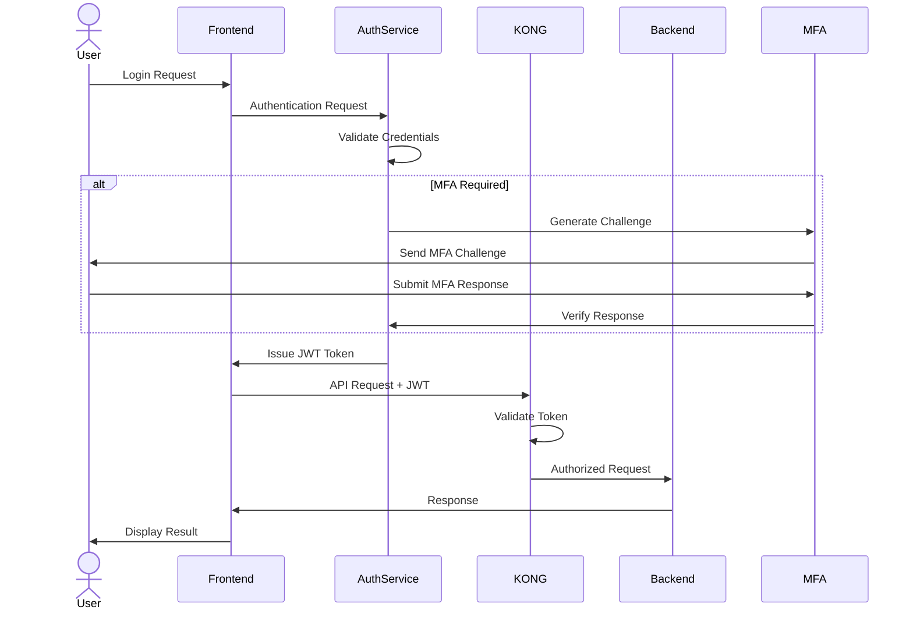
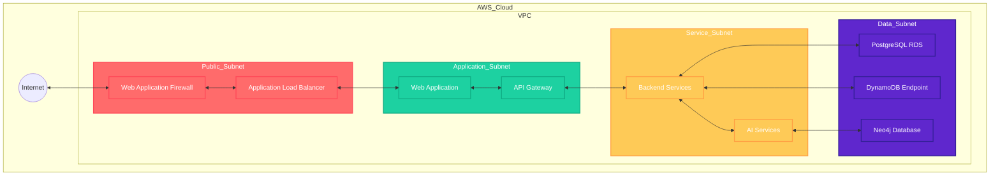

# Security Architecture

## Introduction

The Animal Genetics Research Platform implements a comprehensive security architecture that protects sensitive genetic data, research information, and user privacy. This document outlines the platform's defense-in-depth security strategy, covering authentication, authorization, data protection, network security, and monitoring.

## Security Design Principles

The platform's security architecture is built on the following core principles:

1. **Defense in Depth**: Multiple security layers protect against different threat vectors
2. **Least Privilege**: Users and services access only what they need
3. **Zero Trust**: All access requires verification regardless of location
4. **Secure by Default**: Security controls are enabled by default
5. **Privacy by Design**: Data protection is built into the architecture
6. **Continuous Monitoring**: Security events are constantly monitored and analyzed
7. **Automated Response**: Critical threats trigger automated mitigation actions

## Security Architecture Overview

The platform implements a multi-layered security architecture that protects all aspects of the system:

```mermaid
flowchart TB
    subgraph "Security Layers"
        direction TB
        
        subgraph PerimeterSecurity["Perimeter Security"]
            WAF[Web Application Firewall]
            DDOS[DDoS Protection]
            APIGateway[API Gateway Security]
        end
        
        subgraph NetworkSecurity["Network Security"]
            VPC[VPC Isolation]
            SecurityGroups[Security Groups]
            NetworkACLs[Network ACLs]
        end
        
        subgraph AccessControl["Access Control"]
            IAM[Identity & Access Management]
            RBAC[Role-Based Access Control]
            MFA[Multi-Factor Authentication]
        end
        
        subgraph DataSecurity["Data Security"]
            Encryption[Data Encryption]
            KeyManagement[Key Management]
            DataMasking[Data Masking]
        end
        
        subgraph ApplicationSecurity["Application Security"]
            InputValidation[Input Validation]
            OWASP[OWASP Controls]
            SecureAPIs[API Security]
        end
        
        subgraph MonitoringResponse["Monitoring & Response"]
            SIEM[Security Information & Event Management]
            IDS[Intrusion Detection]
            Logging[Security Logging]
        end
        
        subgraph ComplianceGovernance["Compliance & Governance"]
            Auditing[Security Auditing]
            Compliance[Compliance Controls]
            Policies[Security Policies]
        end
    end
    
    %% Layer connections
    PerimeterSecurity --> NetworkSecurity
    NetworkSecurity --> AccessControl
    AccessControl --> DataSecurity
    DataSecurity --> ApplicationSecurity
    ApplicationSecurity --> MonitoringResponse
    MonitoringResponse --> ComplianceGovernance
    
    %% Styling
    classDef securityLayer fill:#346DDB,stroke:#407AE9,stroke-width:2px,color:#fff
    class PerimeterSecurity,NetworkSecurity,AccessControl,DataSecurity,ApplicationSecurity,MonitoringResponse,ComplianceGovernance securityLayer
```

## 1. Identity and Access Management

### 1.1 Authentication System

The platform implements a robust authentication system:

- **Multi-Factor Authentication (MFA)**: Required for all administrative access and optional for users
- **Single Sign-On (SSO)**: Integration with institutional identity providers via SAML and OAuth 2.0
- **Password Policies**: Enforced complexity, rotation, and history requirements
- **Session Management**: Secure session handling with appropriate timeouts
- **API Authentication**: JWT-based authentication for API access

#### Authentication Flow

### 1.2 Role-Based Access Control (RBAC)

The platform implements fine-grained RBAC to enforce the principle of least privilege:

#### User Roles

| Role | Description | Access Level |
|------|-------------|--------------|
| Administrator | System administrators | Full platform access |
| Researcher | Scientific researchers | Research data and tools |
| Farmer | Farm operators | Farm-specific data |
| Student | Academic learners | Limited research access |
| Guest | Temporary users | Public information only |

#### Permission Matrix

| Resource | Administrator | Researcher | Farmer | Student | Guest |
|----------|---------------|------------|--------|---------|-------|
| User Management | Create, Read, Update, Delete | - | - | - | - |
| Farm Data | Read, Update | Read | Create, Read, Update | Read | - |
| Genetic Data | Read, Update | Create, Read, Update | Read (own) | Read | - |
| Research Tools | Full Access | Full Access | - | Limited | - |
| Analytics | Full Access | Create, Read | Read (own) | Read | - |
| System Config | Full Access | - | - | - | - |

### 1.3 Service-to-Service Authentication

Internal services authenticate using:

- **Mutual TLS**: Certificate-based authentication between services
- **Service Accounts**: Dedicated IAM roles for each service
- **Short-lived Credentials**: Automatic rotation of service credentials
- **Secret Management**: AWS Secrets Manager for credential storage

## 2. Network Security

### 2.1 Network Architecture

The platform implements a secure network architecture:

- **VPC Isolation**: Separate VPCs for different security domains
- **Subnet Segmentation**: Public, private, and restricted subnet tiers
- **Security Groups**: Instance-level firewall rules
- **Network ACLs**: Subnet-level access controls
- **Private Endpoints**: AWS PrivateLink for AWS service access

#### Network Security Zones

### 2.2 Perimeter Security

The platform's perimeter is protected by:

- **AWS Shield**: DDoS protection
- **AWS WAF**: Web application firewall with custom rules
- **Rate Limiting**: KONG Gateway rate limiting for API endpoints
- **IP Allowlisting**: Restricted access to administrative interfaces
- **TLS Termination**: SSL/TLS handling at load balancer

### 2.3 Container Network Security

Kubernetes network security includes:

- **Network Policies**: Pod-to-pod communication controls
- **Service Mesh**: Istio for secure service communication
- **Ingress Controls**: Restricted ingress rules
- **Egress Filtering**: Controlled outbound connections
- **Pod Security Policies**: Enforced pod security standards

## 3. Data Security

### 3.1 Data Encryption

The platform implements comprehensive encryption:

#### Data at Rest Encryption

- **RDS Encryption**: AWS RDS with KMS encryption
- **S3 Encryption**: Server-side encryption for all S3 buckets
- **DynamoDB Encryption**: Encrypted tables with AWS KMS
- **Volume Encryption**: EBS volume encryption for EC2 instances
- **Backup Encryption**: Encrypted backups and snapshots

#### Data in Transit Encryption

- **TLS 1.3**: Enforced for all external communications
- **VPC Encryption**: Traffic encryption within VPC
- **API Encryption**: HTTPS for all API endpoints
- **Mutual TLS**: For service-to-service communication
- **Secure Client Communication**: Enforced encryption for mobile apps

#### Encryption Key Management

- **AWS KMS**: Centralized key management
- **Key Rotation**: Automatic key rotation policies
- **CMK Usage**: Customer managed keys for sensitive data
- **Key Access Control**: Strict IAM policies for key usage
- **Audit Logging**: Comprehensive logging of key operations

### 3.2 Data Classification and Protection

The platform classifies data and applies appropriate protections:

| Classification | Description | Protection Measures |
|----------------|-------------|---------------------|
| Public | Non-sensitive information | Standard encryption |
| Internal | Business data not for public | Encryption, access controls |
| Confidential | Sensitive business data | Strong encryption, strict access, audit logging |
| Restricted | Highly sensitive data | Max encryption, minimal access, enhanced monitoring |

### 3.3 Data Loss Prevention

The platform implements DLP controls:

- **Content Scanning**: Detection of sensitive data patterns
- **Egress Monitoring**: Control of data leaving the system
- **Watermarking**: Digital watermarks for exported documents
- **Access Logging**: Detailed logs of data access
- **Export Controls**: Restrictions on bulk data exports

## 4. Application Security

### 4.1 Secure Development Practices

The platform follows secure development practices:

- **Secure SDLC**: Security integrated throughout development lifecycle
- **Code Scanning**: Automated static and dynamic analysis
- **Dependency Scanning**: Vulnerability checking in dependencies
- **Container Scanning**: Security analysis of container images
- **Infrastructure as Code Scanning**: Security checks for IaC templates

### 4.2 API Security

API security measures include:

- **Input Validation**: Strict validation of all API inputs
- **Output Encoding**: Proper encoding of API responses
- **Rate Limiting**: Protection against abuse
- **Schema Validation**: Enforcement of API contracts
- **OWASP API Security**: Implementation of OWASP API security controls

### 4.3 Frontend Security

The web and mobile applications implement:

- **Content Security Policy**: Protection against XSS
- **CSRF Protection**: Anti-CSRF tokens
- **Secure Cookies**: HttpOnly and Secure flags
- **Subresource Integrity**: Verification of loaded resources
- **Mobile App Hardening**: Code obfuscation and root detection

## 5. Security Monitoring and Response

### 5.1 Security Information and Event Management (SIEM)

The platform implements comprehensive security monitoring:

- **Log Aggregation**: Centralized collection of security logs
- **Event Correlation**: Analysis of security events across systems
- **Threat Detection**: Identification of potential security threats
- **Alerting**: Notification of security incidents
- **Compliance Reporting**: Generation of security compliance reports

### 5.2 Intrusion Detection and Prevention

The platform detects and prevents intrusions:

- **Network IDS/IPS**: Monitoring of network traffic for threats
- **Host-based IDS**: Detection of host-level security events
- **Container Security Monitoring**: Runtime security for containers
- **Behavioral Analysis**: Detection of unusual access patterns
- **Threat Intelligence Integration**: Use of external threat feeds

### 5.3 Security Incident Response

The platform has defined incident response procedures:

- **Incident Classification**: Categorization of security events
- **Response Playbooks**: Predefined response procedures
- **Automated Remediation**: Automatic response to common threats
- **Forensic Capabilities**: Tools for security investigations
- **Communication Plans**: Defined notification procedures

## 6. Compliance and Governance

### 6.1 Regulatory Compliance

The platform is designed to support compliance with:

- **GDPR**: European data protection regulations
- **HIPAA**: Healthcare data privacy (where applicable)
- **ISO 27001**: Information security management
- **SOC 2**: Service organization controls
- **Industry-specific**: Agricultural and genetic data regulations

### 6.2 Security Auditing

The platform supports comprehensive security auditing:

- **Access Auditing**: Logging of all access attempts
- **Configuration Auditing**: Tracking of system configuration changes
- **Data Access Auditing**: Monitoring of data access patterns
- **Administrative Action Auditing**: Logging of privileged operations
- **Compliance Auditing**: Verification of security controls

### 6.3 Security Governance

The platform implements security governance through:

- **Security Policies**: Documented security requirements
- **Risk Assessment**: Regular security risk evaluations
- **Security Reviews**: Periodic review of security controls
- **Penetration Testing**: Regular security testing
- **Vulnerability Management**: Process for addressing vulnerabilities

## 7. Secure DevOps (DevSecOps)

### 7.1 CI/CD Security

The CI/CD pipeline incorporates security:

- **Pipeline Security Scanning**: Automated security checks
- **Artifact Signing**: Cryptographic signing of build artifacts
- **Secure Deployment**: Controlled promotion between environments
- **Infrastructure Validation**: Security checks for infrastructure changes
- **Secrets Management**: Secure handling of deployment secrets

### 7.2 Container Security

The containerized environment is secured through:

- **Minimal Base Images**: Reduced attack surface
- **Image Scanning**: Vulnerability scanning of container images
- **No Root Containers**: Principle of least privilege for containers
- **Read-Only Filesystems**: Immutable container filesystems
- **Runtime Protection**: Container runtime security monitoring

### 7.3 Infrastructure Security

The AWS infrastructure is secured through:

- **Infrastructure as Code**: Versioned and tested infrastructure
- **Immutable Infrastructure**: Replacement rather than modification
- **Security Groups**: Least-privilege network access
- **IAM Roles**: Fine-grained access control
- **AWS Security Hub**: Centralized security management

## 8. Security Architecture Implementation

### 8.1 Authentication Implementation

The platform implements authentication using:

- **Amazon Cognito**: User authentication and management
- **SAML Integration**: For institutional SSO
- **JWT Tokens**: For API authentication
- **OAuth 2.0**: For third-party integrations
- **KONG Gateway**: For API authentication enforcement

### 8.2 Encryption Implementation

Data encryption is implemented using:

- **AWS KMS**: For key management
- **TLS 1.3**: For transport encryption
- **AES-256**: For data at rest
- **Client-Side Encryption**: For sensitive mobile data
- **Field-Level Encryption**: For PII and sensitive genetic data

### 8.3 Monitoring Implementation

Security monitoring is implemented using:

- **AWS CloudTrail**: For API activity monitoring
- **AWS GuardDuty**: For threat detection
- **Prometheus/Grafana**: For security metrics
- **ELK Stack**: For log analysis
- **Custom Security Dashboards**: For security operations

## Conclusion

The Animal Genetics Research Platform's security architecture provides a comprehensive approach to protecting sensitive genetic data, research information, and user privacy. By implementing multiple layers of security controls, the platform ensures that data remains secure throughout its lifecycle while remaining accessible to authorized users. The security architecture is designed to evolve with emerging threats and compliance requirements, ensuring long-term protection of the platform's valuable assets.

