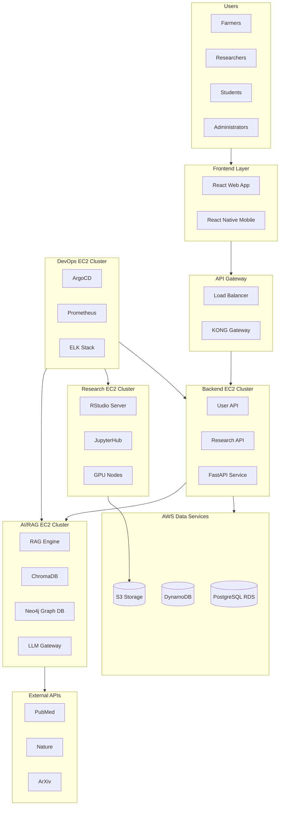

# System Components

## Introduction

The Animal Genetics Research Platform consists of several interconnected components that work together to provide a comprehensive solution for genetic research, farm management, and AI-powered knowledge discovery. This document details each major system component, its responsibilities, and interactions with other parts of the system.

## Core System Components

### 1. User Access Layer

The User Access Layer serves as the entry point for all platform users, providing role-based interfaces tailored to different user personas.

#### Components:
- **User Authentication Service**: Manages user identity, authentication, and session management
- **Role-Based Access Control**: Enforces permissions based on user roles (Farmer, Researcher, Student, Administrator)
- **Single Sign-On Integration**: Supports institutional SSO systems for seamless access

#### Interactions:
- Connects directly to the Presentation Tier
- Communicates with the User Backend API for authentication and authorization
- Enforces access policies across all platform services

### 2. Presentation Tier

The Presentation Tier delivers the user interface across web and mobile platforms, providing a consistent and responsive experience.

#### Components:
- **React Web Application**: Browser-based interface built with React, TypeScript, and Tailwind CSS
- **React Native Mobile Application**: Cross-platform mobile app with offline capabilities
- **Progressive Web App (PWA)**: Installable web application with offline functionality

#### Technologies:
- **Frontend Framework**: React and React Native
- **State Management**: Redux for global state
- **UI Components**: Tailwind CSS and custom components
- **Form Validation**: ZOD and React Hook Form
- **Authentication**: Better-Auth integration

#### Interactions:
- Communicates with the API Gateway Layer
- Renders data from backend services
- Manages local state and offline data

### 3. API Gateway Layer

The API Gateway Layer manages all API traffic, providing routing, authentication, rate limiting, and load balancing services.

#### Components:
- **AWS Application Load Balancer (ALB)**: Distributes traffic and performs SSL termination
- **KONG API Gateway**: Handles API routing, authentication, and rate limiting
- **API Documentation**: Swagger/OpenAPI documentation for all endpoints

#### Features:
- **Rate Limiting**: Prevents API abuse
- **Authentication**: Validates API tokens and credentials
- **Load Balancing**: Distributes traffic across backend services
- **Health Checks**: Monitors service availability
- **SSL Termination**: Manages HTTPS connections

#### Interactions:
- Receives requests from the Presentation Tier
- Routes requests to appropriate backend services
- Enforces security and traffic policies

### 4. Server Side EC2 Instance

The Server Side EC2 Instance hosts the core application services organized into three logical clusters.

#### 4.1 Primary Backend Cluster

##### Components:
- **User Backend API (Bun.js)**:
  - 3 replicas for high availability
  - Handles user management and authentication
  - Processes farmer data entry for animal records
  - Manages sessions via DynamoDB

- **Research API (FastAPI)**:
  - 3 replicas with auto-scaling capabilities
  - Processes ML/AI operations and genomic analysis
  - Integrates with Emilia AI RAG system
  - Manages research operations and data processing

##### Technologies:
- **User Backend**: Bun.js runtime with TypeScript
- **Research Backend**: Python FastAPI framework
- **Container Orchestration**: Kubernetes for service management
- **Service Discovery**: Kubernetes DNS for internal service resolution

##### Interactions:
- Communicates with databases (PostgreSQL, DynamoDB)
- Integrates with the Emilia AI Cluster
- Provides data to the Research Environment Cluster

#### 4.2 Emilia AI Cluster

##### Components:
- **RAG Engine**:
  - Vector search and context retrieval
  - LLM integration for intelligent responses
  - Knowledge processing from multiple sources
  - Query analysis and context management

- **ChromaDB Vector Database**:
  - Stores vector embeddings from research papers
  - Enables semantic search capabilities
  - Integrates with external Journal APIs
  - Manages research paper knowledge base

- **LLM Gateway**:
  - Model orchestration and management
  - Response generation and context handling
  - Integration with various AI models (GPT-4, Claude, Local LLM)
  - Performance optimization and caching

- **Journal APIs Integration**:
  - PubMed API for medical research papers
  - Nature API for scientific publications
  - ArXiv for preprint research papers
  - Automated data extraction and processing

##### Technologies:
- **RAG Framework**: LangChain for retrieval augmented generation
- **Vector Database**: ChromaDB for embedding storage
- **Graph Database**: Neo4j for knowledge representation
- **LLM Integration**: API connections to GPT-4, Claude, and local models

##### Interactions:
- Receives queries from the Research API
- Retrieves context from ChromaDB and Neo4j
- Generates responses via LLM services
- Updates knowledge base with new information

#### 4.3 Research Environment Cluster

##### Components:
- **RStudio Server**:
  - 3 pods with persistent volumes
  - Statistical analysis environment
  - R package ecosystem
  - Integration with genetic analysis libraries

- **JupyterHub**:
  - 3 pods with GPU access
  - Python notebook environment
  - ML workflow support
  - Data visualization capabilities

##### Technologies:
- **Container Management**: Kubernetes for pod orchestration
- **Storage**: Persistent volumes backed by AWS EBS
- **Compute**: CPU and GPU resources for analysis
- **Authentication**: Integration with platform SSO

##### Interactions:
- Accesses data from S3 storage
- Communicates with Research API for data retrieval
- Stores analysis results back to S3
- Supports collaborative research workflows

### 5. Monitoring & CI/CD EC2 Instance

The Monitoring & CI/CD EC2 Instance manages operational aspects of the platform, including deployment, monitoring, and data pipelines.

#### 5.1 CI/CD Pipeline

##### Components:
- **Jenkins**: Build automation, testing pipeline, integration tests
- **ArgoCD**: GitOps deployment, multi-cluster synchronization, rollback capabilities
- **Helm Charts**: Package management, configuration templates, deployment automation

##### Technologies:
- **CI/CD**: Jenkins for continuous integration
- **GitOps**: ArgoCD for continuous deployment
- **Package Management**: Helm for Kubernetes applications
- **Version Control**: Git for source code management

##### Interactions:
- Integrates with code repositories
- Deploys to Kubernetes clusters
- Manages configuration across environments
- Automates testing and quality assurance

#### 5.2 ETL Orchestration

##### Components:
- **Apache Airflow**: Workflow orchestration, batch ETL jobs, external API ingestion
- **Kafka**: Message streaming, event processing, data pipeline buffer
- **Change Data Capture (CDC)**: Real-time data synchronization from PostgreSQL to Neo4j

##### Technologies:
- **Workflow Engine**: Apache Airflow with custom DAGs
- **Stream Processing**: Apache Kafka for event streaming
- **CDC**: Debezium for change data capture
- **Connectors**: Custom connectors for various data sources

##### Interactions:
- Extracts data from PostgreSQL and external sources
- Transforms data for Neo4j and ChromaDB
- Loads processed data into target systems
- Monitors data quality and pipeline health

#### 5.3 Monitoring Stack

##### Components:
- **Prometheus**: Metrics collection, alerting rules, service discovery
- **Grafana**: Visualization dashboards, real-time monitoring, performance analytics
- **ELK Stack**: Log aggregation, search and analysis, audit logging

##### Technologies:
- **Metrics**: Prometheus for time-series data
- **Visualization**: Grafana for dashboards
- **Logging**: Elasticsearch, Logstash, Kibana for log management
- **Alerting**: Prometheus Alertmanager and PagerDuty integration

##### Interactions:
- Collects metrics from all platform services
- Aggregates logs from application components
- Triggers alerts based on defined thresholds
- Provides dashboards for system health monitoring

### 6. Data Tier

The Data Tier manages all persistent data storage for the platform, combining relational, NoSQL, and specialized databases.

#### Components:
- **PostgreSQL RDS**:
  - Farm data and animal records
  - Structured genetic information
  - Research project metadata
  - Relational data with ACID properties

- **DynamoDB**:
  - Chat history and conversations
  - User preferences and settings
  - AI model configurations
  - Session data and workspace states

- **Neo4j Graph Database**:
  - Genetic relationships and pedigrees
  - Knowledge graph for research data
  - Network analysis capabilities
  - Relationship-focused queries

- **ChromaDB Vector Database**:
  - Document embeddings for semantic search
  - Research paper vectors
  - Similarity search capabilities
  - Integration with LangChain RAG system

#### Technologies:
- **Relational Database**: AWS RDS PostgreSQL
- **NoSQL Database**: AWS DynamoDB
- **Graph Database**: Neo4j Enterprise
- **Vector Database**: ChromaDB

#### Interactions:
- Provides persistent storage for all platform services
- Supports real-time and batch data access patterns
- Maintains data integrity and consistency
- Enables complex queries across different data models

### 7. Storage Layer

The Storage Layer provides object storage for user workspaces, research data, and system backups.

#### Components:
- **User Workspaces**: Personal storage for researchers and students
- **Research Data**: Shared datasets for collaborative projects
- **System Backups**: Automated snapshots for disaster recovery
- **Logs & Analytics**: Long-term storage for system logs and metrics

#### Technologies:
- **Object Storage**: AWS S3 with appropriate bucket policies
- **Lifecycle Management**: Automated tiering to S3 Glacier for archival
- **Versioning**: S3 versioning for critical data
- **Access Control**: IAM policies and bucket ACLs

#### Interactions:
- Stores files generated by research environments
- Provides data access to backend services
- Maintains backups of critical system data
- Archives logs and analytics data

### 8. External API Integration

The External API Integration component connects the platform to external research sources and services.

#### Components:
- **PubMed API**: Medical and biological research papers
- **Nature API**: Scientific publications and journals
- **ArXiv API**: Preprint research papers
- **Custom API Connectors**: Integration with specialized genetic databases

#### Technologies:
- **API Clients**: Custom clients for each external API
- **Rate Limiting**: Respects API usage limits
- **Caching**: Local caching to reduce API calls
- **Error Handling**: Robust error management for external dependencies

#### Interactions:
- Retrieves research papers and publications
- Updates the knowledge base with new information
- Provides data for the RAG system
- Enhances the platform's research capabilities

## Component Interaction Diagram

The following diagram illustrates the interactions between major system components:

## Component Deployment Strategy

The platform components are deployed across two primary EC2 instances:

### Server Side EC2 Instance
- Primary Backend Cluster
- Emilia AI Cluster
- Research Environment Cluster

### Monitoring & CI/CD EC2 Instance
- CI/CD Pipeline
- ETL Orchestration
- Monitoring Stack

This consolidated deployment strategy optimizes resource utilization while maintaining separation of concerns between application services and operational tooling.

## Component Scaling Strategy

Each component has a defined scaling strategy:

| Component | Scaling Approach | Scaling Trigger | Min/Max Instances |
|-----------|------------------|-----------------|-------------------|
| User Backend API | Horizontal | CPU > 70%, Memory > 80% | 3/10 |
| Research API | Horizontal | CPU > 70%, Memory > 80% | 3/10 |
| RAG Engine | Horizontal | Request Queue > 100 | 2/8 |
| RStudio Server | Manual | N/A | 3/10 |
| JupyterHub | Manual | N/A | 3/10 |
| PostgreSQL | Vertical + Read Replicas | Storage > 70%, CPU > 60% | 1/3 |
| Neo4j | Cluster (Core + Read Replicas) | Query Load > 5000/min | 3/5 |
| ChromaDB | Horizontal | Memory > 80% | 2/5 |

## Component Health Monitoring

Each component's health is monitored through:

- **Liveness Probes**: Verify that the component is running
- **Readiness Probes**: Verify that the component can accept traffic
- **Custom Health Metrics**: Component-specific health indicators
- **Dependency Checks**: Verify connections to required services

## Conclusion

The Animal Genetics Research Platform's component architecture provides a modular, scalable, and maintainable system that supports the diverse needs of its users. By clearly defining component responsibilities and interactions, the platform can evolve while maintaining overall system integrity and performance.
