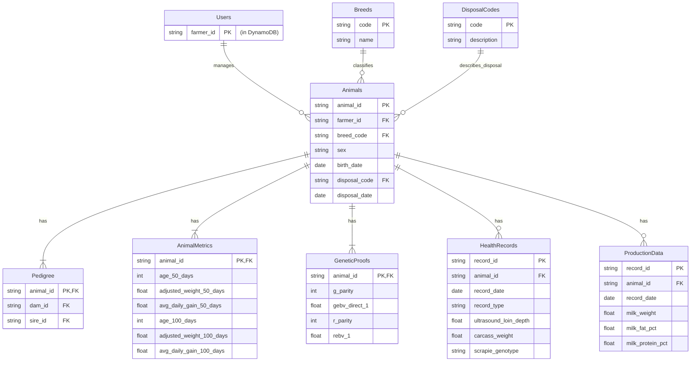

# Final Normalized PostgreSQL Schema

This document presents the final, normalized Entity-Relationship Diagram (ERD) and schema for the new PostgreSQL database. This design eliminates data redundancy and establishes a clean, maintainable structure.

## Guiding Principles

1.  **Single Source of Truth:** Each piece of data is stored only once. The `Animals` table is the definitive source for all core animal attributes.
2.  **Normalization:** Redundant columns have been removed from all tables. Data is linked via foreign keys.
3.  **Clarity:** Table and column names have been standardized for readability.
4.  **Consolidation:** Related data (like different types of genetic proofs or health records) has been merged into single, logical tables.

---

## Entity-Relationship Diagram (ERD)

---

## Table Schema and Column Mapping

| New Table       | New Column                  | Original Source (Table.Column)      |
| :-------------- | :-------------------------- | :---------------------------------- |
| **Animals**     | `animal_id` (PK)            | `Animals.id`                        |
|                 | `farmer_id` (FK)            | `Animals.ropid`                     |
|                 | `breed_code` (FK)           | `Animals.breed`                     |
|                 | `sex`                       | `Animals.sex`                       |
|                 | `birth_date`                | `Animals.birthdate`                 |
|                 | `disposal_code` (FK)        | `Animals.discode`                   |
|                 | `disposal_date`             | `Animals.disdate`                   |
| **Pedigree**    | `animal_id` (PK, FK)        | `Pedigree.id`                       |
|                 | `dam_id` (FK)               | `Pedigree.damid`                    |
|                 | `sire_id` (FK)              | `Pedigree.sireid`                   |
| **AnimalMetrics** | `animal_id` (PK, FK)        | `Animals.id`                        |
|                 | `adjusted_weight_50_days`   | `Animals.adjwt50`                   |
|                 | `...` (other metrics)       | `Animals` & `progenyall`            |
| **GeneticProofs** | `animal_id` (PK, FK)        | `Gproofs2.id` & `Rproofs2.id`       |
|                 | `...` (all proof columns)   | `Gproofs2` & `Rproofs2`             |
| **HealthRecords** | `animal_id` (FK)            | `Ultra.id`, `QCarcass.id`, `ScrapieG.id` |
|                 | `...` (all health columns)  | `Ultra`, `QCarcass`, `ScrapieG`     |
| **ProductionData**| `animal_id` (FK)            | `MilkWts.id` & `MilkComs.id`        |
|                 | `...` (all milk columns)    | `MilkWts` & `MilkComs`              |

### Removed Tables

-   **`progenyall`**: Removed. Its data is now derived from `Animals` and `Pedigree`.
-   **`Matings`**: Removed for now to simplify. Can be added back if mating-specific data (e.g., `pmsg`, `pen`) is required.

This schema is now ready to be implemented. The next step is to write the SQL Data Definition Language (DDL) to create these tables.
