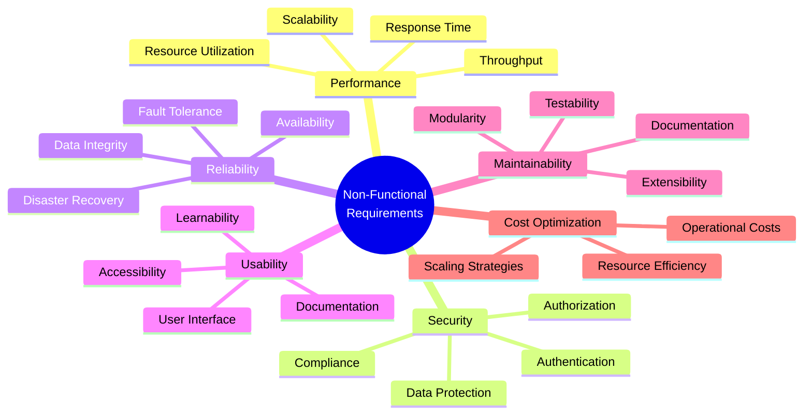
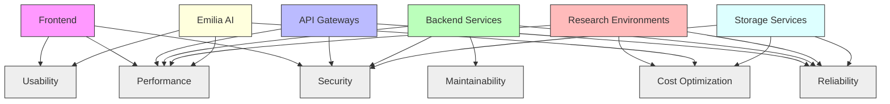
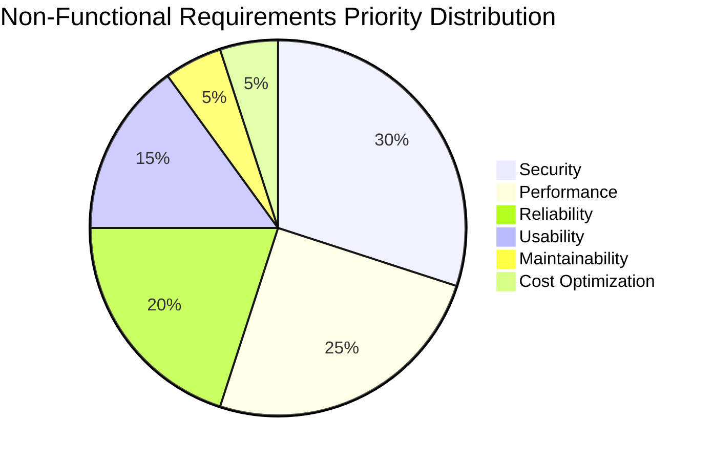

# Non-Functional Requirements

## Overview

Non-functional requirements define the quality attributes and constraints that affect the operation of the Agricultural Research Platform. These requirements are critical for ensuring the system meets user expectations for performance, security, reliability, and other quality characteristics.

This section outlines the non-functional requirements organized by category, with specific metrics and acceptance criteria for each requirement.

## Requirements Summary

## Performance Requirements

### Response Time

| ID | Requirement | Metric | Target | Testing Method |
|----|-------------|--------|--------|---------------|
| NFR-PERF-01 | Web interface response time | Page load time | < 2 seconds for 95% of requests | Load testing with simulated users |
| NFR-PERF-02 | Emilia AI response time | Time to first response | < 5 seconds for typical queries | Automated query testing |
| NFR-PERF-03 | Research environment startup time | Time from request to availability | < 30 seconds for standard environments | Automated timing tests |
| NFR-PERF-04 | Database query performance | Query execution time | < 1 second for 90% of queries | Database performance testing |
| NFR-PERF-05 | API response time | Time to complete API request | < 500ms for 95% of requests | API load testing |

### Throughput and Capacity

| ID | Requirement | Metric | Target | Testing Method |
|----|-------------|--------|--------|---------------|
| NFR-PERF-06 | Concurrent user support | Number of simultaneous users | 500 users without degradation | Load testing with simulated users |
| NFR-PERF-07 | Data processing capacity | Volume of data processed | 10GB datasets in research environments | Performance testing with sample datasets |
| NFR-PERF-08 | File upload capacity | Maximum file size | 1GB per file, 10GB total per user | File upload testing |
| NFR-PERF-09 | API request handling | Requests per second | 100 requests per second | API load testing |
| NFR-PERF-10 | Genomic analysis throughput | Analysis completion time | Varies by complexity, benchmarked against industry standards | Benchmark testing with standard datasets |

### Scalability

| ID | Requirement | Metric | Target | Testing Method |
|----|-------------|--------|--------|---------------|
| NFR-SCAL-01 | User scalability | Maximum registered users | 10,000 without architecture changes | Capacity planning and modeling |
| NFR-SCAL-02 | Storage scalability | Data growth accommodation | Linear cost scaling with data volume | Storage performance testing |
| NFR-SCAL-03 | Computational scalability | Resource scaling | Automatic scaling based on demand | Load testing with varying workloads |
| NFR-SCAL-04 | Geographic scalability | Multi-region support | Support for 5+ geographic regions | Deployment testing across regions |
| NFR-SCAL-05 | Feature scalability | New feature integration | Modular architecture allowing feature addition without downtime | Architecture review and testing |

## Security Requirements

### Authentication and Authorization

| ID | Requirement | Metric | Target | Testing Method |
|----|-------------|--------|--------|---------------|
| NFR-SEC-01 | Multi-factor authentication | MFA implementation | Available for all user accounts | Security testing and audit |
| NFR-SEC-02 | Role-based access control | Permission granularity | Attribute-based permissions for all resources | Security testing and audit |
| NFR-SEC-03 | Authentication standards | Compliance | NIST 800-63B AAL2 compliance | Security audit |
| NFR-SEC-04 | Session management | Session security | Secure session handling with appropriate timeouts | Security testing |
| NFR-SEC-05 | API authentication | Security mechanism | OAuth 2.0 with JWT tokens | API security testing |

### Data Protection

| ID | Requirement | Metric | Target | Testing Method |
|----|-------------|--------|--------|---------------|
| NFR-SEC-06 | Data encryption at rest | Encryption implementation | AES-256 encryption for all sensitive data | Security audit |
| NFR-SEC-07 | Data encryption in transit | Protocol implementation | TLS 1.3 for all data transmission | Security testing |
| NFR-SEC-08 | Personal data protection | Compliance | GDPR and CCPA compliance | Privacy impact assessment |
| NFR-SEC-09 | Data anonymization | Implementation | Automated anonymization for sensitive datasets | Data privacy testing |
| NFR-SEC-10 | Security monitoring | Coverage | 100% of system components monitored | Security audit |

### Vulnerability Management

| ID | Requirement | Metric | Target | Testing Method |
|----|-------------|--------|--------|---------------|
| NFR-SEC-11 | Security testing | Frequency | Monthly automated security testing | Scheduled penetration testing |
| NFR-SEC-12 | Vulnerability patching | Response time | Critical vulnerabilities patched within 24 hours | Security response testing |
| NFR-SEC-13 | Dependency scanning | Coverage | 100% of dependencies scanned for vulnerabilities | Automated dependency scanning |
| NFR-SEC-14 | Security headers | Implementation | OWASP recommended security headers on all responses | Security testing |
| NFR-SEC-15 | Input validation | Coverage | All user inputs validated and sanitized | Security testing |

## Reliability Requirements

### Availability

| ID | Requirement | Metric | Target | Testing Method |
|----|-------------|--------|--------|---------------|
| NFR-REL-01 | System uptime | Availability percentage | 99.9% uptime for critical components | Monitoring and reporting |
| NFR-REL-02 | Planned maintenance | Downtime | < 4 hours per month, scheduled during off-peak hours | Maintenance planning and monitoring |
| NFR-REL-03 | Service degradation | Performance during partial failure | Graceful degradation with core functionality maintained | Chaos engineering testing |
| NFR-REL-04 | Geographic redundancy | Implementation | Multi-region deployment for critical services | Disaster recovery testing |
| NFR-REL-05 | Load balancing | Implementation | Automatic load distribution across resources | Load testing |

### Fault Tolerance and Recovery

| ID | Requirement | Metric | Target | Testing Method |
|----|-------------|--------|--------|---------------|
| NFR-REL-06 | Automated backups | Frequency and retention | Daily backups with 30-day retention | Backup and recovery testing |
| NFR-REL-07 | Point-in-time recovery | Recovery capability | Recovery to any point within last 7 days | Recovery testing |
| NFR-REL-08 | Recovery time objective | Time to recover | < 1 hour for critical services | Disaster recovery testing |
| NFR-REL-09 | Recovery point objective | Maximum data loss | < 15 minutes of data | Recovery testing |
| NFR-REL-10 | Circuit breaking | Implementation | Automatic circuit breaking for failing dependencies | Resilience testing |

### Data Integrity

| ID | Requirement | Metric | Target | Testing Method |
|----|-------------|--------|--------|---------------|
| NFR-REL-11 | Data validation | Coverage | Input validation for all data entry points | Data integrity testing |
| NFR-REL-12 | Transaction consistency | Implementation | ACID compliance for critical transactions | Database testing |
| NFR-REL-13 | Audit logging | Coverage | Comprehensive logging of all data modifications | Log analysis |
| NFR-REL-14 | Data versioning | Implementation | Version history for critical datasets | Data management testing |
| NFR-REL-15 | Conflict resolution | Implementation | Automatic or assisted resolution of concurrent modifications | Concurrency testing |

## Usability Requirements

### Accessibility

| ID | Requirement | Metric | Target | Testing Method |
|----|-------------|--------|--------|---------------|
| NFR-USA-01 | Accessibility compliance | Standard | WCAG 2.1 AA compliance | Accessibility testing |
| NFR-USA-02 | Screen reader compatibility | Implementation | Full compatibility with major screen readers | Accessibility testing |
| NFR-USA-03 | Keyboard navigation | Implementation | Complete functionality via keyboard | Usability testing |
| NFR-USA-04 | Color contrast | Compliance | WCAG 2.1 AA contrast ratios | Visual testing |
| NFR-USA-05 | Text resizing | Support | Proper display with 200% text size | Responsive testing |

### User Interface

| ID | Requirement | Metric | Target | Testing Method |
|----|-------------|--------|--------|---------------|
| NFR-USA-06 | Responsive design | Implementation | Proper display on devices from 320px to 4K | Responsive testing |
| NFR-USA-07 | Consistent design | Implementation | Consistent patterns across all interfaces | Design review |
| NFR-USA-08 | Loading indicators | Implementation | Visual feedback for all operations > 1 second | UI testing |
| NFR-USA-09 | Error messaging | Quality | Clear, actionable error messages | Usability testing |
| NFR-USA-10 | User satisfaction | Score | > 4/5 on user satisfaction surveys | User testing |

### Learnability

| ID | Requirement | Metric | Target | Testing Method |
|----|-------------|--------|--------|---------------|
| NFR-USA-11 | Onboarding experience | Completion rate | > 90% completion of onboarding | User testing |
| NFR-USA-12 | Help documentation | Coverage | Context-sensitive help for all features | Documentation review |
| NFR-USA-13 | Tooltips and guidance | Implementation | Inline guidance for complex features | UI review |
| NFR-USA-14 | Task completion | Success rate | > 85% task completion without assistance | Usability testing |
| NFR-USA-15 | Learning curve | Time to proficiency | < 2 hours for basic proficiency | User testing |

## Maintainability Requirements

### Code Quality

| ID | Requirement | Metric | Target | Testing Method |
|----|-------------|--------|--------|---------------|
| NFR-MAIN-01 | Code coverage | Test coverage percentage | > 80% code coverage | Automated testing metrics |
| NFR-MAIN-02 | Code complexity | Cyclomatic complexity | < 15 per method | Static code analysis |
| NFR-MAIN-03 | Documentation | Coverage | All public APIs and components documented | Documentation review |
| NFR-MAIN-04 | Coding standards | Compliance | 100% compliance with defined standards | Automated linting |
| NFR-MAIN-05 | Technical debt | Management | < 5% of development time allocated to debt | Technical debt tracking |

### Deployment and Operations

| ID | Requirement | Metric | Target | Testing Method |
|----|-------------|--------|--------|---------------|
| NFR-MAIN-06 | Deployment automation | Implementation | Fully automated CI/CD pipeline | Deployment testing |
| NFR-MAIN-07 | Zero-downtime updates | Implementation | Updates without service interruption | Deployment testing |
| NFR-MAIN-08 | Environment parity | Consistency | Development, staging, and production parity | Environment comparison |
| NFR-MAIN-09 | Monitoring coverage | Implementation | Comprehensive monitoring of all components | Monitoring review |
| NFR-MAIN-10 | Logging | Implementation | Structured logging with appropriate detail levels | Log analysis |

### Extensibility

| ID | Requirement | Metric | Target | Testing Method |
|----|-------------|--------|--------|---------------|
| NFR-MAIN-11 | API versioning | Implementation | Semantic versioning with backward compatibility | API testing |
| NFR-MAIN-12 | Plugin architecture | Implementation | Support for third-party extensions | Architecture review |
| NFR-MAIN-13 | Configuration management | Implementation | Externalized configuration for all components | Configuration testing |
| NFR-MAIN-14 | Feature toggles | Implementation | Runtime feature enabling/disabling | Feature toggle testing |
| NFR-MAIN-15 | Internationalization | Support | Full i18n support for UI and content | Internationalization testing |

## Cost Optimization Requirements

### Resource Efficiency

| ID | Requirement | Metric | Target | Testing Method |
|----|-------------|--------|--------|---------------|
| NFR-COST-01 | Compute resource utilization | Average utilization | > 70% average utilization | Resource monitoring |
| NFR-COST-02 | Storage optimization | Implementation | Tiered storage with lifecycle policies | Storage analysis |
| NFR-COST-03 | Caching strategy | Implementation | Multi-level caching for frequently accessed data | Performance testing |
| NFR-COST-04 | Resource scaling | Implementation | Automatic scaling based on demand | Scaling testing |
| NFR-COST-05 | Idle resource management | Implementation | Automatic shutdown of idle resources | Resource monitoring |

### Cost Management

| ID | Requirement | Metric | Target | Testing Method |
|----|-------------|--------|--------|---------------|
| NFR-COST-06 | Cost allocation | Implementation | Resource tagging for cost attribution | Cost analysis |
| NFR-COST-07 | Budget alerts | Implementation | Automated alerts for budget thresholds | Budget testing |
| NFR-COST-08 | Cost reporting | Implementation | Detailed cost breakdowns by component | Cost reporting |
| NFR-COST-09 | Reserved capacity | Implementation | Reserved instances for predictable workloads | Cost analysis |
| NFR-COST-10 | Cost optimization review | Frequency | Monthly cost optimization reviews | Process audit |

## Non-Functional Requirements Traceability Matrix

The following diagram illustrates how non-functional requirements relate to system components:

## Non-Functional Requirements Testing Strategy

Each non-functional requirement will be validated through a combination of:

1. **Automated Testing**: Continuous testing as part of the CI/CD pipeline
2. **Load and Performance Testing**: Regular testing with simulated user loads
3. **Security Testing**: Vulnerability scanning, penetration testing, and security audits
4. **Usability Testing**: User testing sessions with representatives from each persona
5. **Monitoring and Alerting**: Real-time monitoring of production metrics against requirements

For detailed testing procedures, see the [User Acceptance Test Plan](../acceptance/test-plan.md) section.

## Non-Functional Requirements Prioritization

The following chart illustrates the prioritization of non-functional requirement categories:

This prioritization reflects the critical importance of security, performance, and reliability for the Agricultural Research Platform, while still maintaining focus on usability, maintainability, and cost optimization.
