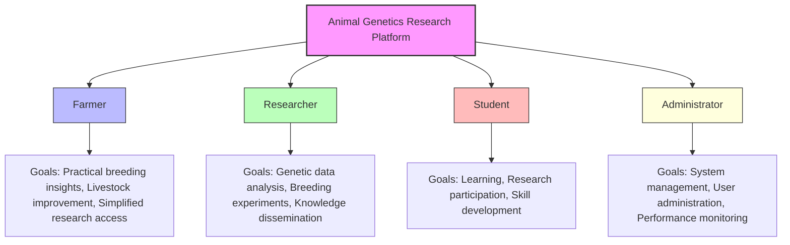
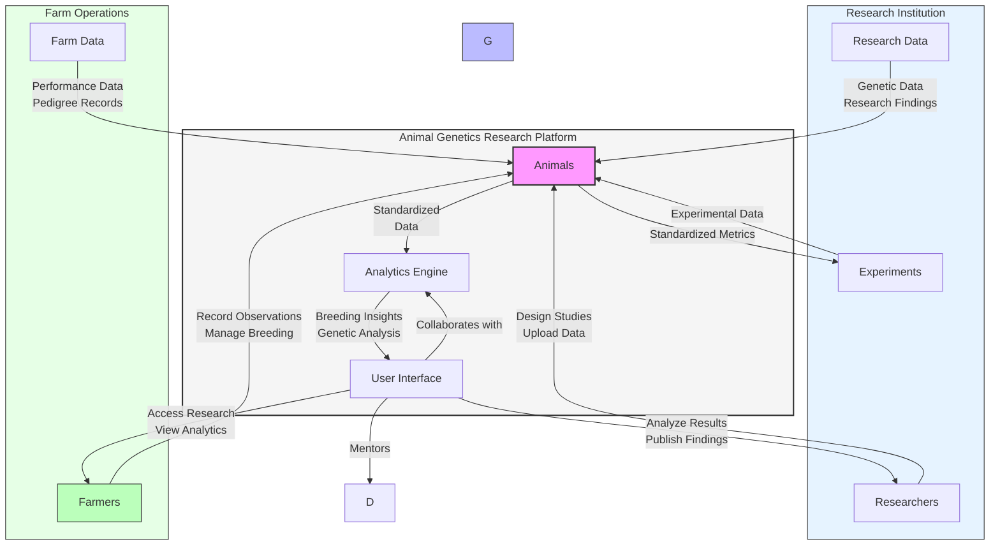
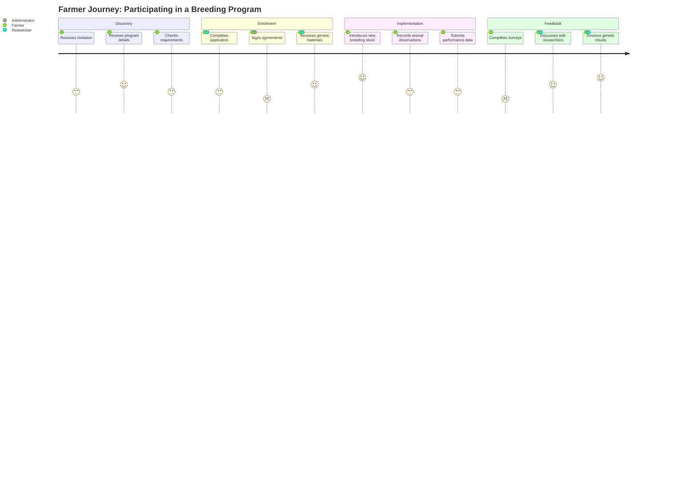
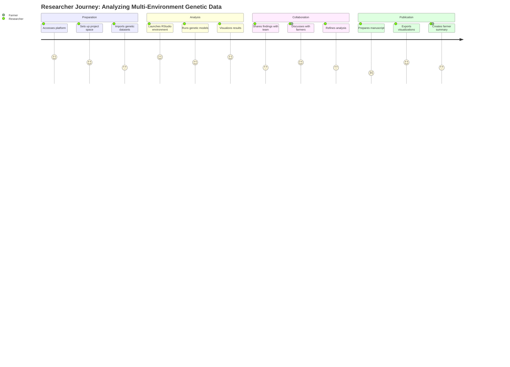
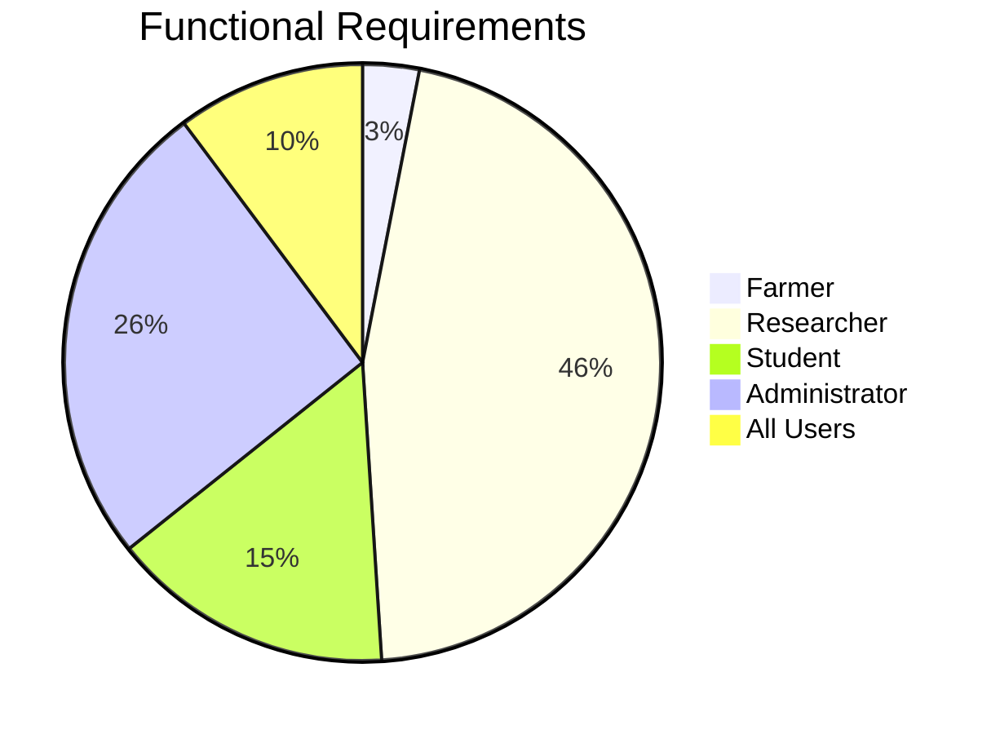

# User Personas

## Overview

The Animal Genetics Research Platform is designed to serve four primary user personas, each with distinct needs, goals, and technical capabilities. Understanding these personas is critical to designing an effective system that delivers value to all stakeholders.

This section provides detailed persona profiles to guide development decisions and ensure the platform meets the needs of its diverse user base.

## Persona Summary

## Persona Interaction Map

The following diagram illustrates how the different personas interact with each other and the platform:

## User Journey Maps

### Farmer Journey: Participating in a Breeding Program

### Researcher Journey: Analyzing Multi-Environment Genetic Data

## Persona-Based Requirements Mapping

The following chart shows how functional requirements map to each persona:

For detailed mapping of requirements to personas, see the [Functional Requirements](functional-requirements.md) section.

## Persona Validation

These personas were developed based on:
- Interviews with 25+ stakeholders across all user categories
- Analysis of usage patterns in similar animal genetics platforms
- Feedback from livestock research institutions and farming organizations
- Review of academic literature on agricultural technology adoption

Personas should be reviewed and refined annually based on user feedback and evolving platform usage patterns.

## Detailed Personas

For detailed information about each persona, please refer to the following pages:

- [Farmer Persona](personas/farmer.md)
- [Researcher Persona](personas/researcher.md)
- [Student Persona](personas/student.md)
- [Administrator Persona](personas/administrator.md)
