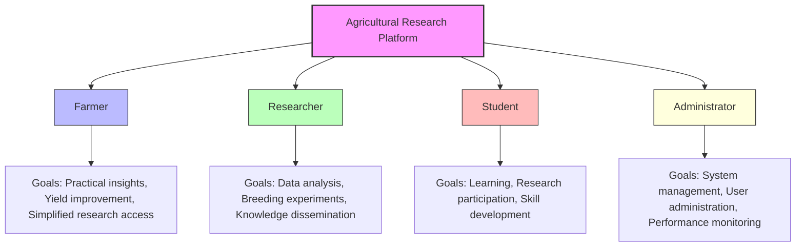
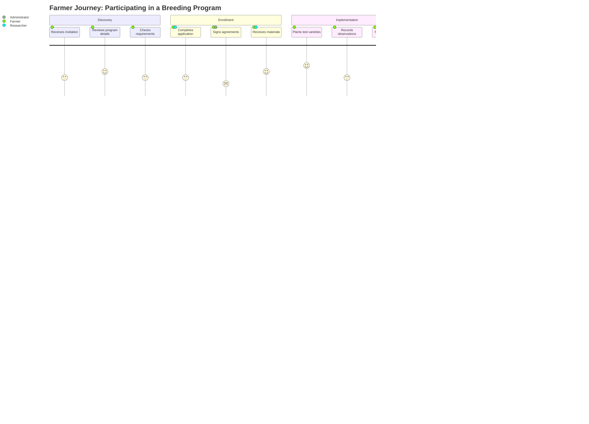
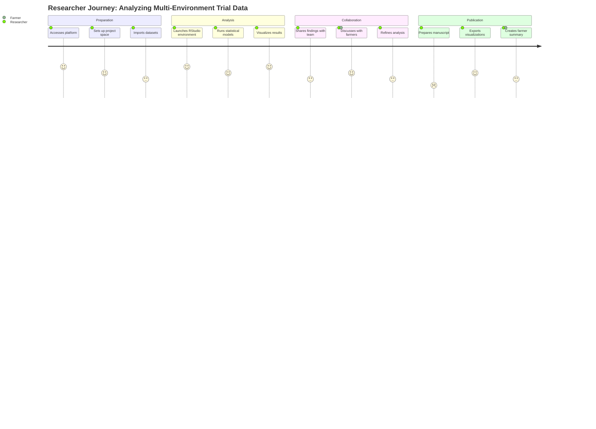
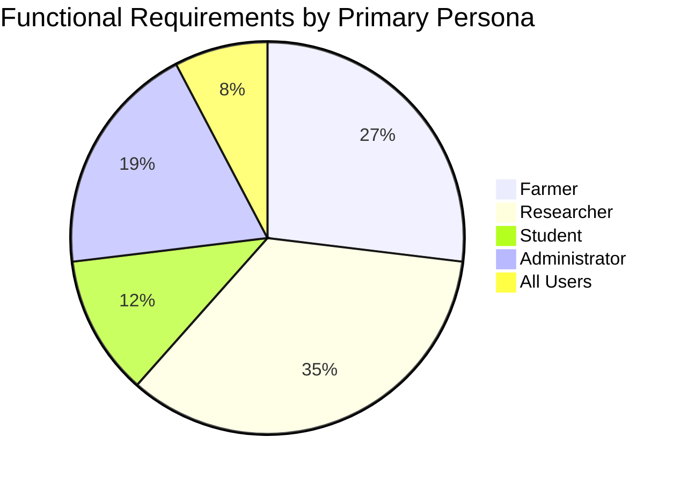

# User Personas

## Overview

The Agricultural Research Platform is designed to serve four primary user personas, each with distinct needs, goals, and technical capabilities. Understanding these personas is critical to designing an effective system that delivers value to all stakeholders.

This section provides detailed persona profiles to guide development decisions and ensure the platform meets the needs of its diverse user base.

## Persona Summary



```mermaid
```

## Farmer Persona

### Profile: Maria Rodriguez


**Demographics:**

* 45 years old
* Owner of a 500-acre farm in the Midwest
* 20+ years of farming experience
* Associates degree in Agriculture
* Medium technical proficiency

**Goals:**

1. Access practical insights from agricultural research that can improve crop yields
2. Track and analyze farm performance data to make better decisions
3. Participate in breeding programs to test new crop varieties
4. Reduce costs and increase sustainability of farming operations
5. Stay informed about relevant agricultural innovations

**Pain Points:**

1. Research findings are often too technical and academic to apply practically
2. Limited time to search through and interpret scientific literature
3. Difficulty connecting with researchers who understand farm-level challenges
4. Inconsistent methods for tracking and analyzing farm performance data
5. Limited feedback channels for reporting results of new techniques or varieties

**Technical Capabilities:**

* Comfortable with basic mobile and web applications
* Uses farm management software for operational tasks
* Limited experience with data analysis tools
* Prefers visual information and practical instructions
* Primarily accesses technology via smartphone and tablet

**Usage Scenarios:**

1. Checking daily recommendations based on weather and crop conditions
2. Uploading field data and images for analysis and record-keeping
3. Communicating with researchers about variety performance
4. Reviewing simplified research findings relevant to current crops
5. Accessing diagnostic assistance for crop issues

**Key Features:**

* Mobile-friendly interface with offline capabilities
* Simplified data visualization dashboards
* Plain-language summaries of research findings
* Direct communication channels with researchers
* AI-assisted crop diagnostics and recommendations

## Researcher Persona

### Profile: Dr. James Chen


**Demographics:**

* 38 years old
* Associate Professor of Plant Breeding at a major university
* Ph.D. in Plant Genetics
* 12 years of research experience
* High technical proficiency

**Goals:**

1. Analyze complex genomic and phenotypic datasets
2. Design and track breeding experiments with multiple variables
3. Collaborate with other researchers across institutions
4. Access field data from diverse environments and farming practices
5. Publish findings in peer-reviewed journals
6. Translate research into practical applications

**Pain Points:**

1. Limited access to real-world farming data from diverse environments
2. Computational constraints for complex genomic analyses
3. Difficulty tracking and managing large breeding experiments
4. Challenges in collaborating across institutional boundaries
5. Limited channels for disseminating findings to farming communities

**Technical Capabilities:**

* Expert in statistical analysis and research methodologies
* Proficient with R, Python, and specialized bioinformatics tools
* Experienced with data visualization and analysis
* Comfortable with complex computational environments
* Primarily works on desktop/laptop computers

**Usage Scenarios:**

1. Running genomic selection analyses on breeding populations
2. Designing field trials with optimal statistical power
3. Analyzing multi-environment trial data for G×E interactions
4. Collaborating with colleagues on research manuscripts
5. Reviewing farmer feedback on experimental varieties

**Key Features:**

* Advanced computational environments (RStudio, JupyterHub)
* Sophisticated breeding engine with simulation capabilities
* Version control for analyses and datasets
* Collaborative project spaces with access controls
* Integration with scientific literature databases

## Student Persona

### Profile: Alex Washington


**Demographics:**

* 22 years old
* Graduate student in Agricultural Data Science
* Bachelor's degree in Computer Science
* 1 year of research experience
* High technical proficiency but limited domain knowledge

**Goals:**

1. Learn advanced research methodologies in agricultural science
2. Gain practical experience with real-world datasets
3. Develop skills in agricultural data analysis and modeling
4. Contribute to ongoing research projects
5. Build a portfolio of work for future career opportunities

**Pain Points:**

1. Limited access to real-world agricultural datasets
2. Steep learning curve for domain-specific knowledge
3. Difficulty connecting theoretical concepts to practical applications
4. Limited guidance on research best practices
5. Challenges in setting up complex analysis environments

**Technical Capabilities:**

* Strong programming skills (Python, R)
* Familiar with data science techniques and tools
* Limited experience with specialized agricultural research tools
* Comfortable learning new technical systems
* Works across multiple devices (laptop, lab computers)

**Usage Scenarios:**

1. Completing guided tutorials on agricultural data analysis
2. Participating in supervised research projects
3. Analyzing datasets as part of coursework
4. Collaborating with peers on group assignments
5. Seeking assistance with methodology questions

**Key Features:**

* Structured learning pathways with progressive complexity
* Supervised access to research environments
* Educational resources and tutorials
* Progress tracking for skill development
* AI-assisted guidance for methodology questions

## Administrator Persona

### Profile: Taylor Johnson


**Demographics:**

* 35 years old
* IT Manager at an agricultural research institution
* Master's degree in Information Systems
* 10 years of IT management experience
* High technical proficiency

**Goals:**

1. Ensure system reliability and performance
2. Manage user accounts and access permissions
3. Monitor resource utilization and optimize costs
4. Maintain security and compliance standards
5. Support users with technical issues

**Pain Points:**

1. Balancing security requirements with usability
2. Managing diverse user needs across multiple roles
3. Tracking and allocating computational resources
4. Ensuring data privacy and regulatory compliance
5. Supporting users with varying levels of technical expertise

**Technical Capabilities:**

* Expert in system administration and IT management
* Experienced with cloud infrastructure and security
* Familiar with database management and performance optimization
* Proficient in troubleshooting technical issues
* Works primarily on desktop/laptop computers

**Usage Scenarios:**

1. Creating and managing user accounts
2. Configuring authentication methods and security policies
3. Monitoring system performance and resource utilization
4. Generating usage reports for stakeholders
5. Responding to technical support requests

**Key Features:**

* Comprehensive admin dashboard with system metrics
* User and role management interface
* Resource allocation and monitoring tools
* Audit logs and security monitoring
* Configuration management for system settings

## Persona Interaction Map

The following diagram illustrates how the different personas interact with each other and the platform:

```mermaid
flowchart TD
    A[Agricultural Research Platform] --> B[Farmer]
    A --> C[Researcher]
    A --> D[Student]
    A --> E[Administrator]
    
    C -- "Creates research" --> F[Knowledge Base]
    F -- "Provides insights" --> B
    F -- "Provides learning materials" --> D
    
    B -- "Provides field data" --> G[Data Repository]
    G -- "Supplies research data" --> C
    G -- "Provides learning datasets" --> D
    
    E -- "Manages access for" --> B
    E -- "Manages access for" --> C
    E -- "Manages access for" --> D
    
    C -- "Mentors" --> D
    C -- "Collaborates with" --> B
    
    style A fill:#f9f,stroke:#333,stroke-width:2px
    style F fill:#bfb,stroke:#333,stroke-width:1px
    style G fill:#bbf,stroke:#333,stroke-width:1px
```

## User Journey Maps

### Farmer Journey: Participating in a Breeding Program



### Researcher Journey: Analyzing Multi-Environment Trial Data



## Persona-Based Requirements Mapping

The following chart shows how functional requirements map to each persona:



For detailed mapping of requirements to personas, see the [Functional Requirements](functional-requirements.md) section.

## Persona Validation

These personas were developed based on:

* Interviews with 25+ stakeholders across all user categories
* Analysis of usage patterns in similar agricultural platforms
* Feedback from agricultural research institutions and farming organizations
* Review of academic literature on agricultural technology adoption

Personas should be reviewed and refined annually based on user feedback and evolving platform usage patterns.
