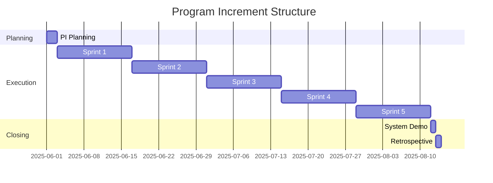

# Development Approach Recommendations

## Introduction

This document outlines the recommended development approach for the Animal Genetics Research Platform. These recommendations are designed to ensure successful implementation of this complex system while managing risks and delivering value incrementally.

## Development Philosophy

We recommend adopting a hybrid development approach that combines:

1. **Agile Methodology**: For iterative development with regular feedback
2. **Domain-Driven Design**: To address the complex domain of animal genetics
3. **DevOps Practices**: For continuous integration and deployment
4. **User-Centered Design**: To ensure the platform meets the needs of all personas

## Recommended Development Framework

### Scaled Agile Framework (SAFe)

For a project of this complexity involving multiple teams, we recommend the Scaled Agile Framework with:

- **Program Increments**: 8-12 week development cycles
- **Two-Week Sprints**: For regular delivery and feedback
- **Feature Teams**: Cross-functional teams organized around key capabilities
- **System Demos**: Regular demonstrations to stakeholders

## Team Structure

We recommend organizing development teams around key platform capabilities:

```mermaid
graph TD
    A[Program Management] --> B[Farmer Experience Team]
    A --> C[Research Environment Team]
    A --> D[Data & Analytics Team]
    A --> E[AI & Knowledge Team]
    A --> F[Platform & Infrastructure Team]
    
    B --> B1[Farmer UI/UX]
    B --> B2[Mobile Data Collection]
    B --> B3[Breeding Program Management]
    
    C --> C1[Genomic Analysis Tools]
    C --> C2[Research Collaboration]
    C --> C3[Computational Environment]
    
    D --> D1[Data Storage & Management]
    D --> D2[Analytics & Visualization]
    D --> D3[Data Integration]
    
    E --> E1[Emilia AI Development]
    E --> E2[Knowledge Base Management]
    E --> E3[Natural Language Processing]
    
    F --> F1[Authentication & Security]
    F --> F2[API Development]
    F --> F3[Infrastructure & DevOps]
    
    style A fill:#f9f,stroke:#333,stroke-width:2px
    style B fill:#bbf,stroke:#333,stroke-width:1px
    style C fill:#bfb,stroke:#333,stroke-width:1px
    style D fill:#fbb,stroke:#333,stroke-width:1px
    style E fill:#fbf,stroke:#333,stroke-width:1px
    style F fill:#bff,stroke:#333,stroke-width:1px
```

## Development Phases

We recommend a phased approach to development:

### Phase 1: Foundation (3-4 months)

- Core user authentication and management
- Basic data storage and management
- Essential farmer and researcher interfaces
- Initial sheep genetics database implementation
- Foundational API development

### Phase 2: Core Capabilities (4-6 months)

- Advanced genomic analysis tools
- Collaborative research environments
- Mobile data collection for farmers
- Initial Emilia AI integration
- Breeding program management

### Phase 3: Advanced Features (4-6 months)

- Advanced AI capabilities
- Sophisticated breeding simulation tools
- Enhanced visualization and analytics
- Cross-institutional collaboration features
- Educational resources and tools

### Phase 4: Refinement and Scale (3-4 months)

- Performance optimization
- Enhanced security features
- Advanced integration capabilities
- Comprehensive mobile support
- System hardening and scaling

## Technical Practices

### Development Practices

| Practice | Description | Benefit |
|----------|-------------|---------|
| Test-Driven Development | Write tests before implementation | Ensures quality and clear requirements |
| Pair Programming | Two developers working together | Knowledge sharing and better design |
| Code Reviews | Systematic examination of code changes | Quality assurance and knowledge transfer |
| Continuous Integration | Frequent integration of code changes | Early detection of integration issues |
| Continuous Deployment | Automated deployment pipeline | Faster delivery and feedback |
| Feature Flags | Toggles for enabling/disabling features | Safer production deployments |

### Quality Assurance

| Practice | Description | Benefit |
|----------|-------------|---------|
| Automated Testing | Unit, integration, and end-to-end tests | Consistent quality verification |
| Performance Testing | Load and stress testing | Ensures system meets performance requirements |
| Security Testing | Vulnerability scanning and penetration testing | Identifies security weaknesses |
| User Acceptance Testing | Testing with actual users | Validates usability and functionality |
| Accessibility Testing | Ensuring platform is accessible | Supports diverse user needs |
| Cross-browser/device Testing | Testing across platforms | Ensures consistent experience |

## Risk Management

### Key Risks and Mitigation Strategies

| Risk | Mitigation Strategy |
|------|---------------------|
| Complex domain knowledge requirements | Embed domain experts in development teams |
| Integration challenges with existing systems | Early prototyping and integration testing |
| Performance issues with large genomic datasets | Performance testing with realistic data volumes |
| User adoption challenges | Early and continuous user involvement |
| Security concerns with sensitive genetic data | Security-by-design approach and regular audits |
| Regulatory compliance issues | Ongoing compliance monitoring and documentation |

## Development Environment

### Recommended Tools and Infrastructure

| Category | Recommendations |
|----------|----------------|
| Source Control | GitHub with branch protection and PR workflows |
| CI/CD | GitHub Actions or Jenkins for automation |
| Infrastructure | Terraform for infrastructure as code |
| Containerization | Docker for consistent environments |
| Orchestration | Kubernetes for service management |
| Monitoring | Prometheus and Grafana for observability |
| Documentation | GitBook for comprehensive documentation |

## Success Metrics

We recommend tracking the following metrics to measure development success:

### Process Metrics

- Sprint velocity and predictability
- Defect rates and resolution times
- Code coverage and quality metrics
- Deployment frequency and lead time
- Mean time to recovery from failures

### Product Metrics

- User adoption and engagement rates
- Feature usage statistics
- Performance benchmarks
- User satisfaction scores
- Support ticket volume and patterns

## Collaboration Model

### Stakeholder Engagement

- Weekly demos for immediate feedback
- Monthly steering committee reviews
- Quarterly roadmap planning sessions
- User research and testing throughout development
- Regular engagement with animal genetics domain experts

### Documentation Strategy

- Living documentation updated throughout development
- Architecture decision records (ADRs) for key decisions
- Comprehensive API documentation
- User guides tailored to each persona
- Knowledge transfer sessions for operations team

## Conclusion

The recommended development approach balances the need for structure and flexibility in building this complex platform. By adopting these practices, the development team can deliver a high-quality Animal Genetics Research Platform that meets the needs of all stakeholders while managing risks effectively.

The approach emphasizes:
- Incremental delivery of value
- Close collaboration with domain experts
- Regular feedback from actual users
- Technical excellence and sustainable practices
- Comprehensive testing and quality assurance

By following these recommendations, the development team will be well-positioned to successfully implement the Animal Genetics Research Platform according to the requirements outlined in this documentation.
