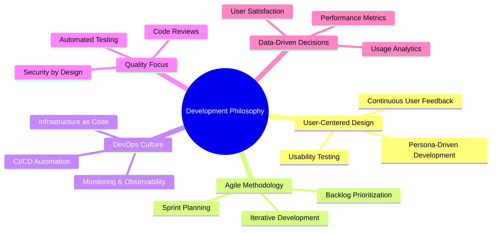
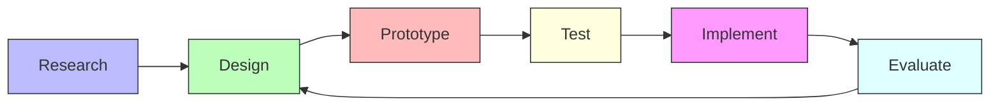
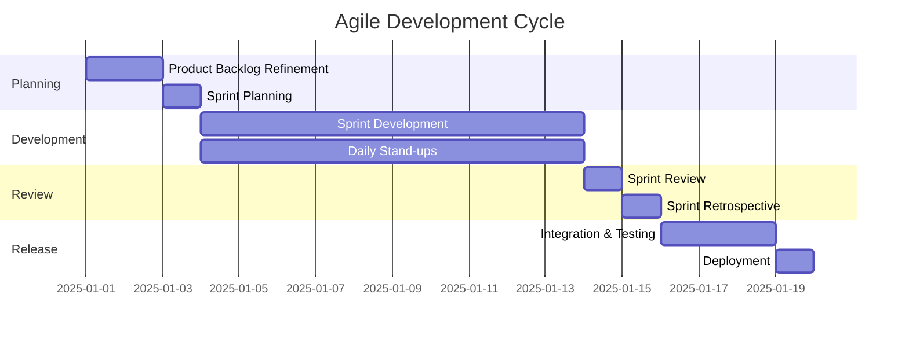
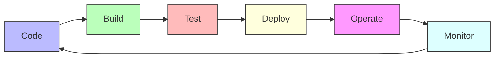
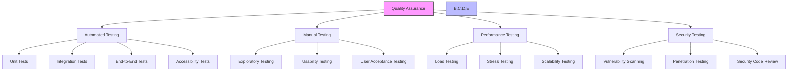
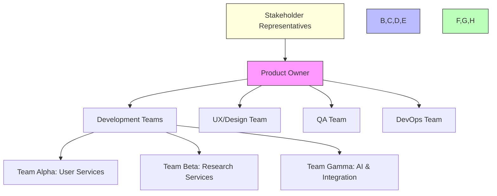
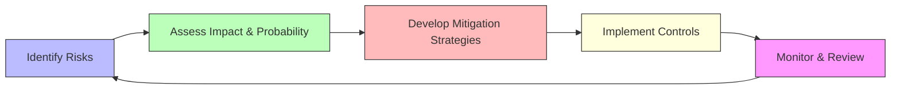
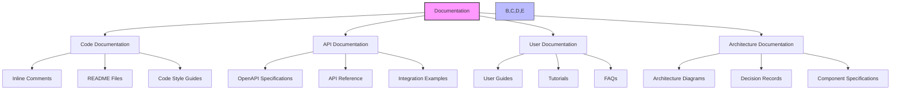
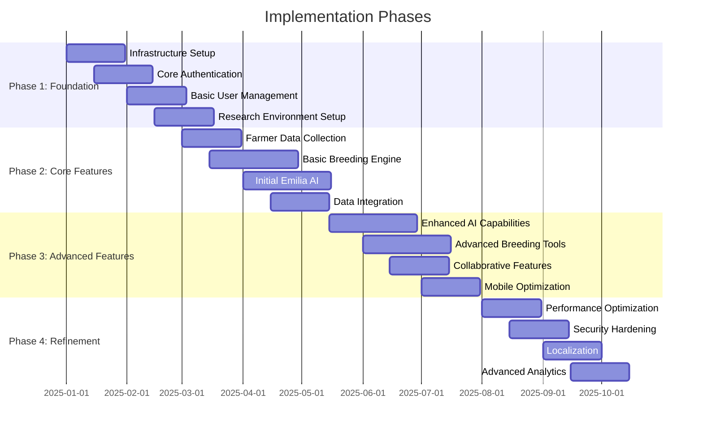

# Development Approach Recommendations

## Introduction

This section provides strategic recommendations for the development approach of the Agricultural Research Platform. These recommendations are designed to ensure successful implementation, minimize risks, and deliver maximum value to all stakeholders throughout the development lifecycle.

## Development Philosophy

We recommend adopting the following development philosophy:

## Recommended Development Approach

### 1. User-Centered Design Process

1. **Research**: Conduct in-depth user research with all personas (Farmers, Researchers, Students, Administrators)
   - Contextual inquiry to understand real-world workflows
   - User interviews to identify pain points and opportunities
   - Competitive analysis of existing agricultural research tools

2. **Design**: Create user-centered designs based on research findings
   - Information architecture optimized for each persona
   - Wireframes and mockups for key user journeys
   - Design system for consistent user experience

3. **Prototype**: Develop interactive prototypes for early validation
   - Low-fidelity prototypes for concept validation
   - High-fidelity prototypes for detailed interaction design
   - Functional prototypes for technical validation

4. **Test**: Validate designs with representative users
   - Usability testing with all user personas
   - Accessibility testing for inclusive design
   - Performance testing for critical workflows

5. **Implement**: Develop production-ready features
   - Incremental implementation of validated designs
   - Continuous integration with existing components
   - Feature flagging for controlled rollout

6. **Evaluate**: Measure success against user needs
   - Usage analytics to identify patterns and issues
   - User feedback collection and analysis
   - Iterative refinement based on evaluation results

### 2. Agile Development Methodology

We recommend implementing a hybrid Agile approach combining elements of Scrum and Kanban:

**Key Agile Practices:**

1. **Two-Week Sprints**: Short iteration cycles for rapid feedback and adaptation
2. **Cross-Functional Teams**: Teams organized around features rather than technical layers
3. **Daily Stand-ups**: Brief synchronization meetings to identify blockers and coordinate efforts
4. **Sprint Reviews**: Demonstration of completed features to stakeholders
5. **Sprint Retrospectives**: Continuous process improvement through team reflection
6. **Backlog Refinement**: Regular prioritization and elaboration of upcoming work
7. **Definition of Done**: Clear criteria for feature completion including quality standards
8. **Visible Kanban Boards**: Transparent workflow visualization for all team members

### 3. DevOps Implementation

**Recommended DevOps Practices:**

1. **Infrastructure as Code (IaC)**
   - All infrastructure defined in Terraform
   - Version-controlled infrastructure definitions
   - Automated environment provisioning

2. **Continuous Integration**
   - Automated builds on code commit
   - Static code analysis and linting
   - Unit and integration testing
   - Security scanning

3. **Continuous Delivery**
   - Automated deployment pipelines
   - Environment promotion workflow
   - Feature flags for controlled rollout
   - Automated rollback capabilities

4. **Monitoring and Observability**
   - Comprehensive logging strategy
   - Real-time performance monitoring
   - User behavior analytics
   - Alerting and incident response

5. **Security Automation**
   - Automated security testing
   - Dependency vulnerability scanning
   - Compliance validation
   - Secret management

### 4. Quality Assurance Strategy

**Testing Pyramid Implementation:**

1. **Unit Testing**
   - High coverage of business logic (target: >80%)
   - Automated as part of CI pipeline
   - Fast execution for rapid feedback

2. **Integration Testing**
   - Focus on service interactions and API contracts
   - Database integration tests
   - External service mocking

3. **End-to-End Testing**
   - Critical user journeys for each persona
   - Cross-browser and cross-device testing
   - Realistic test data sets

4. **Specialized Testing**
   - Accessibility testing (WCAG 2.1 AA compliance)
   - Performance testing for critical operations
   - Security testing integrated into pipeline
   - Usability testing with representative users

### 5. Team Structure and Collaboration

**Recommended Team Structure:**

1. **Feature Teams**
   - Cross-functional teams organized around product features
   - 5-7 members per team with all necessary skills
   - Autonomous decision-making within team boundaries

2. **Communities of Practice**
   - Horizontal groups for shared expertise (Frontend, Backend, Data Science)
   - Knowledge sharing and standard setting
   - Technical leadership and mentoring

3. **Stakeholder Engagement**
   - Regular demos to stakeholder representatives
   - Embedded domain experts within teams
   - User research coordination

### 6. Risk Management Approach

**Key Risk Areas and Mitigations:**

| Risk Category | Potential Risks | Recommended Mitigations |
|---------------|-----------------|-------------------------|
| **Technical** | Integration complexity between components | Proof-of-concept integrations early, clear API contracts |
| | Performance issues with large datasets | Performance testing with realistic data volumes, optimization strategy |
| | AI component reliability | Fallback mechanisms, graceful degradation, monitoring |
| **Schedule** | Scope creep | Clear prioritization framework, MVP definition, feature freezes |
| | Dependency delays | Identify critical path, buffer time for external dependencies |
| | Resource constraints | Resource planning, skill matrix, cross-training |
| **User Adoption** | Resistance to new workflows | Early user involvement, change management plan, training |
| | Usability challenges | Iterative usability testing, progressive rollout |
| | Varying technical abilities | Persona-specific onboarding, contextual help |
| **Data** | Data quality issues | Data validation, cleansing strategies, quality metrics |
| | Privacy concerns | Privacy by design, data minimization, consent management |
| | Integration with legacy systems | Data mapping, transformation services, validation |

### 7. Development Tools and Environment

**Recommended Development Toolchain:**

1. **Source Control**
   - GitHub for code repository
   - Branch protection rules
   - Pull request workflow

2. **CI/CD Pipeline**
   - GitHub Actions for automation
   - AWS CodePipeline for deployment
   - Automated testing and quality gates

3. **Development Environments**
   - Containerized development environments
   - Environment parity with production
   - Automated provisioning

4. **Collaboration Tools**
   - Jira for issue tracking
   - Confluence for documentation
   - Slack for team communication
   - Figma for design collaboration

### 8. Documentation Strategy

**Documentation Approach:**

1. **Documentation as Code**
   - Version-controlled documentation
   - Automated generation where possible
   - Review process for documentation changes

2. **Living Documentation**
   - Regular updates as part of development process
   - Automated testing of documentation examples
   - Feedback mechanisms for documentation users

3. **Multi-format Documentation**
   - Technical documentation for developers
   - User-friendly guides for end users
   - Visual documentation for complex concepts

## Implementation Recommendations

### Phased Implementation Approach

We recommend a phased implementation approach with clear milestones and deliverables:

### Key Success Factors

1. **Early and Continuous Stakeholder Engagement**
   - Regular demos to stakeholders
   - Feedback collection and incorporation
   - Transparent progress reporting

2. **Technical Excellence**
   - Code quality standards
   - Architecture governance
   - Technical debt management

3. **User-Centered Approach**
   - Continuous user research
   - Usability testing throughout development
   - Feedback-driven refinement

4. **Data-Driven Decision Making**
   - Usage analytics to guide priorities
   - Performance metrics to identify optimizations
   - User satisfaction measurement

5. **Adaptive Planning**
   - Regular plan reviews and adjustments
   - Flexible scope management
   - Continuous prioritization

## Conclusion

The recommended development approach emphasizes user-centered design, agile methodologies, DevOps practices, and quality assurance to ensure successful implementation of the Agricultural Research Platform. By following these recommendations, the development team can deliver a high-quality platform that meets the needs of all user personas while managing risks effectively.

For detailed implementation phases and priorities, see the [Implementation Phases](implementation-phases.md) section.
