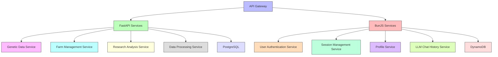

# Backend Technologies

## Overview

This section details the backend technologies selected for the Animal Genetics Research Platform. The backend architecture is designed to provide robust, scalable services that support the diverse needs of farmers, researchers, and students while maintaining high performance and data integrity.

## Core Backend Stack

The platform utilizes a dual backend architecture to optimize for different workloads:

| Technology | Purpose | Rationale |
|------------|---------|-----------|
| FastAPI | Genetic/genomic data and farm management | High-performance Python framework optimized for data processing and scientific computing |
| BunJS | User session, profile, and LLM chat history | JavaScript runtime with exceptional performance for user-facing services |

## Backend Architecture

The backend is structured as a microservices architecture with specialized services:

## FastAPI Services

FastAPI is used for data-intensive operations and scientific computing:

### Genetic Data Service

- Handles genomic data processing and analysis
- Provides APIs for genetic evaluation calculations
- Manages breeding value estimation
- Supports complex genetic queries
- Integrates with bioinformatics tools

### Farm Management Service

- Manages animal records and metadata
- Handles breeding event tracking
- Processes performance data collection
- Provides farm analytics and reporting
- Supports mobile data collection synchronization

### Research Analysis Service

- Interfaces with RStudio and JupyterHub environments
- Manages research project data
- Handles statistical analysis requests
- Provides visualization data preparation
- Supports collaborative research workflows

### Data Processing Service

- Manages ETL pipelines for data integration
- Handles batch processing of large datasets
- Provides data validation and cleaning
- Supports data import/export operations
- Manages data versioning and lineage

## BunJS Services

BunJS is used for user-facing services and real-time operations:

### User Authentication Service

- Manages user authentication and authorization
- Handles OAuth integration with institutions
- Provides role-based access control
- Supports multi-factor authentication
- Manages security policies and compliance

### Session Management Service

- Handles user session creation and management
- Provides session persistence and recovery
- Manages concurrent session policies
- Tracks session analytics and metrics
- Supports session timeout and security features

### Profile Service

- Manages user profile information
- Handles preference settings and customization
- Provides personalization features
- Supports profile analytics and recommendations
- Manages privacy settings and data sharing preferences

### LLM Chat History Service

- Stores and retrieves chat history with Emilia AI
- Manages context for ongoing conversations
- Provides analytics on chat interactions
- Supports conversation export and sharing
- Handles privacy and retention policies

## Key Backend Features

### FastAPI Implementation

The platform leverages FastAPI for:

- **Asynchronous request handling** for high throughput
- **Automatic API documentation** with OpenAPI and Swagger UI
- **Type validation** with Pydantic models
- **High performance** for data-intensive operations
- **Python ecosystem integration** for scientific computing

### BunJS Implementation

BunJS provides:

- **Exceptional JavaScript performance** for user-facing services
- **Low memory footprint** for efficient resource utilization
- **TypeScript support** for type safety
- **Built-in bundler** for optimized deployment
- **WebSocket support** for real-time features

### API Design

The backend APIs follow these principles:

- RESTful design for standard operations
- GraphQL for complex, nested data queries
- Versioned endpoints for backward compatibility
- Comprehensive documentation with examples
- Rate limiting and throttling for stability

### Security Implementation

Backend security includes:

- JWT-based authentication
- Role-based access control
- Input validation and sanitization
- SQL injection prevention
- CSRF protection
- Rate limiting and brute force protection

## Database Integration

The backend connects to specialized databases:

### PostgreSQL (SQL)

- Stores structured genetic and farm management data
- Handles complex relationships between entities
- Supports advanced querying for genetic analysis
- Provides ACID compliance for critical data
- Manages transactional integrity for breeding operations

### DynamoDB (NoSQL)

- Stores user profiles and preferences
- Manages session data and authentication tokens
- Handles LLM chat history and context
- Provides high-performance key-value access
- Supports flexible schema for evolving user data

## Performance Optimization

The backend is optimized for performance through:

- Caching strategies for frequently accessed data
- Database query optimization
- Asynchronous processing for long-running tasks
- Horizontal scaling for high-demand services
- Resource pooling and connection management

## Monitoring and Observability

Backend services include:

- Comprehensive logging with structured formats
- Metrics collection for performance monitoring
- Distributed tracing for request flows
- Health checks and readiness probes
- Alerting for critical issues

## Development Tooling

Backend development is supported by:

- Containerization with Docker
- CI/CD pipelines for automated testing and deployment
- Code quality tools and linters
- Automated testing frameworks
- Documentation generation

## Integration Points

The backend integrates with:

- Frontend applications via REST and GraphQL APIs
- External data sources and APIs
- Authentication providers
- Analytics and monitoring systems
- Research computing environments

