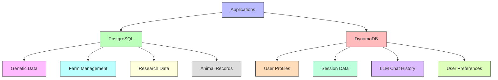

# Database Architecture

## Overview

This section details the database architecture for the Animal Genetics Research Platform. The platform utilizes a dual database approach to optimize for different data types and access patterns, ensuring high performance, scalability, and data integrity.

## Core Database Stack

The platform employs two complementary database systems:

| Database | Type | Purpose | Provider |
|----------|------|---------|----------|
| PostgreSQL | Relational (SQL) | Genetic/genomic data and farm management | Amazon RDS for PostgreSQL |
| DynamoDB | NoSQL | User profiles, sessions, and LLM chat history | Amazon DynamoDB |

## Database Architecture

The database architecture is designed to support the diverse needs of the platform:

## PostgreSQL Implementation

Amazon RDS for PostgreSQL is used for structured data with complex relationships:

### Genetic Data Storage

- Implements the [Sheep Genetics Schema](../architecture/components/sheep-genetics-schema.md)
- Stores genomic data with efficient indexing
- Manages complex pedigree relationships
- Supports advanced genetic analysis queries
- Handles breeding value calculations and storage

### Farm Management Data

- Stores animal records and metadata
- Manages breeding event tracking
- Records performance measurements
- Supports farm analytics and reporting
- Maintains historical data for trend analysis

### Research Data Management

- Stores research project data and metadata
- Manages experimental designs and protocols
- Records analysis results and findings
- Supports collaborative research data sharing
- Maintains publication-related data

### Key PostgreSQL Features

The platform leverages PostgreSQL's capabilities:

- **Advanced Indexing**: Optimized for genetic data queries
- **Partitioning**: For efficient management of large datasets
- **JSON Support**: For semi-structured data within relational context
- **Full-Text Search**: For research content and documentation
- **Transactional Integrity**: For critical breeding and research operations
- **Spatial Data**: For geographic analysis of farm data
- **Triggers and Stored Procedures**: For complex data validation and processing

## DynamoDB Implementation

Amazon DynamoDB is used for high-throughput, low-latency access to user-related data:

### User Profile Storage

- Stores user account information
- Manages role and permission data
- Records user preferences and settings
- Supports personalization features
- Maintains user activity history

### Session Management

- Stores authentication tokens and session data
- Manages concurrent session information
- Records session analytics and metrics
- Supports session recovery and persistence
- Handles security-related session attributes

### LLM Chat History

- Stores conversation history with Emilia AI
- Manages context for ongoing conversations
- Records interaction patterns and preferences
- Supports conversation export and sharing
- Maintains privacy and retention policies

### Key DynamoDB Features

The platform leverages DynamoDB's capabilities:

- **Auto-scaling**: For handling variable workloads
- **Global Tables**: For multi-region availability
- **Point-in-time Recovery**: For data protection
- **TTL (Time to Live)**: For automatic data expiration
- **Streams**: For event-driven architectures
- **Secondary Indexes**: For flexible query patterns
- **Transactions**: For multi-item operations

## Data Integration and Synchronization

The platform implements several strategies for maintaining consistency across databases:

- **Event-driven Updates**: Using message queues for cross-database synchronization
- **Change Data Capture**: For tracking and propagating changes
- **Batch Synchronization**: For periodic reconciliation of data
- **Transactional Outbox Pattern**: For reliable cross-database operations
- **Eventual Consistency Model**: For non-critical data synchronization

## Data Security and Compliance

Database security measures include:

- **Encryption at Rest**: For all stored data
- **Encryption in Transit**: For all data communications
- **Fine-grained Access Control**: For data access management
- **Audit Logging**: For tracking all data access and modifications
- **Backup and Recovery**: For data protection and disaster recovery
- **Compliance Controls**: For meeting regulatory requirements

## Performance Optimization

Database performance is optimized through:

- **Query Optimization**: For efficient data retrieval
- **Connection Pooling**: For efficient resource utilization
- **Read Replicas**: For distributing read workloads
- **Caching Strategies**: For frequently accessed data
- **Data Partitioning**: For improved query performance
- **Index Optimization**: For faster data access
- **Query Monitoring**: For identifying and resolving bottlenecks

## Scalability Approach

The database architecture supports scalability through:

- **Horizontal Scaling**: Adding more database instances
- **Vertical Scaling**: Increasing resources for existing instances
- **Read/Write Splitting**: Separating read and write operations
- **Sharding**: Distributing data across multiple instances
- **Auto-scaling**: Automatically adjusting resources based on demand

## Data Lifecycle Management

The platform implements comprehensive data lifecycle policies:

- **Data Retention**: Policies for how long different data types are kept
- **Archiving**: Moving historical data to cost-effective storage
- **Purging**: Removing unnecessary or expired data
- **Versioning**: Tracking changes to critical data over time
- **Lineage Tracking**: Recording the origin and transformations of data

## Integration with Analytics

The database architecture supports analytics through:

- **Data Warehousing**: Integration with analytics platforms
- **ETL Pipelines**: For transforming data for analysis
- **Real-time Analytics**: For immediate insights
- **Reporting Infrastructure**: For generating business intelligence
- **Machine Learning Integration**: For predictive analytics

