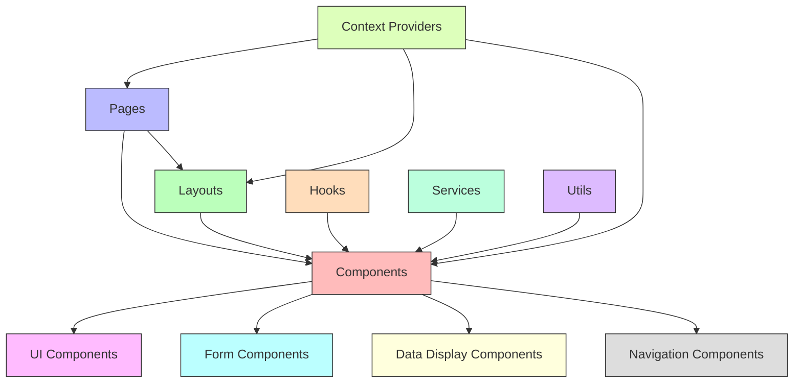

# Frontend Technologies

## Overview

This section details the frontend technologies selected for the Animal Genetics Research Platform. The frontend stack is designed to provide a responsive, accessible, and feature-rich user experience across all device types while maintaining high performance and code quality.

## Core Frontend Stack

| Technology | Purpose | Rationale |
|------------|---------|-----------|
| Next.js | React framework | Provides server-side rendering, static site generation, and optimized performance |
| Next UI | Component library | Offers accessible, customizable UI components with modern design aesthetics |
| Tailwind CSS | Utility-first CSS framework | Enables rapid UI development with consistent design patterns and responsive layouts |
| ZOD | Schema validation | Ensures type safety and validation for form inputs and API responses |
| React Hook Form | Form management | Provides performant, flexible form handling with minimal re-renders |
| Better-Auth | Authentication library | Simplifies authentication flows with secure, customizable implementations |

## Frontend Architecture

The frontend is structured as a modern, component-based application:

## Key Frontend Features

### Next.js Implementation

The platform leverages Next.js for:

- **Server-side rendering** for improved initial load performance and SEO
- **Static site generation** for documentation and educational content
- **API routes** for backend communication
- **Image optimization** for efficient delivery of visual content
- **Incremental static regeneration** for dynamic content with static performance benefits

### Component System with Next UI

The UI is built using Next UI components:

- Consistent design language across all platform interfaces
- Accessible components meeting WCAG 2.1 AA standards
- Dark/light mode support with theme customization
- Responsive design for all device sizes
- Animation and transition effects for improved user experience

### Styling with Tailwind CSS

Tailwind CSS provides:

- Utility-first approach for rapid development
- Consistent spacing, typography, and color systems
- Custom design system implementation
- Responsive utilities for all viewport sizes
- Performance optimization through purging unused styles

### Form Management

Forms are implemented using:

- **React Hook Form** for performant form state management
- **ZOD** for schema validation and type safety
- Custom form components for consistent UX
- Form persistence for multi-step processes
- Inline validation with accessible error messaging

### Authentication

User authentication is handled through:

- **Better-Auth** for secure authentication flows
- Role-based access control integration
- Session management and persistence
- Multi-factor authentication support
- OAuth integration with research institutions

## Role-Specific Interfaces

The frontend provides tailored interfaces for each user persona:

### Farmer Interface

- Simplified dashboard with key performance indicators
- Mobile-optimized data entry forms
- Offline-capable functionality for field use
- Visual breeding recommendations
- Simplified data visualization

### Researcher Interface

- Advanced data visualization tools
- Research environment integration
- Collaborative workspaces
- Publication-ready figure export
- Complex data filtering and analysis

### Student Interface

- Guided learning experiences
- Interactive tutorials
- Progress tracking
- Simplified research tools
- Educational content integration

### Administrator Interface

- System monitoring dashboards
- User management tools
- Configuration interfaces
- Audit logging and reporting
- System health visualization

## Performance Optimization

The frontend is optimized for performance through:

- Code splitting and lazy loading
- Image and asset optimization
- Caching strategies
- Bundle size minimization
- Performance monitoring and metrics

## Accessibility

The platform meets accessibility requirements through:

- WCAG 2.1 AA compliance
- Keyboard navigation support
- Screen reader compatibility
- Color contrast requirements
- Focus management

## Browser Support

The frontend supports:

- Modern evergreen browsers (Chrome, Firefox, Safari, Edge)
- Mobile browsers on iOS and Android
- Progressive enhancement for older browsers
- Responsive design for all screen sizes

## Development Tooling

Frontend development is supported by:

- TypeScript for type safety
- ESLint for code quality
- Prettier for code formatting
- Jest and React Testing Library for testing
- Storybook for component documentation

## Integration Points

The frontend integrates with:

- Backend APIs for data access
- Authentication services
- Analytics and monitoring
- Third-party visualization libraries
- External research tools

