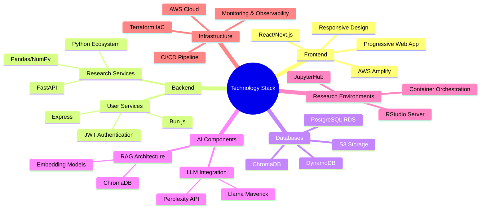
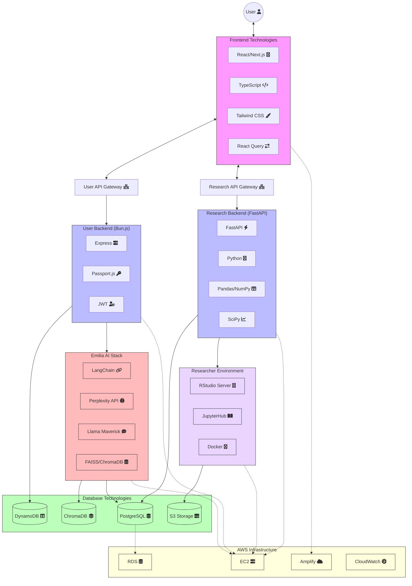

# Technology Stack Overview

## Introduction

The Agricultural Research Platform employs a modern, cloud-native technology stack designed to meet the diverse needs of researchers, farmers, students, and administrators. This section provides a comprehensive overview of the technologies selected for each system component, along with the rationale for these choices.

## Technology Stack Summary

## Technology Selection Principles

The technology stack was selected based on the following principles:

1. **Best-of-Breed**: Selecting the most appropriate technology for each specific function
2. **Developer Productivity**: Prioritizing technologies that enhance development efficiency
3. **Performance Optimization**: Choosing technologies that deliver optimal performance
4. **Scalability**: Ensuring all components can scale to meet growing demand
5. **Maintainability**: Selecting technologies with strong community support and documentation
6. **Security**: Prioritizing technologies with robust security features and practices
7. **Cost Efficiency**: Balancing performance needs with operational costs

## Frontend Technologies

### Core Technologies

| Technology | Version | Purpose | Selection Rationale |
|------------|---------|---------|---------------------|
| React | 18.x | UI component library | Component reusability, virtual DOM performance, strong ecosystem |
| Next.js | 14.x | React framework | Server-side rendering, routing, API routes, optimized performance |
| TypeScript | 5.x | Type-safe JavaScript | Improved code quality, developer productivity, better tooling |
| Tailwind CSS | 3.x | Utility-first CSS | Rapid UI development, consistent design system, responsive design |

### Frontend Libraries

| Technology | Version | Purpose | Selection Rationale |
|------------|---------|---------|---------------------|
| React Query | 5.x | Data fetching and caching | Optimized API interactions, reduced network requests |
| Redux Toolkit | 2.x | State management | Centralized state, predictable updates, developer tools |
| React Hook Form | 7.x | Form handling | Performance optimization, validation, reduced re-renders |
| D3.js | 7.x | Data visualization | Powerful custom visualizations for research data |
| Chart.js | 4.x | Charting library | Simple charts for farmer dashboards and analytics |
| Leaflet | 1.9.x | Interactive maps | Field mapping, geospatial data visualization |

### Deployment and Hosting

| Technology | Version | Purpose | Selection Rationale |
|------------|---------|---------|---------------------|
| AWS Amplify | Latest | Frontend hosting | CI/CD integration, global CDN, easy deployment |
| CloudFront | Latest | Content delivery | Global distribution, reduced latency, HTTPS |
| Route 53 | Latest | DNS management | Reliable routing, health checks, domain management |

## Backend Technologies

### User Services Stack

| Technology | Version | Purpose | Selection Rationale |
|------------|---------|---------|---------------------|
| Bun.js | 1.x | JavaScript runtime | Superior performance, built-in bundler, TypeScript support |
| Express | 4.x | Web framework | Lightweight, flexible, extensive middleware ecosystem |
| TypeScript | 5.x | Type-safe JavaScript | Code quality, maintainability, developer productivity |
| JWT | - | Authentication tokens | Stateless authentication, cross-service compatibility |
| Passport.js | 0.6.x | Authentication middleware | Multiple auth strategy support, extensibility |

### Research Services Stack

| Technology | Version | Purpose | Selection Rationale |
|------------|---------|---------|---------------------|
| FastAPI | 0.104.x | API framework | Performance, automatic OpenAPI docs, type safety |
| Python | 3.11.x | Programming language | Rich ecosystem for scientific computing, ML libraries |
| Pandas | 2.1.x | Data manipulation | Powerful data analysis capabilities, wide adoption |
| NumPy | 1.26.x | Numerical computing | Efficient numerical operations, scientific computing |
| SciPy | 1.11.x | Scientific computing | Statistical functions, optimization, signal processing |
| Pydantic | 2.4.x | Data validation | Type checking, schema validation, automatic documentation |

### AI Components

| Technology | Version | Purpose | Selection Rationale |
|------------|---------|---------|---------------------|
| Perplexity API | Latest | LLM integration | High-quality responses, scientific knowledge |
| Llama Maverick | Latest | LLM integration | Open-source model, customization potential |
| LangChain | 0.1.x | LLM framework | RAG implementation, prompt management, agent architecture |
| ChromaDB | 0.4.x | Vector database | Efficient similarity search, embedding storage |
| Sentence Transformers | 2.2.x | Embedding models | High-quality text embeddings for search |
| FAISS | 1.7.x | Vector search | Efficient similarity search at scale |

## Database Technologies

### Relational Database

| Technology | Version | Purpose | Selection Rationale |
|------------|---------|---------|---------------------|
| PostgreSQL | 15.x | Primary relational database | ACID compliance, advanced features, performance |
| Amazon RDS | Latest | Database hosting | Managed service, automated backups, high availability |
| PostGIS | 3.3.x | Geospatial extension | Spatial data types and functions for field mapping |
| TimescaleDB | 2.11.x | Time-series extension | Efficient storage and querying of time-series data |
| pgvector | 0.5.x | Vector extension | Vector similarity search within PostgreSQL |

### NoSQL Database

| Technology | Version | Purpose | Selection Rationale |
|------------|---------|---------|---------------------|
| DynamoDB | Latest | NoSQL database | Scalability, low-latency, managed service |
| ElastiCache | Latest | In-memory caching | Session data, frequent queries, performance |
| ChromaDB | 0.4.x | Vector database | Embedding storage, semantic search |

### Storage

| Technology | Version | Purpose | Selection Rationale |
|------------|---------|---------|---------------------|
| Amazon S3 | Latest | Object storage | Scalable, durable, cost-effective |
| S3 Glacier | Latest | Archival storage | Long-term storage of historical research data |
| EFS | Latest | File system | Shared storage for research environments |

## Research Environment Technologies

### RStudio Environment

| Technology | Version | Purpose | Selection Rationale |
|------------|---------|---------|---------------------|
| RStudio Server Pro | Latest | R development environment | Interactive R development, visualization |
| R | 4.3.x | Statistical programming | Statistical analysis, specialized agricultural packages |
| Shiny | 1.7.x | Interactive web apps | Creating interactive visualizations and dashboards |
| Bioconductor | 3.17.x | Bioinformatics packages | Genomic data analysis tools |
| tidyverse | 2.0.x | Data science packages | Data manipulation, visualization, analysis |

### JupyterHub Environment

| Technology | Version | Purpose | Selection Rationale |
|------------|---------|---------|---------------------|
| JupyterHub | 4.0.x | Multi-user Jupyter server | Collaborative notebooks, resource management |
| JupyterLab | 4.0.x | Data science IDE | Interactive development, visualization, documentation |
| Python | 3.11.x | Programming language | Scientific computing, data analysis |
| scikit-learn | 1.3.x | Machine learning | Predictive modeling, classification, regression |
| Matplotlib | 3.8.x | Visualization | Publication-quality figures and visualizations |
| Seaborn | 0.13.x | Statistical visualization | Enhanced statistical graphics |

## Infrastructure and DevOps

### Cloud Infrastructure

| Technology | Version | Purpose | Selection Rationale |
|------------|---------|---------|---------------------|
| AWS | Latest | Cloud provider | Comprehensive services, global presence, reliability |
| EC2 | Latest | Compute resources | Flexible instance types, autoscaling |
| VPC | Latest | Network isolation | Security, control, private networking |
| ELB | Latest | Load balancing | Traffic distribution, high availability |
| IAM | Latest | Access management | Fine-grained access control, security |

### Infrastructure as Code

| Technology | Version | Purpose | Selection Rationale |
|------------|---------|---------|---------------------|
| Terraform | 1.6.x | Infrastructure provisioning | Provider-agnostic, state management, modularity |
| AWS CDK | 2.x | Infrastructure as code | TypeScript/Python definition, AWS integration |
| CloudFormation | Latest | AWS resource templates | Native AWS integration, comprehensive coverage |

### CI/CD Pipeline

| Technology | Version | Purpose | Selection Rationale |
|------------|---------|---------|---------------------|
| GitHub Actions | Latest | CI/CD automation | Integration with GitHub, flexible workflows |
| AWS CodePipeline | Latest | Deployment automation | AWS integration, managed service |
| Docker | 24.x | Containerization | Consistent environments, isolation, portability |
| ECR | Latest | Container registry | Private container storage, integration with ECS |

### Monitoring and Observability

| Technology | Version | Purpose | Selection Rationale |
|------------|---------|---------|---------------------|
| CloudWatch | Latest | Monitoring and logging | AWS integration, metrics, alarms |
| Prometheus | 2.47.x | Metrics collection | Open-source, flexible, powerful query language |
| Grafana | 10.x | Visualization | Dashboards, alerts, comprehensive data source support |
| OpenTelemetry | 1.19.x | Distributed tracing | Standardized observability, vendor-neutral |

## Technology Stack Diagram

The following diagram illustrates how the various technologies interact within the system architecture:

## Technology Evaluation Matrix

The following matrix summarizes the evaluation of key technologies against selection criteria:

| Technology | Performance | Scalability | Developer Experience | Community Support | Security | Cost Efficiency | Overall Rating |
|------------|------------|------------|---------------------|------------------|---------|----------------|---------------|
| React/Next.js | ⭐⭐⭐⭐⭐ | ⭐⭐⭐⭐ | ⭐⭐⭐⭐⭐ | ⭐⭐⭐⭐⭐ | ⭐⭐⭐⭐ | ⭐⭐⭐⭐ | ⭐⭐⭐⭐⭐ |
| Bun.js | ⭐⭐⭐⭐⭐ | ⭐⭐⭐⭐ | ⭐⭐⭐⭐ | ⭐⭐⭐ | ⭐⭐⭐⭐ | ⭐⭐⭐⭐⭐ | ⭐⭐⭐⭐ |
| FastAPI | ⭐⭐⭐⭐⭐ | ⭐⭐⭐⭐⭐ | ⭐⭐⭐⭐⭐ | ⭐⭐⭐⭐ | ⭐⭐⭐⭐ | ⭐⭐⭐⭐⭐ | ⭐⭐⭐⭐⭐ |
| PostgreSQL | ⭐⭐⭐⭐ | ⭐⭐⭐⭐ | ⭐⭐⭐⭐ | ⭐⭐⭐⭐⭐ | ⭐⭐⭐⭐⭐ | ⭐⭐⭐⭐ | ⭐⭐⭐⭐ |
| DynamoDB | ⭐⭐⭐⭐⭐ | ⭐⭐⭐⭐⭐ | ⭐⭐⭐ | ⭐⭐⭐⭐ | ⭐⭐⭐⭐⭐ | ⭐⭐⭐ | ⭐⭐⭐⭐ |
| ChromaDB | ⭐⭐⭐⭐ | ⭐⭐⭐⭐ | ⭐⭐⭐⭐ | ⭐⭐⭐ | ⭐⭐⭐ | ⭐⭐⭐⭐ | ⭐⭐⭐⭐ |
| RStudio Server | ⭐⭐⭐⭐ | ⭐⭐⭐ | ⭐⭐⭐⭐⭐ | ⭐⭐⭐⭐⭐ | ⭐⭐⭐⭐ | ⭐⭐⭐ | ⭐⭐⭐⭐ |
| JupyterHub | ⭐⭐⭐⭐ | ⭐⭐⭐⭐ | ⭐⭐⭐⭐⭐ | ⭐⭐⭐⭐⭐ | ⭐⭐⭐⭐ | ⭐⭐⭐⭐ | ⭐⭐⭐⭐ |
| AWS | ⭐⭐⭐⭐⭐ | ⭐⭐⭐⭐⭐ | ⭐⭐⭐⭐ | ⭐⭐⭐⭐⭐ | ⭐⭐⭐⭐⭐ | ⭐⭐⭐ | ⭐⭐⭐⭐ |
| Terraform | ⭐⭐⭐⭐ | ⭐⭐⭐⭐⭐ | ⭐⭐⭐⭐ | ⭐⭐⭐⭐⭐ | ⭐⭐⭐⭐ | ⭐⭐⭐⭐ | ⭐⭐⭐⭐ |

## Technology Versioning and Compatibility

The system will maintain compatibility between components through:

1. **Semantic Versioning**: All custom components follow semantic versioning
2. **Dependency Management**: Strict version pinning for all dependencies
3. **Compatibility Testing**: Automated testing of component interactions
4. **Upgrade Strategy**: Coordinated upgrades with backward compatibility periods
5. **Documentation**: Clear documentation of version dependencies and constraints

## Technology Roadmap

The technology stack will evolve according to the following roadmap:

### Short-term (1 year)
- Adoption of latest stable versions of core technologies
- Integration of additional agricultural-specific libraries and tools
- Performance optimization of key computational workflows

### Medium-term (2-3 years)
- Evaluation of emerging AI technologies for potential integration
- Migration to serverless architectures where appropriate
- Enhanced edge computing capabilities for field data collection

### Long-term (3+ years)
- Exploration of quantum computing for complex genomic analysis
- Integration with emerging agricultural IoT standards
- Adoption of advanced visualization technologies (AR/VR)

For detailed information on specific technology components, see the following sections:
- [Frontend Technologies](frontend.md)
- [Backend Technologies](backend.md)
- [Database Architecture](database.md)
- [AI Components](ai-components.md)
- [Infrastructure & Deployment](infrastructure.md)
