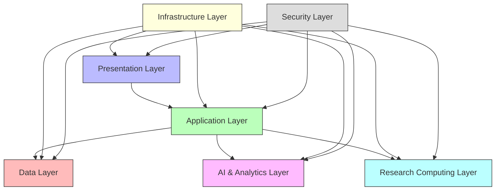

# Technology Stack Overview

## Introduction

The Animal Genetics Research Platform requires a robust and specialized technology stack to support the complex needs of genomic analysis, breeding management, and collaborative research. This section outlines the technologies selected for each component of the platform, with rationale for their selection and implementation considerations.

## Technology Stack Summary

The platform's technology stack is organized into several key layers:

## Presentation Layer

### Web Frontend

| Technology | Purpose | Rationale |
|------------|---------|-----------|
| React | Component-based UI framework | Enables responsive, interactive interfaces with reusable components |
| TypeScript | Typed JavaScript superset | Improves code quality and maintainability through static typing |
| Tailwind CSS | Utility-first CSS framework | Accelerates UI development with consistent design patterns |
| D3.js | Data visualization library | Powers complex visualizations of genetic data and breeding outcomes |
| React Query | Data fetching library | Optimizes API interactions with caching and background updates |

### Mobile Access

| Technology | Purpose | Rationale |
|------------|---------|-----------|
| React Native | Cross-platform mobile framework | Enables code sharing between web and mobile applications |
| Offline-first architecture | Local data storage and sync | Supports field use in areas with limited connectivity |
| PWA capabilities | Progressive web app features | Provides app-like experience through web browsers |

## Application Layer

### API Services

| Technology | Purpose | Rationale |
|------------|---------|-----------|
| Node.js | JavaScript runtime | Enables unified language across frontend and backend |
| Express | Web framework | Provides robust routing and middleware capabilities |
| GraphQL | API query language | Allows flexible, client-specific data retrieval |
| REST APIs | Traditional API endpoints | Supports integration with external systems |
| WebSockets | Real-time communication | Enables collaborative features and live updates |

### Authentication & Authorization

| Technology | Purpose | Rationale |
|------------|---------|-----------|
| OAuth 2.0 | Authentication protocol | Industry standard for secure authentication |
| JWT | Token-based authentication | Enables stateless authentication across services |
| DID Protocol | Decentralized identifiers | Supports portable identity verification |
| RBAC | Role-based access control | Provides granular permission management |

## Data Layer

### Databases

| Technology | Purpose | Rationale |
|------------|---------|-----------|
| PostgreSQL | Primary relational database | Handles complex relationships in animal genetics data |
| MongoDB | Document database | Stores flexible research data and unstructured content |
| Neo4j | Graph database | Manages complex pedigree and genetic relationship networks |
| Redis | In-memory data store | Provides caching and session management |
| ClickHouse | Column-oriented analytics DB | Enables high-performance queries on large genetic datasets |

### Data Processing

| Technology | Purpose | Rationale |
|------------|---------|-----------|
| Apache Kafka | Event streaming platform | Handles real-time data ingestion and processing |
| Apache Spark | Distributed computing | Processes large-scale genomic datasets |
| Airflow | Workflow orchestration | Manages ETL pipelines and data processing workflows |
| dbt | Data transformation | Maintains consistent data models and transformations |

## AI & Analytics Layer

### Machine Learning

| Technology | Purpose | Rationale |
|------------|---------|-----------|
| PyTorch | Deep learning framework | Powers genetic prediction models and image analysis |
| scikit-learn | ML library | Provides classical machine learning algorithms |
| TensorFlow | Deep learning framework | Supports production ML model deployment |
| MLflow | ML lifecycle management | Tracks experiments and manages model versions |

### LLM Integration

| Technology | Purpose | Rationale |
|------------|---------|-----------|
| LangChain | LLM framework | Orchestrates LLM interactions and context management |
| Vector databases | Semantic search | Enables retrieval-augmented generation for domain knowledge |
| Hugging Face Transformers | Model library | Provides access to state-of-the-art language models |
| ONNX Runtime | Model optimization | Improves inference performance for production deployment |

## Research Computing Layer

### Computational Environments

| Technology | Purpose | Rationale |
|------------|---------|-----------|
| RStudio Server | R development environment | Industry standard for statistical genetics research |
| JupyterHub | Python notebook platform | Supports collaborative research and education |
| Docker | Containerization | Ensures consistent research environments |
| Kubernetes | Container orchestration | Manages computational resources for researchers |

### Bioinformatics Tools

| Technology | Purpose | Rationale |
|------------|---------|-----------|
| Bioconductor | R packages for genomics | Provides specialized tools for genetic analysis |
| Biopython | Python libraries for bioinformatics | Supports sequence analysis and data processing |
| PLINK | Whole genome association analysis | Industry standard for genetic association studies |
| BLUPF90 | Genetic evaluation software | Specialized for animal breeding value estimation |

## Infrastructure Layer

### Cloud Infrastructure

| Technology | Purpose | Rationale |
|------------|---------|-----------|
| AWS | Cloud provider | Offers comprehensive services for all platform needs |
| Terraform | Infrastructure as code | Enables reproducible infrastructure deployment |
| Docker | Containerization | Provides consistent environments across development and production |
| Kubernetes | Container orchestration | Manages scalable, resilient application deployment |

### DevOps & Monitoring

| Technology | Purpose | Rationale |
|------------|---------|-----------|
| GitHub Actions | CI/CD pipeline | Automates testing and deployment workflows |
| Prometheus | Metrics collection | Monitors system performance and resource utilization |
| Grafana | Metrics visualization | Provides dashboards for system health and performance |
| ELK Stack | Log management | Centralizes log collection and analysis |

## Security Layer

### Data Protection

| Technology | Purpose | Rationale |
|------------|---------|-----------|
| Vault | Secrets management | Securely stores and manages sensitive credentials |
| AWS KMS | Key management | Handles encryption keys for sensitive genetic data |
| Data encryption | Security measure | Protects data at rest and in transit |
| Anonymization tools | Privacy protection | Enables safe sharing of sensitive breeding data |

### Security Monitoring

| Technology | Purpose | Rationale |
|------------|---------|-----------|
| SIEM | Security information management | Monitors for security threats and anomalies |
| WAF | Web application firewall | Protects against common web vulnerabilities |
| Penetration testing | Security validation | Identifies potential security weaknesses |
| Compliance automation | Regulatory adherence | Ensures platform meets industry standards |

## Technology Selection Criteria

Technologies for the Animal Genetics Research Platform were selected based on:

1. **Performance**: Ability to handle large genomic datasets and complex analyses
2. **Scalability**: Support for growing user base and expanding data volumes
3. **Reliability**: Proven stability in production environments
4. **Community Support**: Active development and maintenance
5. **Integration Capabilities**: Compatibility with existing research tools
6. **Domain Relevance**: Suitability for animal genetics and breeding applications
7. **Cost Efficiency**: Balanced approach to performance and resource utilization

## Technology Roadmap

The platform's technology stack will evolve according to this roadmap:

### Phase 1: Foundation
- Core database implementation with PostgreSQL
- Basic web frontend with React
- Authentication system with OAuth 2.0
- Initial research environments with RStudio and JupyterHub

### Phase 2: Advanced Features
- Integration of graph database for pedigree management
- Enhanced AI capabilities with custom models
- Mobile access for farmers
- Expanded bioinformatics tool integration

### Phase 3: Scale and Optimization
- Distributed computing for large-scale genomic analyses
- Advanced caching and performance optimizations
- Enhanced security features for sensitive genetic data
- Integration with emerging genomic technologies

For detailed specifications of each technology component, please refer to the specific technology sections.
