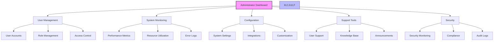
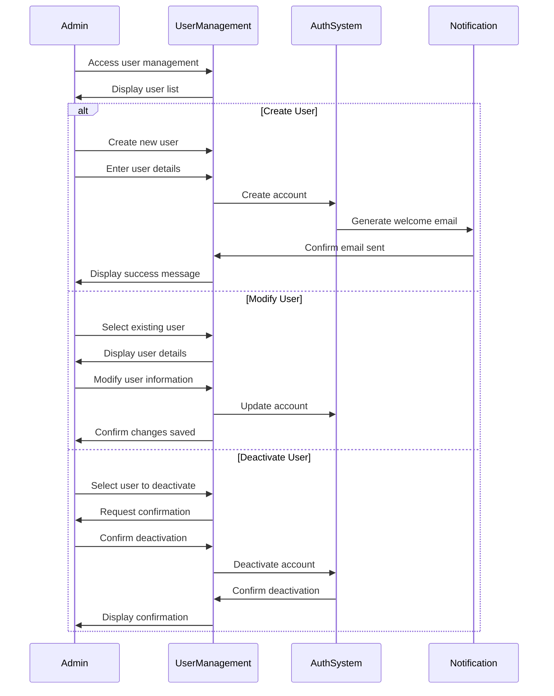
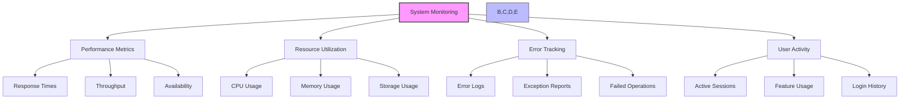
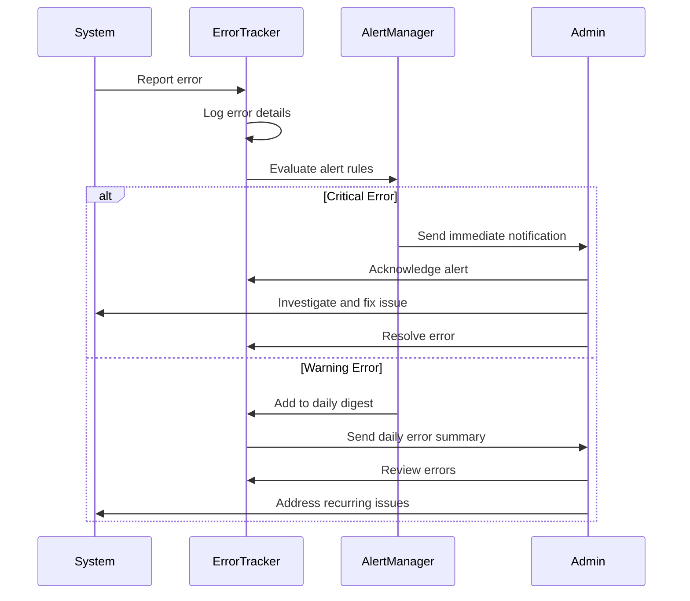
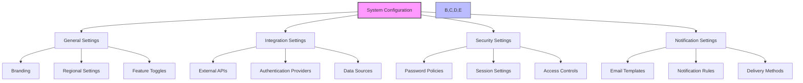
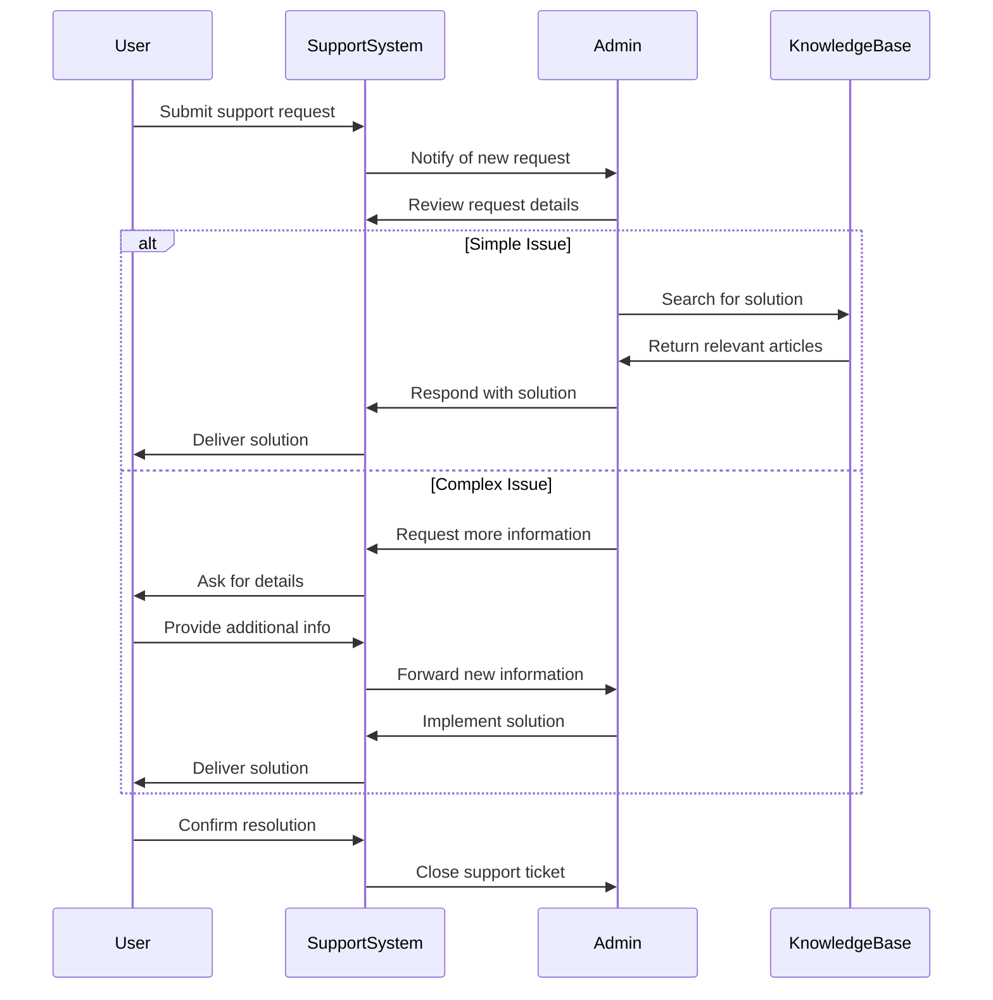
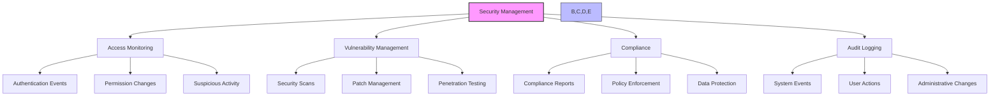
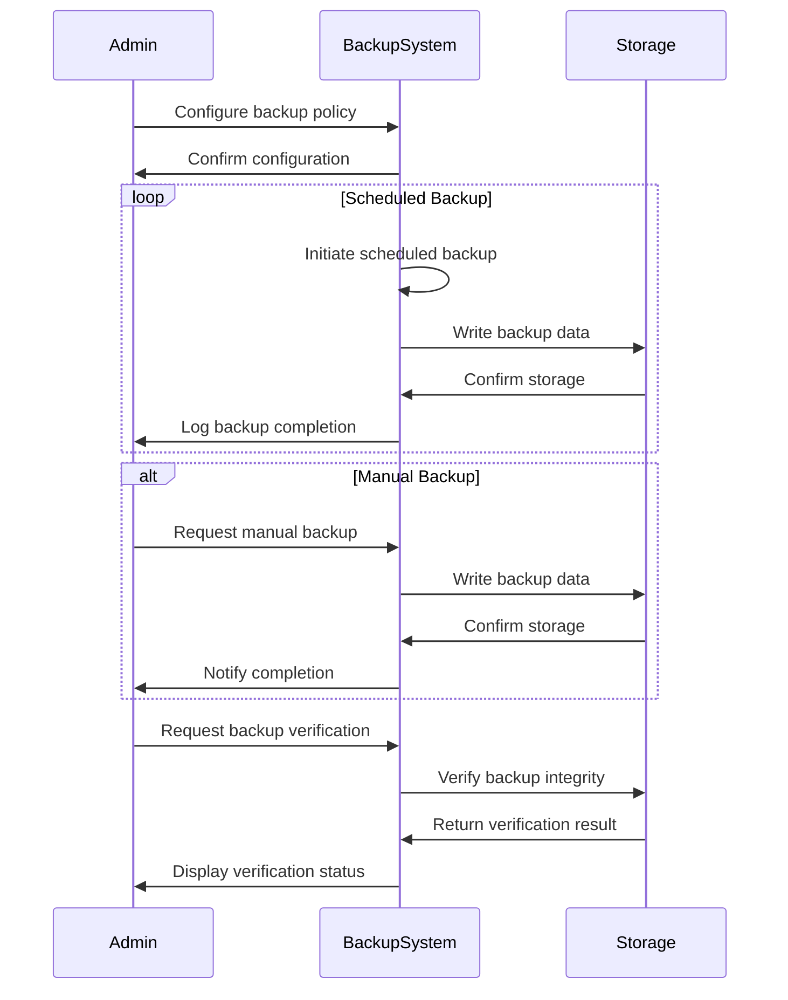

# Administrator Guide

## Introduction

Welcome to the Administrator's Guide for the Agricultural Research Platform. This guide is designed to help system administrators effectively manage the platform, ensure its smooth operation, and support users across all roles.

As an administrator, you are responsible for:
- Managing user accounts and access permissions
- Monitoring system performance and resources
- Configuring system settings and integrations
- Troubleshooting technical issues
- Supporting users across all roles
- Maintaining system security and compliance

This guide provides comprehensive information on all administrative functions and best practices for platform management.

## Administrator Dashboard Overview

Your administrator dashboard provides a centralized interface for all system management functions.



### Accessing the Administrator Dashboard

1. Log in to the Agricultural Research Platform
2. The system will automatically direct you to the Administrator Dashboard if you have admin privileges
3. Alternatively, click on your profile icon and select "Admin Dashboard"
4. Customize your dashboard layout by clicking "Customize" in the top right corner
5. Save your preferred layout for future sessions

## User Management

The User Management section allows you to manage all aspects of user accounts and access control.

### User Account Management



#### Creating User Accounts

1. Navigate to "User Management" > "User Accounts"
2. Click "Create New User"
3. Enter required information:
   - Email address
   - Full name
   - Primary role (Farmer, Researcher, Student, Administrator)
   - Organization/Institution
   - Contact information
4. Set initial password options:
   - Generate temporary password
   - Send email invitation
   - Require password change on first login
5. Click "Create Account"
6. The system will send a welcome email with login instructions

#### Managing Existing Users

1. Navigate to "User Management" > "User Accounts"
2. Use search and filters to find specific users:
   - Search by name, email, or ID
   - Filter by role, status, or organization
   - Sort by various attributes
3. Click on a user to view their profile
4. From the user profile, you can:
   - Edit user information
   - Reset password
   - Change user role
   - Manage permissions
   - View activity history
   - Deactivate or reactivate account

#### Bulk User Operations

For efficient management of multiple users:

1. Navigate to "User Management" > "User Accounts"
2. Use checkboxes to select multiple users
3. Click "Bulk Actions" to access options:
   - Assign to role
   - Add to group
   - Export user data
   - Send notification
   - Deactivate accounts

#### User Import and Export

To manage users in bulk via spreadsheets:

1. **Importing Users**
   - Navigate to "User Management" > "Import/Export"
   - Download the user import template
   - Fill in user details following the template format
   - Upload the completed spreadsheet
   - Review and confirm the import preview
   - Process the import and view results

2. **Exporting Users**
   - Navigate to "User Management" > "Import/Export"
   - Select export criteria and fields to include
   - Choose export format (CSV, Excel)
   - Generate and download the export file

### Role-Based Access Control (RBAC)

The platform uses role-based access control to manage permissions efficiently.

#### Standard Roles

The system includes four primary roles with predefined permissions:

1. **Farmer**
   - Access to farmer-specific features
   - Limited research environment access
   - Data entry and visualization capabilities
   - Participation in breeding programs

2. **Researcher**
   - Full research environment access
   - Advanced analytical tools
   - Collaboration features
   - Publication capabilities

3. **Student**
   - Supervised research environment access
   - Learning resources
   - Limited analytical capabilities
   - Guided project participation

4. **Administrator**
   - Complete system access
   - User management capabilities
   - Configuration and monitoring tools
   - Support functions

#### Custom Roles

You can create custom roles for specialized access needs:

1. Navigate to "User Management" > "Roles"
2. Click "Create New Role"
3. Define role details:
   - Name and description
   - Base role (optional starting point)
   - Permission settings
4. Configure permissions by category:
   - Research tools
   - Data access
   - User management
   - System configuration
5. Save the new role
6. Assign users to the custom role

#### Permission Management

Fine-tune permissions for specific roles:

1. Navigate to "User Management" > "Roles"
2. Select the role to modify
3. Click "Edit Permissions"
4. Adjust permissions using the matrix interface:
   - View: Can see but not modify
   - Edit: Can modify but not delete
   - Admin: Full control including deletion
   - None: No access
5. Save changes to update all users with that role

### User Groups

Create and manage user groups for easier permission management:

1. **Creating Groups**
   - Navigate to "User Management" > "Groups"
   - Click "Create New Group"
   - Define group name and description
   - Add users to the group
   - Set group-specific permissions
   - Save the group

2. **Managing Group Membership**
   - Navigate to "User Management" > "Groups"
   - Select the group to manage
   - Add or remove users
   - Update group permissions
   - Save changes

3. **Group Hierarchies**
   - Create parent-child relationships between groups
   - Inherit permissions from parent groups
   - Override specific permissions as needed

## System Monitoring

The System Monitoring section provides tools to monitor platform performance and resource utilization.

### Dashboard Overview



#### Real-Time Monitoring

The real-time monitoring dashboard provides current system status:

1. Navigate to "System Monitoring" > "Real-Time Dashboard"
2. View key metrics:
   - Active users and sessions
   - System response times
   - Resource utilization
   - Error rates
3. Set refresh rate for automatic updates
4. Configure alerts for critical thresholds

#### Historical Analytics

Analyze system performance over time:

1. Navigate to "System Monitoring" > "Historical Analytics"
2. Select metrics to analyze
3. Choose time period (hour, day, week, month, custom)
4. View trend charts and statistics
5. Export data for external analysis
6. Save custom reports for future reference

### Resource Monitoring

Monitor and manage system resources:

#### Compute Resources

1. Navigate to "System Monitoring" > "Compute Resources"
2. View utilization metrics:
   - CPU usage by service
   - Memory allocation and usage
   - Instance health status
   - Autoscaling events
3. Adjust resource allocations as needed
4. Schedule maintenance windows

#### Storage Resources

1. Navigate to "System Monitoring" > "Storage Resources"
2. Monitor storage metrics:
   - Total storage usage
   - Usage by service/user
   - Growth trends
   - Backup status
3. Manage storage quotas
4. Initiate cleanup procedures for unused data

#### Database Performance

1. Navigate to "System Monitoring" > "Database Performance"
2. Monitor database metrics:
   - Query performance
   - Connection counts
   - Lock contention
   - Replication status
3. Identify slow queries
4. Optimize database configuration

### Error Tracking and Alerting

Monitor and respond to system errors:



#### Error Log Management

1. Navigate to "System Monitoring" > "Error Logs"
2. View errors filtered by:
   - Severity (Critical, Error, Warning, Info)
   - Component (Frontend, Backend, Database, etc.)
   - Time period
   - User impact
3. Drill down into specific errors for details:
   - Stack traces
   - User context
   - System state
   - Related errors

#### Alert Configuration

1. Navigate to "System Monitoring" > "Alert Configuration"
2. Create alert rules based on:
   - Error types and patterns
   - Performance thresholds
   - Resource utilization
   - Security events
3. Configure notification methods:
   - Email
   - SMS
   - Dashboard notifications
   - Integration with external systems (Slack, PagerDuty, etc.)
4. Set alert severity and escalation paths
5. Define on-call schedules for rotating responsibilities

### User Activity Monitoring

Track and analyze user activity across the platform:

1. **Session Monitoring**
   - View active user sessions
   - Track session duration and activity
   - Identify unusual access patterns
   - Force logout when necessary

2. **Feature Usage Analytics**
   - Monitor usage of platform features
   - Identify popular and underutilized features
   - Track resource-intensive operations
   - Generate usage reports by role or department

3. **Access Logs**
   - Review authentication attempts
   - Track resource access
   - Monitor privileged operations
   - Export logs for compliance reporting

## System Configuration

The System Configuration section allows you to customize and configure platform settings.

### General Settings



#### Platform Customization

1. Navigate to "System Configuration" > "General Settings"
2. Customize branding elements:
   - Organization name and logo
   - Color scheme and theme
   - Custom welcome messages
   - Terms of service and privacy policy
3. Configure regional settings:
   - Default language
   - Date and time formats
   - Units of measurement
   - Geographic defaults
4. Manage feature toggles:
   - Enable/disable specific features
   - Set feature availability by role
   - Configure beta features

### Integration Management

Configure and manage integrations with external systems:

#### Authentication Providers

1. Navigate to "System Configuration" > "Integrations" > "Authentication"
2. Configure authentication methods:
   - Email/Password settings
   - OAuth 2.0 providers
   - DID Protocol settings
   - Web3/MetaMask integration
   - Single Sign-On (SSO) configuration
3. Set authentication policies:
   - Multi-factor authentication requirements
   - Account lockout settings
   - Password complexity rules

#### External API Connections

1. Navigate to "System Configuration" > "Integrations" > "External APIs"
2. Manage API connections:
   - Weather data services
   - Journal and publication APIs
   - Genomic databases
   - Agricultural data sources
3. Configure API credentials and access tokens
4. Set up data synchronization schedules
5. Monitor API usage and quotas

#### Data Source Configuration

1. Navigate to "System Configuration" > "Integrations" > "Data Sources"
2. Configure connections to external data sources:
   - Research databases
   - Genomic repositories
   - Field sensor networks
   - Satellite imagery services
3. Set up data import/export schedules
4. Configure data transformation rules
5. Monitor data synchronization status

### Research Environment Configuration

Manage settings for research computational environments:

1. **RStudio Configuration**
   - Package repositories and versions
   - Resource allocation tiers
   - User quotas and limits
   - Default configurations

2. **JupyterHub Configuration**
   - Kernel specifications
   - Extension management
   - Resource allocation tiers
   - User quotas and limits

3. **Shared Resources**
   - Reference datasets
   - Common libraries
   - Shared storage allocation
   - Collaboration settings

### Notification System

Configure the platform's notification system:

1. **Email Templates**
   - Edit system email templates
   - Create custom notification templates
   - Configure email formatting
   - Set up email signatures

2. **Notification Rules**
   - Define events that trigger notifications
   - Configure notification content
   - Set notification priorities
   - Create role-specific notification rules

3. **Delivery Methods**
   - Configure email delivery settings
   - Set up SMS notifications
   - Configure in-app notifications
   - Integrate with external messaging systems

## Support Tools

The Support Tools section provides resources for helping users and troubleshooting issues.

### User Support Management



#### Support Ticket Management

1. Navigate to "Support Tools" > "Support Tickets"
2. View all support tickets with filters:
   - Status (New, In Progress, Waiting, Resolved)
   - Priority (Low, Medium, High, Critical)
   - Category (Account, Technical, Research, Data)
   - Assigned staff
3. Click on a ticket to view details:
   - User information
   - Issue description
   - Communication history
   - Related tickets
4. Manage ticket workflow:
   - Assign to support staff
   - Change status and priority
   - Add internal notes
   - Communicate with user
   - Attach solution resources
   - Close and document resolution

#### User Impersonation

For troubleshooting user-specific issues:

1. Navigate to "Support Tools" > "User Impersonation"
2. Search for the user account
3. Click "Impersonate User"
4. The system will:
   - Log the impersonation event for audit purposes
   - Switch your view to the user's perspective
   - Apply all the user's permissions and settings
5. Navigate the platform as the user to identify issues
6. Click "End Impersonation" to return to admin view
7. Document findings in the support ticket

### Knowledge Base Management

Manage the platform's knowledge base for self-service support:

1. **Article Management**
   - Create new knowledge base articles
   - Organize articles by category and tags
   - Update existing content
   - Archive outdated information

2. **FAQ Management**
   - Create and organize frequently asked questions
   - Group FAQs by topic and user role
   - Track FAQ effectiveness
   - Update based on common support issues

3. **Tutorial Management**
   - Create step-by-step tutorials
   - Upload tutorial videos and screenshots
   - Organize tutorials by difficulty and topic
   - Track tutorial completion rates

### System Announcements

Communicate important information to platform users:

1. Navigate to "Support Tools" > "Announcements"
2. Create a new announcement:
   - Title and content
   - Importance level
   - Target audience (all users or specific roles)
   - Display duration
   - Dismissible or persistent
3. Preview the announcement
4. Schedule or publish immediately
5. Track view and dismissal rates
6. Archive past announcements

## Security Management

The Security Management section provides tools for maintaining platform security.

### Security Monitoring



#### Security Dashboard

1. Navigate to "Security Management" > "Security Dashboard"
2. View security metrics and alerts:
   - Failed login attempts
   - Permission changes
   - Unusual access patterns
   - System vulnerability status
3. Investigate security events
4. Generate security reports

#### Security Audit Logs

1. Navigate to "Security Management" > "Audit Logs"
2. View comprehensive logs of security-relevant events:
   - Authentication events
   - Permission changes
   - Administrative actions
   - Data access events
3. Filter logs by:
   - Event type
   - User
   - Time period
   - Severity
4. Export logs for external analysis or compliance reporting

### Compliance Management

Manage platform compliance with relevant regulations:

1. **Compliance Dashboard**
   - View compliance status across regulations
   - Track compliance tasks and deadlines
   - Monitor policy enforcement
   - Generate compliance reports

2. **Data Protection**
   - Configure data retention policies
   - Manage data anonymization rules
   - Set up data export controls
   - Configure consent management

3. **Policy Management**
   - Create and update security policies
   - Distribute policies to users
   - Track policy acknowledgment
   - Enforce policy compliance

### Security Configuration

Configure security settings for the platform:

1. **Password Policies**
   - Set password complexity requirements
   - Configure password expiration
   - Manage account lockout settings
   - Set up password history rules

2. **Session Management**
   - Configure session timeout
   - Set concurrent session limits
   - Manage session validation rules
   - Configure secure cookie settings

3. **Access Control**
   - Set IP address restrictions
   - Configure time-based access rules
   - Manage device authorization
   - Set up geolocation restrictions

## Backup and Recovery

Manage platform data backup and recovery processes.

### Backup Management



#### Backup Configuration

1. Navigate to "System Management" > "Backup & Recovery" > "Configuration"
2. Configure backup policies:
   - Backup frequency and schedule
   - Retention period
   - Storage location
   - Encryption settings
3. Define backup scope:
   - Database backups
   - File storage backups
   - Configuration backups
   - User workspace backups
4. Save and apply backup configuration

#### Backup Operations

1. Navigate to "System Management" > "Backup & Recovery" > "Operations"
2. View backup status and history
3. Perform manual backup operations:
   - Full system backup
   - Specific component backup
   - User data backup
4. Verify backup integrity
5. Test backup restoration process

### Recovery Management

Restore system data from backups when needed:

1. **Recovery Planning**
   - Define recovery objectives
   - Document recovery procedures
   - Assign recovery responsibilities
   - Schedule recovery testing

2. **Recovery Operations**
   - Select backup to restore from
   - Choose recovery scope
   - Initiate recovery process
   - Verify recovered data
   - Document recovery results

## System Maintenance

Manage routine maintenance and updates for the platform.

### Maintenance Scheduling

1. Navigate to "System Management" > "Maintenance"
2. Schedule maintenance windows:
   - Date and time
   - Expected duration
   - Affected services
   - User notification plan
3. Configure maintenance mode settings:
   - Custom maintenance page
   - Service availability during maintenance
   - User notification methods
4. Implement and monitor maintenance activities

### System Updates

Manage platform updates and patches:

1. **Update Planning**
   - Review available updates
   - Assess impact and dependencies
   - Schedule update implementation
   - Create rollback plan

2. **Update Implementation**
   - Apply updates in test environment
   - Verify functionality after update
   - Schedule production update
   - Monitor system during and after update
   - Document update results

## Using Emilia AI for Administration

Emilia AI provides specialized assistance for platform administrators.

### Administrator-Specific AI Features

1. **System Diagnostics**
   - Analyze error patterns
   - Suggest troubleshooting steps
   - Identify potential optimizations
   - Predict resource needs

2. **User Support**
   - Generate responses to common questions
   - Suggest knowledge base articles
   - Draft announcement messages
   - Create tutorial content

3. **Security Analysis**
   - Identify unusual access patterns
   - Suggest security improvements
   - Explain compliance requirements
   - Generate security reports

### Example AI Interactions

**Example 1: Troubleshooting Assistance**

```
Admin: Several researchers are reporting slow performance in the genomic analysis 
tools. What should I check first?

Emilia AI: Based on the reported slow performance in genomic analysis tools, 
here's a systematic troubleshooting approach:

1. First, check current resource utilization:
   - Navigate to "System Monitoring" > "Resource Utilization"
   - Look specifically at:
     * CPU usage on research environment servers
     * Memory allocation for genomic analysis services
     * Database query performance metrics
     * Storage I/O rates for genomic data files

2. Check for concurrent usage patterns:
   - Review "User Activity" > "Active Sessions"
   - Look for multiple large genomic analyses running simultaneously
   - Check if the issue correlates with specific times of day

3. Examine recent changes:
   - Review the "System Updates" log for recent changes
   - Check if any genomic libraries or tools were recently updated
   - Verify if data volume has increased significantly recently

4. Quick mitigation options:
   - Temporarily increase resource allocation to genomic services
   - Implement a job queue if many analyses are running concurrently
   - Check for and terminate any stalled or runaway processes

Would you like me to help you create a user notification about this issue while 
you investigate, or would you prefer guidance on specific resource allocation 
adjustments?
```

**Example 2: Security Alert Analysis**

```
Admin: We're seeing an unusual number of failed login attempts from multiple 
locations. What should I do?

Emilia AI: This pattern of multiple failed login attempts from various locations 
could indicate a potential brute force attack. Here's what you should do immediately:

1. Assess the situation:
   - Navigate to "Security Management" > "Security Dashboard"
   - Review the pattern of failed attempts:
     * Are they targeting specific user accounts?
     * What is the geographic distribution?
     * Is there a pattern in timing or frequency?

2. Immediate actions to take:
   - Temporarily enable additional login protections:
     * Navigate to "System Configuration" > "Security Settings"
     * Enable CAPTCHA for all login attempts
     * Reduce the threshold for temporary account lockouts
     * Consider implementing IP-based rate limiting

3. For targeted accounts:
   - Navigate to "User Management" > "User Accounts"
   - Identify any accounts with excessive failed attempts
   - Consider forcing password resets for these accounts
   - Enable mandatory MFA if not already required

4. Documentation and reporting:
   - Document the incident details in "Security Management" > "Incident Log"
   - Capture relevant logs for further analysis
   - Prepare a brief report for your security team

5. Monitor the situation:
   - Keep the Security Dashboard open to monitor ongoing attempts
   - Watch for changes in attack patterns
   - Be prepared to implement additional measures if attacks persist

Would you like me to help you draft a security notification to your users, or 
would you prefer assistance with configuring specific security countermeasures?
```

### Best Practices for Using Emilia AI in Administration

1. **Verification and Validation**
   - Always verify AI suggestions before implementation
   - Cross-check recommendations with system documentation
   - Test changes in non-production environments first
   - Document AI-assisted actions for audit purposes

2. **Effective Questioning**
   - Be specific about the issue or task
   - Provide relevant context and error messages
   - Specify system versions and configurations
   - Clarify expected outcomes

3. **Security Considerations**
   - Avoid sharing sensitive security details with AI
   - Do not provide actual user credentials or data
   - Sanitize logs and error messages of sensitive information
   - Use AI for guidance, not for direct security implementation

## Troubleshooting Common Issues

### User Access Issues

| Issue | Troubleshooting Steps |
|-------|----------------------|
| User cannot log in | Check account status, verify credentials, check authentication logs, reset password if necessary |
| User cannot access specific feature | Verify role permissions, check feature availability, review access logs, check for feature dependencies |
| Session unexpectedly terminates | Check session timeout settings, verify network stability, review server logs for errors, check for concurrent session limits |
| Password reset emails not received | Verify email address, check spam folders, verify email delivery logs, check email service status |

### Performance Issues

| Issue | Troubleshooting Steps |
|-------|----------------------|
| Slow system response | Check current load, review resource utilization, identify bottlenecks, optimize database queries |
| Research environment not launching | Check resource availability, verify user quotas, review environment logs, restart environment services |
| File upload/download issues | Check storage capacity, verify network connectivity, check file size limits, review file transfer logs |
| Report generation delays | Check report complexity, verify data volume, optimize report queries, increase report generation resources |

### Data Issues

| Issue | Troubleshooting Steps |
|-------|----------------------|
| Missing or corrupt data | Check backup status, review data access logs, verify storage integrity, restore from backup if necessary |
| Data import failures | Verify file format, check data validation rules, review import logs, check for duplicate records |
| Synchronization errors | Check connection to external systems, verify API credentials, review sync logs, manually trigger synchronization |
| Search index issues | Rebuild search indexes, verify indexing service status, check for index corruption, optimize index configuration |

## Administrator Best Practices

### System Management

1. **Regular Maintenance**
   - Schedule routine maintenance during low-usage periods
   - Communicate maintenance windows in advance
   - Perform regular health checks
   - Document all maintenance activities

2. **Performance Optimization**
   - Monitor system performance trends
   - Identify and address bottlenecks proactively
   - Optimize database queries and indexes
   - Scale resources based on usage patterns

3. **Capacity Planning**
   - Monitor resource utilization trends
   - Project future resource needs
   - Plan for seasonal usage variations
   - Implement resource scaling strategies

### User Support

1. **Proactive Communication**
   - Announce changes and updates in advance
   - Provide clear instructions for new features
   - Create targeted communications for different user roles
   - Maintain a regular communication schedule

2. **Knowledge Base Development**
   - Continuously update documentation
   - Create content based on common support issues
   - Develop role-specific guides
   - Include visual aids and examples

3. **Support Process Optimization**
   - Track support metrics and response times
   - Identify common issues for self-service solutions
   - Implement tiered support structure
   - Collect and act on user feedback

### Security Management

1. **Regular Security Reviews**
   - Conduct periodic security assessments
   - Review access logs for unusual patterns
   - Verify compliance with security policies
   - Test security controls and procedures

2. **User Education**
   - Provide security awareness training
   - Communicate security best practices
   - Alert users to potential threats
   - Encourage reporting of security concerns

3. **Incident Response Preparation**
   - Develop and maintain incident response plans
   - Conduct tabletop exercises
   - Document response procedures
   - Establish communication protocols

## Next Steps

Now that you're familiar with the administrator features, consider:

1. **Complete System Configuration**: Review and customize all system settings
2. **Develop Support Resources**: Create knowledge base articles and tutorials
3. **Establish Monitoring Routines**: Set up regular system health checks
4. **Create Backup Schedule**: Implement and test backup procedures
5. **Document Custom Procedures**: Create documentation for your organization's specific processes

For more detailed information on specific features, refer to:
- [User Management Guide](administrator/user-management.md)
- [System Monitoring Guide](administrator/system-monitoring.md)
- [Security Management Guide](administrator/security-management.md)
- [Backup and Recovery Procedures](administrator/backup-recovery.md)
