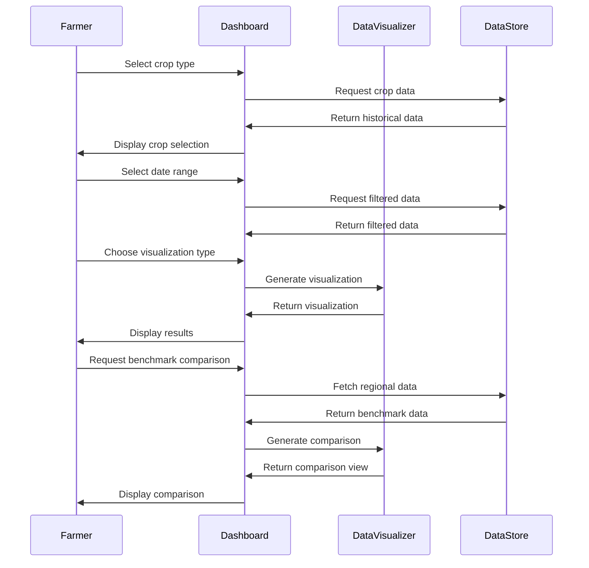
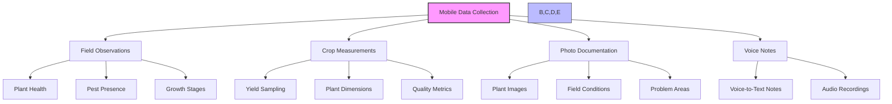
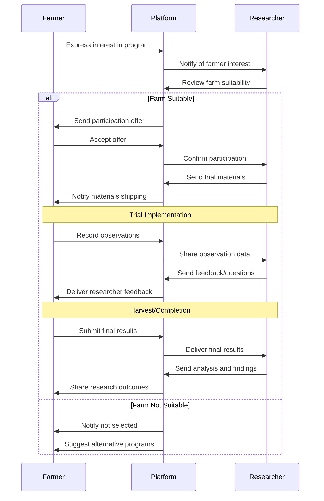

# Farmer Guide

## Introduction

Welcome to the Farmer's Guide for the Agricultural Research Platform. This guide is designed to help you leverage the platform's capabilities to improve your farming operations, gain insights from agricultural research, and participate in breeding programs.

As a farmer, the platform provides you with tools to:
- Access simplified insights from research findings relevant to your crops
- Track and analyze performance of your agricultural operations
- Receive actionable recommendations for improving yields and sustainability
- Participate in breeding programs with research institutions
- Contribute valuable field data to the research community

## Farmer Dashboard Overview

Your personalized dashboard is the central hub for accessing all farmer-specific features and information.

```mermaid
graph TD
    A[Farmer Dashboard] --> B[Crop Performance]
    A --> C[Weather Insights]
    A --> D[Research Highlights]
    A --> E[Breeding Programs]
    A --> F[Field Data Collection]
    
    B --> B1[Yield Trends]
    B --> B2[Regional Comparisons]
    B --> B3[Performance Analytics]
    
    C --> C1[Forecasts]
    C --> C2[Historical Data]
    C --> C3[Climate Patterns]
    
    D --> D1[Latest Findings]
    D --> D2[Practical Applications]
    D --> D3[Recommended Practices]
    
    E --> E1[Active Programs]
    E --> E2[Variety Testing]
    E --> E3[Results & Feedback]
    
    F --> F1[Data Entry Forms]
    F --> F2[Mobile Collection]
    F --> F3[Data Visualization]
    
    style A fill:#f9f,stroke:#333,stroke-width:2px
    style B,C,D,E,F fill:#bbf,stroke:#333,stroke-width:1px
```



### Accessing Your Dashboard

1. Log in to the Agricultural Research Platform
2. The Farmer Dashboard will appear as your home page
3. Customize your dashboard by clicking the "Customize" button in the top right corner
4. Drag and drop widgets to rearrange them based on your priorities
5. Click "Save Layout" to preserve your customizations

## Farmer Insights Dashboard

The Insights Dashboard provides data-driven analytics about your farm operations and relevant research findings.

### Key Features

#### Crop Performance Analytics

The Crop Performance section allows you to:

1. **View Historical Yields**
   - Track yields across multiple seasons
   - Compare performance across different fields
   - Identify trends and patterns

2. **Regional Benchmarking**
   - Compare your yields with regional averages
   - See how your practices compare to similar farms
   - Identify opportunities for improvement

3. **Input Efficiency Analysis**
   - Track input costs against yields
   - Analyze return on investment for different practices
   - Optimize resource allocation

#### Using the Analytics Tools



**Step-by-Step Guide:**

1. From your dashboard, click on "Crop Performance Analytics"
2. Select the crop type you want to analyze from the dropdown menu
3. Choose the date range for analysis using the calendar selector
4. Select fields to include in the analysis by checking the appropriate boxes
5. Choose visualization type (bar chart, line graph, heat map, etc.)
6. Toggle the "Regional Benchmark" option to compare with regional data
7. Use the filter options to refine your analysis by variables such as:
   - Soil type
   - Weather conditions
   - Farming practices
   - Input variables
8. Export your analysis as PDF, CSV, or share directly with your advisors

### Research Insights

The Research Insights section translates complex research findings into practical recommendations for your farm.

#### Accessing Research Insights

1. Click on the "Research Insights" tab in your dashboard
2. Filter insights by:
   - Crop type
   - Farming practice
   - Climate zone
   - Problem area (pest management, soil health, etc.)
3. Browse through simplified research summaries
4. Click "Learn More" on any insight to see detailed information including:
   - Practical applications
   - Implementation steps
   - Expected outcomes
   - Source research

#### Example: Interpreting Research Findings


Each research insight includes:
- Plain language summary of findings
- Practical implementation steps
- Expected benefits and potential challenges
- Confidence level based on research strength
- Source citations for further reading

### Seasonal Recommendations

The platform provides season-specific recommendations based on your location, crops, and historical data.

#### How to Use Seasonal Recommendations

1. Recommendations appear automatically on your dashboard based on the current season
2. Click on any recommendation to see detailed implementation guidance
3. Use the calendar view to see upcoming recommendations for future planning
4. Mark recommendations as "Implemented" to track your adoption
5. Provide feedback on recommendations to improve future suggestions

## Data Entry and Collection

The platform provides multiple ways to record and manage your farm data, designed to fit your workflow whether you're in the office or in the field.

### Mobile Data Collection



#### Using the Mobile App

1. Download the Agricultural Research Platform mobile app from the App Store or Google Play
2. Log in with your platform credentials
3. Tap "Collect Data" from the main menu
4. Select the data collection template appropriate for your task:
   - Field observations
   - Crop measurements
   - Harvest data
   - Input applications
5. Use your device's GPS to tag the location automatically
6. Fill in the required fields
7. Take photos to document observations when needed
8. Record voice notes for additional context
9. Save data (will be stored locally if offline)
10. Sync when connected to the internet

#### Offline Functionality

The mobile app works without an internet connection:
- All forms and templates are available offline
- Data is stored securely on your device
- Photos and voice notes are compressed for efficient storage
- Automatic synchronization when connectivity is restored
- Conflict resolution if data was updated in multiple places

### Web-Based Data Entry

For more extensive data entry, the web interface provides comprehensive forms and data management tools.

#### Importing Data from Farm Management Software

The platform supports data import from common farm management systems:
1. Navigate to "Data Management" > "Import Data"
2. Select your farm management software from the list
3. Choose the data type to import (field records, input applications, yield data, etc.)
4. Follow the connection instructions for your specific software
5. Review the mapped data before confirming import
6. Resolve any data conflicts or mapping issues
7. Confirm import to add the data to your account

#### Data Validation and Quality

The platform helps ensure your data is accurate and useful:
- Automatic validation checks flag potential errors
- Historical comparison identifies unusual values
- Visualization tools help spot outliers
- Data quality score shows completeness and consistency
- Suggestions for improving data collection practices

## Participating in Breeding Programs

As a farmer, you play a crucial role in agricultural innovation by participating in breeding programs and field trials.

### Finding Breeding Programs

1. Navigate to "Breeding Programs" in the main menu
2. Browse available programs filtered by:
   - Crop type
   - Geographic region
   - Program duration
   - Compensation offered
3. Click on programs of interest to view details:
   - Research objectives
   - Farmer requirements
   - Timeline and commitments
   - Support provided
   - Compensation details
4. Use the "Match Me" tool to find programs best suited to your farm

### Participating in Field Trials



#### Step-by-Step Participation Guide

1. **Application**
   - Complete the program application form
   - Provide details about your farm conditions and capabilities
   - Submit any required documentation

2. **Planning**
   - Receive trial materials (seeds, treatments, etc.)
   - Review trial protocol and requirements
   - Participate in orientation (virtual or in-person)
   - Plan field layout according to protocol

3. **Implementation**
   - Plant trial materials following protocol guidelines
   - Record required observations at specified intervals
   - Document conditions that might affect results
   - Communicate issues or questions to researchers

4. **Data Collection**
   - Use mobile app to record observations
   - Take photos at designated growth stages
   - Record management practices applied
   - Note any unusual occurrences or observations

5. **Harvest and Reporting**
   - Harvest according to protocol specifications
   - Record yield and quality measurements
   - Complete end-of-trial assessment
   - Submit all data through the platform

6. **Results and Feedback**
   - Review trial results and analysis
   - Provide feedback on variety performance
   - Discuss findings with researchers
   - Consider participation in follow-up trials

### Tracking Trial Progress

The platform provides tools to help you manage and track your breeding trial participation:
- Calendar view of required activities and observations
- Notification reminders for upcoming tasks
- Progress tracker showing completion status
- Communication channel with research team
- Photo timeline documenting crop development

## Using Emilia AI for Farming Decisions

Emilia AI provides personalized assistance for farm management decisions and research interpretation.

### Farmer-Specific AI Features

1. **Research Translation**
   - Ask Emilia to explain technical research in practical terms
   - Request summaries of research relevant to your crops
   - Get plain-language explanations of scientific concepts

2. **Diagnostic Assistance**
   - Upload photos of crop issues for identification
   - Describe symptoms to receive potential diagnoses
   - Get management recommendations for identified problems

3. **Decision Support**
   - Ask for input on variety selection based on your conditions
   - Get recommendations on timing for planting or treatments
   - Receive guidance on interpreting soil test results

### Example AI Interactions

**Example 1: Crop Issue Diagnosis**

```
Farmer: I'm seeing these yellow spots on my corn leaves. What could it be?
[Photo uploaded]

Emilia AI: Based on the image, these yellow spots appear to be symptoms of 
Northern Corn Leaf Blight, a fungal disease caused by Exserohilum turcicum. 
The elongated lesions with defined margins are characteristic of this disease.

Management options include:
1. Fungicide application (recommended products: [list])
2. Ensuring adequate crop rotation
3. Considering resistant varieties for next season

Would you like more specific recommendations based on your farm's conditions?
```

**Example 2: Research Interpretation**

```
Farmer: I heard about this new drought-resistant corn variety. Is it worth trying?

Emilia AI: Recent research on drought-resistant corn varieties shows promising 
results, particularly for XYZ-123 which demonstrated 15-20% yield advantage under 
water stress conditions compared to standard varieties.

However, these advantages were primarily observed in regions with specific 
drought patterns. Based on your farm's location and the last 3 years of weather 
data, your risk of the type of drought where these varieties excel is relatively 
low (approximately 1 in 8 years).

The cost premium for these seeds is currently about $45/acre. Given your farm's 
specific conditions, the economic analysis suggests the investment might not 
provide significant returns unless drought predictions for the coming season 
indicate higher than normal risk.

Would you like me to analyze the specific varieties available in your region?
```

### Best Practices for Using Emilia AI

1. **Be Specific**: Provide detailed information about your situation
2. **Share Context**: Include information about your location, conditions, and constraints
3. **Ask Follow-ups**: Request clarification or more details as needed
4. **Provide Feedback**: Rate responses to help improve future recommendations
5. **Verify Recommendations**: Use Emilia's suggestions as input for decisions, but combine with your experience and local knowledge

## Troubleshooting and Support

### Common Issues and Solutions

| Issue | Possible Solution |
|-------|------------------|
| Cannot sync mobile data | Check internet connection, ensure app is updated to latest version, try force sync from settings menu |
| Missing field boundaries | Go to "Farm Setup" > "Fields" and verify boundaries are properly defined |
| Data not appearing in analytics | Check date filters, verify data was successfully submitted, refresh analytics view |
| Cannot access breeding program | Verify program status is "Active", check that all agreements have been completed |
| Emilia AI not responding | Refresh the page, check internet connection, try a more specific question |

### Getting Support

If you encounter issues not covered in this guide:

1. **In-App Help**: Click the "?" icon for contextual help
2. **Knowledge Base**: Search the farmer-specific articles at help.agriculturalresearch.org
3. **Community Forum**: Connect with other farmers at community.agriculturalresearch.org
4. **Support Ticket**: Submit a support request through "Help" > "Contact Support"
5. **Live Chat**: Available during business hours through the chat icon
6. **Phone Support**: Call the Farmer Support Line at (555) 123-4567

## Next Steps

Now that you're familiar with the farmer-specific features, consider:

1. **Complete Your Profile**: Add details about your farm to receive more targeted recommendations
2. **Set Up Field Boundaries**: Define your fields for more accurate data collection
3. **Import Historical Data**: Bring in past seasons' data for better analytics
4. **Explore Breeding Programs**: Find opportunities to participate in research
5. **Schedule a Training Session**: Sign up for a personalized walkthrough with our support team

For more detailed information on specific features, refer to:
- [Farmer Insights Dashboard](farmer/insights-dashboard.md)
- [Data Entry & Management](farmer/data-entry.md)
- [Breeding Program Participation](farmer/breeding-program.md)
