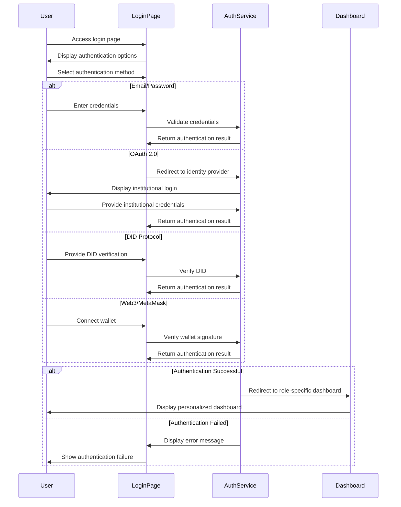

# Getting Started

## Welcome to the Agricultural Research Platform

Welcome to the Agricultural Research Platform with Emilia AI integration. This comprehensive platform bridges the gap between agricultural researchers, farmers, and students by providing a unified ecosystem for advanced genomic analysis, AI-assisted research capabilities, and practical farming insights.

This guide will help you get started with the platform, regardless of your role or technical expertise.

## Platform Overview

```mermaid
graph TD
    A[Agricultural Research Platform] --> B[Farmer Features]
    A --> C[Researcher Features]
    A --> D[Student Features]
    A --> E[Administrator Features]
    A --> F[Emilia AI Assistant]
    
    B --> B1[Farmer Insights Dashboard]
    B --> B2[Data Entry & Collection]
    B --> B3[Breeding Program Participation]
    
    C --> C1[Research Environment]
    C --> C2[Breeding Engine]
    C --> C3[Data Analysis Tools]
    
    D --> D1[Learning Resources]
    D --> D2[Research Environment Access]
    D --> D3[Guided Projects]
    
    E --> E1[User Management]
    E --> E2[System Monitoring]
    E --> E3[Configuration]
    
    F --> F1[Research Assistant]
    F --> F2[Farmer Assistant]
    F --> F3[Knowledge Base Access]
    
    style A fill:#f9f,stroke:#333,stroke-width:2px
    style B,C,D,E,F fill:#bbf,stroke:#333,stroke-width:1px
```

## User Roles

The platform supports four primary user roles, each with tailored features and capabilities:

1. **Farmer**: Access simplified research insights, track agricultural operations, participate in breeding programs, and contribute field data.

2. **Researcher**: Analyze genomic and phenotypic data, design breeding experiments, access scientific literature, and collaborate with farmers and other researchers.

3. **Student**: Learn research methodologies, participate in projects, access educational resources, and develop analytical skills.

4. **Administrator**: Manage user accounts, monitor system performance, configure system parameters, and support users.

## First-Time Login

### Creating Your Account

1. Navigate to the platform login page at `https://platform.agriculturalresearch.org`
2. Click on "Create Account" button
3. Choose your preferred authentication method:
   - Email/Password
   - OAuth 2.0 (Institutional login)
   - DID Protocol
   - Web3/MetaMask
4. Complete the registration form with your details
5. Select your primary role (Farmer, Researcher, Student)
6. Verify your email address or institutional affiliation
7. Set up multi-factor authentication (recommended)

### Login Process

## Platform Navigation

### Main Navigation Areas

The platform interface is organized into several key areas:

1. **Top Navigation Bar**: User profile, notifications, help, and global search
2. **Side Navigation Menu**: Main feature categories based on your role
3. **Main Content Area**: Primary workspace for the current feature
4. **Context Panel**: Contextual information and related actions
5. **Footer**: Links to documentation, support, and legal information

### Role-Specific Navigation

Each user role has a customized navigation menu with relevant features:

**Farmer Navigation:**
- Dashboard
- Field Data
- Crop Performance
- Breeding Programs
- Research Insights
- Settings

**Researcher Navigation:**
- Dashboard
- Research Environment
- Breeding Engine
- Data Repository
- Collaborations
- Publications
- Settings

**Student Navigation:**
- Dashboard
- Learning Resources
- Research Projects
- Analysis Tools
- Progress Tracking
- Settings

**Administrator Navigation:**
- Dashboard
- User Management
- System Monitoring
- Configuration
- Reports
- Settings

## Using Emilia AI Assistant

Emilia AI is an intelligent assistant integrated throughout the platform to provide context-aware support and information.

### Accessing Emilia AI

1. Click the Emilia AI icon (🤖) in the bottom right corner of any page
2. Type your question or request in natural language
3. Emilia will respond with relevant information, suggestions, or actions

### Example Interactions

**For Farmers:**
- "Show me the latest research on drought-resistant corn varieties"
- "Help me interpret these soil test results"
- "What planting schedule do you recommend for my region?"

**For Researchers:**
- "Summarize recent publications on gene editing in wheat"
- "Help me design an experiment to test heat tolerance in these varieties"
- "What statistical approach is best for analyzing this multi-environment trial?"

**For Students:**
- "Explain heritability calculation methods"
- "Guide me through the process of genomic selection"
- "What learning resources do you recommend for breeding statistics?"

**For Administrators:**
- "Show me system usage statistics for the past week"
- "Help me troubleshoot user access issues"
- "Generate a report on research environment utilization"

## Getting Help

### In-Platform Help

- **Contextual Help**: Click the "?" icon next to any feature for specific guidance
- **Tooltips**: Hover over interface elements for brief explanations
- **Guided Tours**: Interactive walkthroughs of key features
- **Knowledge Base**: Searchable repository of help articles and tutorials

### Support Options

- **Chat Support**: Available during business hours through the support chat icon
- **Email Support**: Contact support@agriculturalresearch.org
- **Community Forums**: Discuss issues and share tips with other users
- **Training Webinars**: Regular online training sessions (schedule available in the Help section)

## Next Steps

Depending on your role, we recommend starting with the following guides:

- [Farmer Guide](farmer.md): Learn how to use insights dashboard, data collection tools, and participate in breeding programs
- [Researcher Guide](researcher.md): Explore research environments, breeding engine, and collaboration tools
- [Student Guide](student.md): Discover learning resources and research participation opportunities
- [Administrator Guide](administrator.md): Understand user management and system monitoring tools
- [Emilia AI Guide](emilia-ai.md): Learn advanced techniques for leveraging AI assistance

Welcome aboard! We're excited to have you join the Agricultural Research Platform community.
