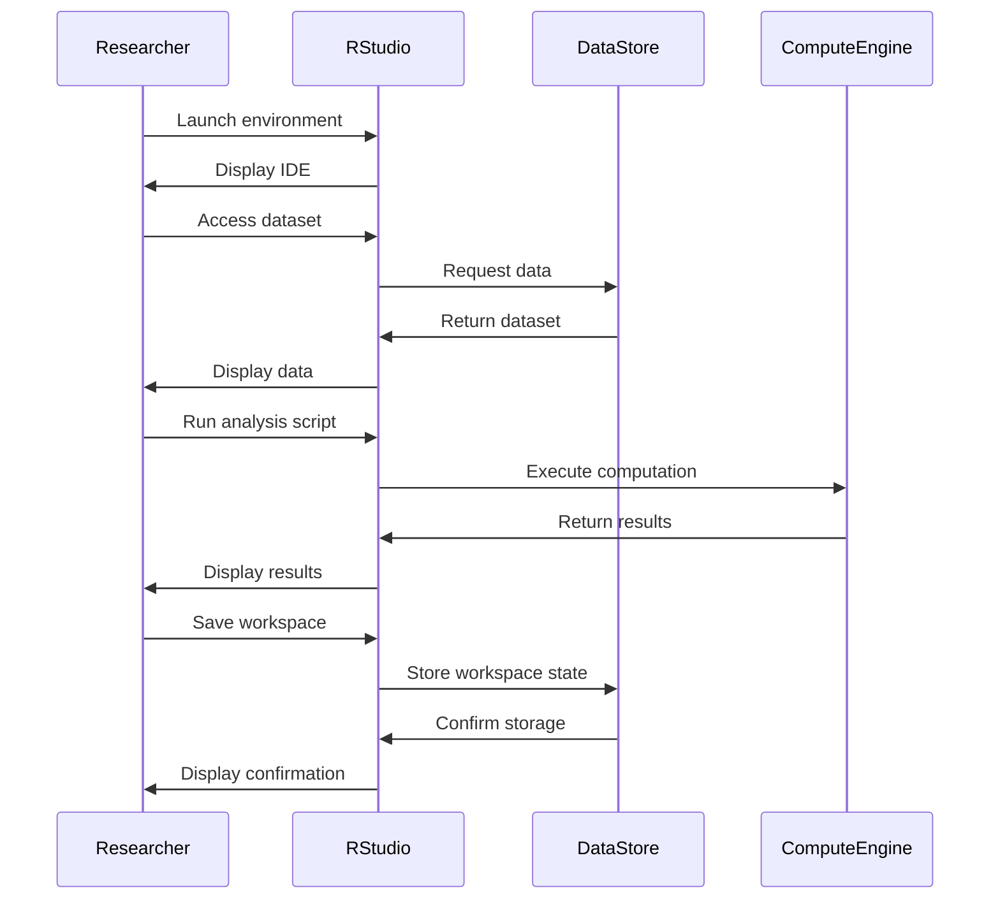
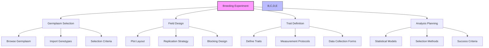
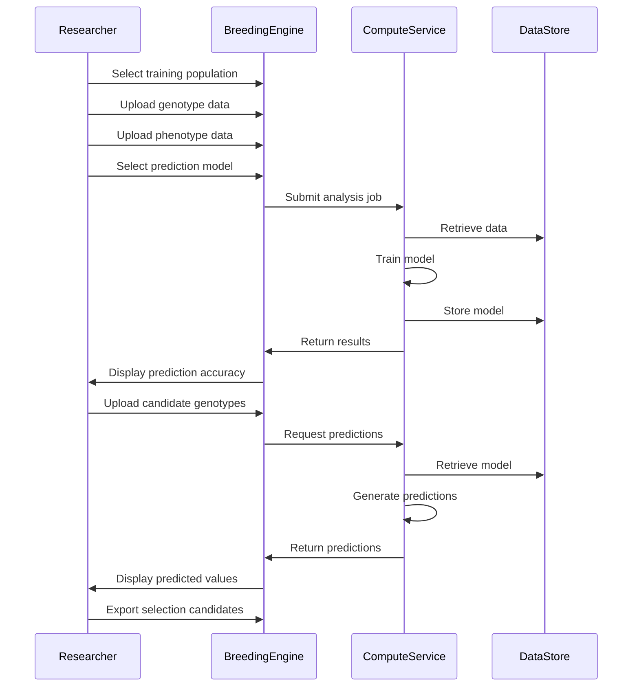
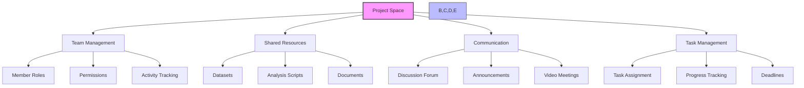

# Researcher Guide

## Introduction

Welcome to the Researcher's Guide for the Agricultural Research Platform. This guide is designed to help you leverage the platform's advanced capabilities for agricultural research, genomic analysis, breeding experiments, and collaboration with farmers and other researchers.

As a researcher, the platform provides you with tools to:
- Analyze complex genomic and phenotypic datasets
- Design and track breeding experiments
- Access and contribute to scientific literature
- Collaborate with other researchers and farmers
- Publish and disseminate research findings
- Access high-performance computing resources

## Researcher Dashboard Overview

Your personalized dashboard serves as the central hub for accessing all researcher-specific features and information.

```mermaid
graph TD
    A[Researcher Dashboard] --> B[Research Environment]
    A --> C[Breeding Engine]
    A --> D[Data Repository]
    A --> E[Collaborations]
    A --> F[Publications]
    
    B --> B1[RStudio]
    B --> B2[JupyterHub]
    B --> B3[Computational Resources]
    
    C --> C1[Experiment Design]
    C --> C2[Genomic Selection]
    C --> C3[Simulation Tools]
    
    D --> D1[Research Datasets]
    D --> D2[Field Trial Data]
    D --> D3[Genomic Data]
    
    E --> E1[Researcher Network]
    E --> E2[Farmer Collaborations]
    E --> E3[Project Spaces]
    
    F --> F1[Manuscript Preparation]
    F --> F2[Knowledge Dissemination]
    F --> F3[Citation Management]
    
    style A fill:#f9f,stroke:#333,stroke-width:2px
    style B,C,D,E,F fill:#bbf,stroke:#333,stroke-width:1px
```



### Accessing Your Dashboard

1. Log in to the Agricultural Research Platform
2. The Researcher Dashboard will appear as your home page
3. Customize your dashboard by clicking the "Customize" button in the top right corner
4. Drag and drop widgets to rearrange them based on your research priorities
5. Click "Save Layout" to preserve your customizations

## Research Environment

The platform provides powerful computational environments specifically designed for agricultural research.

### RStudio Environment

The RStudio environment comes preconfigured with libraries and packages commonly used in agricultural research.

#### Accessing RStudio

1. From your dashboard, click on "Research Environment" > "RStudio"
2. Select your desired configuration:
   - Standard: Basic R environment with common packages
   - Genomics: Enhanced with bioinformatics packages
   - Statistics: Focused on advanced statistical analysis
   - Custom: Your previously saved configurations
3. Choose computational resources:
   - Small: 2 cores, 8GB RAM (for light analysis)
   - Medium: 4 cores, 16GB RAM (standard analysis)
   - Large: 8 cores, 32GB RAM (complex analysis)
   - Custom: Specify your requirements
4. Click "Launch Environment"

#### Pre-installed R Packages

The RStudio environment includes the following key packages:

| Category | Packages |
|----------|----------|
| **Core R** | tidyverse, data.table, devtools, knitr, rmarkdown |
| **Statistics** | lme4, nlme, car, emmeans, multcomp, MASS |
| **Visualization** | ggplot2, plotly, lattice, viridis, RColorBrewer |
| **Genomics** | Bioconductor, GenomicRanges, VariantAnnotation, SNPRelate |
| **Breeding** | asreml, sommer, rrBLUP, BGLR, synbreed, AlphaSimR |
| **Spatial** | sp, sf, raster, leaflet, gstat |
| **Machine Learning** | caret, randomForest, xgboost, keras, h2o |

#### Working with RStudio



**Best Practices for RStudio:**

1. **Workspace Management**
   - Use projects to organize your work
   - Store scripts in version-controlled repositories
   - Use relative paths for data access
   - Document your analysis with R Markdown

2. **Resource Optimization**
   - Select appropriate computational resources
   - Use efficient data structures (data.table for large datasets)
   - Implement parallel processing for intensive tasks
   - Close environments when not in use

3. **Collaboration**
   - Share projects through the platform's collaboration tools
   - Use consistent coding standards
   - Document your analysis thoroughly
   - Include reproducible examples

### JupyterHub Environment

The JupyterHub environment provides Python and R kernels with agricultural research libraries.

#### Accessing JupyterHub

1. From your dashboard, click on "Research Environment" > "JupyterHub"
2. Select your desired configuration:
   - Standard: Python environment with common packages
   - Data Science: Enhanced with machine learning libraries
   - Genomics: Focused on bioinformatics tools
   - Custom: Your previously saved configurations
3. Choose computational resources (same options as RStudio)
4. Click "Launch Environment"

#### Pre-installed Python Packages

The JupyterHub environment includes the following key packages:

| Category | Packages |
|----------|----------|
| **Core Python** | numpy, pandas, scipy, matplotlib, seaborn |
| **Data Science** | scikit-learn, statsmodels, patsy, category_encoders |
| **Deep Learning** | tensorflow, keras, pytorch, fastai |
| **Genomics** | biopython, plink, pysam, scikit-allel, geneparse |
| **Geospatial** | geopandas, rasterio, folium, pyproj, shapely |
| **Visualization** | plotly, bokeh, altair, holoviews, datashader |
| **Specialized** | agridat, plantcv, phenopype, cropgym |

#### Working with Notebooks

1. Create a new notebook by clicking "New" > "Python 3" or "R"
2. Organize your analysis into cells:
   - Code cells for executable code
   - Markdown cells for documentation
   - Raw cells for content that shouldn't be processed
3. Execute cells with Shift+Enter or the Run button
4. Save your notebook regularly (Ctrl+S)
5. Export notebooks in various formats (HTML, PDF, Python script)

**Best Practices for JupyterHub:**

1. **Notebook Organization**
   - Begin with a markdown cell describing the purpose
   - Organize into logical sections with headings
   - Include explanatory text between code blocks
   - Keep code cells focused on single tasks

2. **Reproducibility**
   - Document package versions with `!pip freeze`
   - Include data preprocessing steps
   - Set random seeds for stochastic processes
   - Test your notebook in a clean environment

3. **Performance**
   - Use `%%time` and `%%timeit` to measure performance
   - Implement vectorized operations when possible
   - Consider using Dask for large datasets
   - Clean up memory with `del` and `gc.collect()`

### Workspace Management

The platform provides tools to manage your research workspaces efficiently.

#### Autosave Functionality

Your work is automatically saved at regular intervals:
- RStudio workspaces: Every 5 minutes
- Jupyter notebooks: Every 2 minutes
- Scripts and data files: Every 3 minutes

To access autosaved versions:
1. Go to "Research Environment" > "Workspace Manager"
2. Select the workspace or file
3. Click "Version History"
4. Choose the version to restore

#### Sharing Workspaces

To share your workspace with collaborators:
1. Open the Workspace Manager
2. Select the workspace to share
3. Click "Share"
4. Enter collaborator names or emails
5. Set permission level:
   - View: Can see but not modify
   - Edit: Can modify but not share
   - Admin: Full control including sharing
6. Click "Send Invitation"

## Breeding Engine

The Breeding Engine provides sophisticated tools for designing and analyzing breeding experiments.

### Experiment Design



#### Creating a New Experiment

1. Navigate to "Breeding Engine" > "Experiment Design"
2. Click "New Experiment"
3. Complete the experiment setup wizard:
   - Basic Information: Name, description, objectives
   - Germplasm Selection: Choose breeding materials
   - Field Design: Define experimental layout
   - Trait Definition: Specify traits to measure
   - Analysis Plan: Select statistical approaches
4. Review and finalize the experiment design
5. Click "Create Experiment"

#### Field Trial Design Tools

The platform offers several experimental design options:

1. **Completely Randomized Design (CRD)**
   - Simplest design with random assignment
   - Best for uniform experimental conditions
   - Generates randomized plot assignments

2. **Randomized Complete Block Design (RCBD)**
   - Accounts for one source of variation
   - Organizes plots into homogeneous blocks
   - Reduces experimental error

3. **Alpha Lattice Design**
   - For large numbers of treatments
   - Incomplete block design
   - Efficient for field trials with spatial variation

4. **Augmented Design**
   - For trials with limited seed quantities
   - Includes replicated checks and unreplicated test entries
   - Efficient for early-stage breeding

5. **Split-Plot Design**
   - For experiments with multiple treatment factors
   - Hierarchical randomization structure
   - Accounts for different experimental units

### Genomic Selection Tools

The Breeding Engine includes advanced tools for genomic selection and marker-assisted breeding.

#### Genomic Prediction Models

The platform supports multiple genomic prediction models:

| Model | Description | Best Use Case |
|-------|-------------|---------------|
| **GBLUP** | Genomic Best Linear Unbiased Prediction | General-purpose model with moderate computational requirements |
| **Bayesian Models** (BayesA, BayesB, BayesC) | Bayesian approaches with different prior distributions | When traits are influenced by few large-effect QTLs |
| **RRBLUP** | Ridge Regression BLUP | Efficient for large marker datasets with small effects |
| **Random Forest** | Machine learning approach | For capturing non-additive effects and interactions |
| **Deep Learning** | Neural network approaches | For complex trait architectures with non-linear relationships |

#### Running Genomic Selection



**Step-by-Step Guide:**

1. Navigate to "Breeding Engine" > "Genomic Selection"
2. Click "New Prediction Model"
3. Upload or select training data:
   - Genotype data (VCF, Hapmap, or custom format)
   - Phenotype data (CSV with appropriate headers)
4. Configure model parameters:
   - Select prediction model
   - Set cross-validation parameters
   - Adjust model-specific settings
5. Click "Train Model"
6. Review model performance metrics:
   - Prediction accuracy
   - Cross-validation results
   - Feature importance
7. Apply model to selection candidates:
   - Upload candidate genotypes
   - Run prediction
   - Review predicted values
8. Export results for selection decisions

### Breeding Simulation

The platform allows you to simulate breeding outcomes based on genetic models.

#### Simulation Features

1. **Population Dynamics**
   - Simulate multiple generations
   - Model different mating schemes
   - Track genetic diversity

2. **Genetic Architecture**
   - Define QTL effects and positions
   - Model epistatic interactions
   - Incorporate pleiotropy

3. **Selection Strategies**
   - Phenotypic selection
   - Marker-assisted selection
   - Genomic selection
   - Multi-trait selection

4. **Environmental Factors**
   - G×E interactions
   - Environmental variability
   - Stress scenarios

#### Running a Breeding Simulation

1. Navigate to "Breeding Engine" > "Simulation"
2. Click "New Simulation"
3. Configure simulation parameters:
   - Genetic map and QTL effects
   - Population structure
   - Selection strategy
   - Number of generations
4. Click "Run Simulation"
5. Analyze results:
   - Genetic gain over generations
   - Diversity metrics
   - Selection accuracy
   - Optimal breeding strategy

### Heritability Analysis

The platform provides tools for calculating heritability and analyzing genetic components of variance.

#### Available Methods

1. **Variance Component Analysis**
   - REML (Restricted Maximum Likelihood)
   - Bayesian approaches
   - ANOVA-based methods

2. **Heritability Estimation**
   - Narrow-sense heritability
   - Broad-sense heritability
   - Genomic heritability

3. **Genetic Correlation Analysis**
   - Multi-trait models
   - Structural equation modeling
   - Graphical models

#### Performing Heritability Analysis

1. Navigate to "Breeding Engine" > "Heritability Analysis"
2. Click "New Analysis"
3. Upload or select phenotypic data
4. For genomic heritability, upload or select genotypic data
5. Configure analysis parameters:
   - Select analysis method
   - Define fixed and random effects
   - Set convergence criteria
6. Click "Run Analysis"
7. Review results:
   - Variance components
   - Heritability estimates with confidence intervals
   - Model fit statistics
   - Visualizations of genetic vs. environmental variance

### Mating Strategy Optimization

The platform helps optimize crossing schemes to maximize genetic gain while managing diversity.

#### Optimization Approaches

1. **Optimal Contribution Selection**
   - Balances genetic gain and diversity
   - Constrains inbreeding rate
   - Optimizes number of progeny per cross

2. **Genomic Mating**
   - Predicts progeny variance
   - Identifies complementary parents
   - Maximizes probability of superior progeny

3. **Multi-Objective Optimization**
   - Handles multiple traits simultaneously
   - Implements Pareto optimization
   - Allows custom objective functions

#### Creating a Mating Plan

1. Navigate to "Breeding Engine" > "Mating Strategy"
2. Click "New Mating Plan"
3. Select candidate parents:
   - Upload or select genotype data
   - Define breeding values or selection indices
   - Set constraints (e.g., flowering time compatibility)
4. Configure optimization parameters:
   - Selection method
   - Diversity constraints
   - Number of crosses to make
5. Click "Generate Mating Plan"
6. Review and refine the plan:
   - Examine predicted outcomes
   - Adjust constraints if needed
   - Finalize crossing schedule

## Data Repository

The Data Repository provides tools for managing, sharing, and discovering research datasets.

### Managing Research Datasets

#### Uploading Datasets

1. Navigate to "Data Repository" > "My Datasets"
2. Click "Upload Dataset"
3. Provide dataset metadata:
   - Title and description
   - Data type and format
   - Collection methodology
   - Relevant species/crops
4. Set access permissions:
   - Private: Only you can access
   - Shared: Specific collaborators can access
   - Public: Available to all platform users
5. Upload data files (supported formats include CSV, TSV, Excel, VCF, FASTA, etc.)
6. Add documentation files if needed
7. Click "Submit Dataset"

#### Dataset Versioning

The platform maintains version history for all datasets:
1. To update a dataset, navigate to the dataset page
2. Click "Create New Version"
3. Upload new files or modify metadata
4. Provide version notes describing changes
5. Previous versions remain accessible through the "Versions" tab

### Discovering Datasets

1. Navigate to "Data Repository" > "Browse Datasets"
2. Use search filters:
   - Keywords
   - Crop/species
   - Data type
   - Date range
   - Author/institution
3. Sort results by relevance, date, or citation count
4. Click on datasets to view details:
   - Metadata and description
   - File listings
   - Usage metrics
   - Citation information
5. Request access to restricted datasets if needed

### Data Integration Tools

The platform provides tools to integrate and analyze data from multiple sources:

1. **Dataset Merging**
   - Combine datasets with common identifiers
   - Resolve conflicts between sources
   - Create integrated datasets

2. **Format Conversion**
   - Convert between common file formats
   - Standardize data structures
   - Prepare data for specific analysis tools

3. **Quality Control**
   - Identify missing or anomalous values
   - Apply quality filters
   - Generate quality reports

## Collaboration Tools

The platform facilitates collaboration between researchers, farmers, and students.

### Project Spaces

Project Spaces provide dedicated environments for collaborative research:



#### Creating a Project Space

1. Navigate to "Collaborations" > "Project Spaces"
2. Click "New Project Space"
3. Define project details:
   - Name and description
   - Research objectives
   - Timeline and milestones
4. Invite team members:
   - Search for platform users
   - Assign roles (Admin, Member, Observer)
   - Send invitations
5. Set up initial resources:
   - Create folder structure
   - Upload key documents
   - Link relevant datasets
6. Configure communication preferences
7. Click "Create Project"

#### Collaborating in Project Spaces

1. **Resource Sharing**
   - Upload and organize files
   - Share datasets with proper attribution
   - Collaborate on documents in real-time

2. **Communication**
   - Post updates and announcements
   - Participate in threaded discussions
   - Schedule and conduct video meetings

3. **Task Management**
   - Create and assign tasks
   - Track progress with status updates
   - Set deadlines and reminders

### Researcher-Farmer Collaboration

The platform facilitates direct collaboration between researchers and farmers:

1. **Field Trial Coordination**
   - Design collaborative trials
   - Share protocols and materials
   - Monitor trial progress
   - Collect and analyze results

2. **Knowledge Exchange**
   - Create simplified summaries of research findings
   - Receive practical feedback on varieties and methods
   - Discuss implementation challenges
   - Document real-world performance

3. **Communication Channels**
   - Direct messaging
   - Group discussions
   - Virtual field tours
   - Scheduled check-ins

#### Best Practices for Researcher-Farmer Collaboration

1. **Clear Communication**
   - Use plain language when communicating with farmers
   - Provide visual aids and practical examples
   - Be explicit about expectations and timelines
   - Listen to farmer feedback and concerns

2. **Mutual Respect**
   - Acknowledge farmers' practical expertise
   - Incorporate farmer input into research design
   - Recognize the value of field observations
   - Share credit for collaborative outcomes

3. **Practical Focus**
   - Emphasize practical applications of research
   - Address real-world farming challenges
   - Consider economic and logistical constraints
   - Provide actionable recommendations

## Publication and Knowledge Dissemination

The platform supports the publication process and helps disseminate research findings.

### Manuscript Preparation

1. **Collaborative Writing**
   - Real-time collaborative document editing
   - Version control for manuscripts
   - Comment and suggestion features
   - Integration with reference management

2. **Data Visualization**
   - Create publication-quality figures
   - Generate interactive visualizations
   - Export in various formats (PNG, SVG, PDF)
   - Follow journal-specific guidelines

3. **Citation Management**
   - Search and import references
   - Generate formatted citations
   - Create and manage bibliographies
   - Export in various citation styles

### Knowledge Dissemination

1. **Research Summaries**
   - Create technical summaries for researchers
   - Generate simplified summaries for farmers
   - Produce educational materials for students
   - Develop policy briefs for stakeholders

2. **Publication Repository**
   - Upload published papers
   - Link to datasets and code
   - Track citations and impact
   - Manage access and licensing

3. **Outreach Materials**
   - Create presentations and posters
   - Develop infographics and visual abstracts
   - Record video summaries
   - Generate social media content

## Using Emilia AI for Research

Emilia AI provides specialized assistance for agricultural researchers.

### Researcher-Specific AI Features

1. **Literature Review Assistance**
   - Summarize relevant papers
   - Identify research gaps
   - Track emerging trends
   - Generate literature reviews

2. **Research Planning**
   - Help formulate hypotheses
   - Suggest experimental designs
   - Recommend statistical approaches
   - Identify potential collaborators

3. **Data Interpretation**
   - Assist with complex analysis
   - Suggest visualizations
   - Identify patterns and outliers
   - Compare with published findings

### Example AI Interactions

**Example 1: Literature Review Assistance**

```
Researcher: I'm starting a project on drought tolerance in wheat. Can you 
summarize recent advances in this area?

Emilia AI: Here's a summary of key advances in wheat drought tolerance research 
from the past 3 years:

1. Genetic Mechanisms:
   - Liu et al. (2024) identified 3 novel QTLs for root architecture traits 
     associated with drought tolerance
   - Zhang et al. (2023) characterized the TaDREB transcription factor family's 
     role in drought response
   - Patel et al. (2023) demonstrated epigenetic regulation of ABA signaling 
     pathways under water stress

2. Phenotyping Approaches:
   - Johnson et al. (2024) developed high-throughput root phenotyping using 
     computer vision
   - Sharma et al. (2022) validated spectral indices for early detection of 
     drought stress
   - Garcia et al. (2023) established standardized protocols for drought 
     phenotyping across growth stages

3. Breeding Applications:
   - Wang et al. (2024) reported 15-20% yield improvement under drought using 
     genomic selection
   - Brown et al. (2023) demonstrated successful introgression of drought 
     tolerance from wild relatives
   - Miller et al. (2022) compared conventional vs. marker-assisted selection 
     for drought tolerance traits

Would you like me to provide the full citations, focus on a specific aspect, 
or suggest research gaps in this area?
```

**Example 2: Statistical Approach Recommendation**

```
Researcher: I have yield data from a multi-environment trial with 50 genotypes 
across 6 locations over 3 years. What's the best statistical approach to analyze 
G×E interactions?

Emilia AI: For your multi-environment trial with 50 genotypes across 6 locations 
and 3 years, I recommend the following statistical approaches for G×E analysis:

Primary Recommendation:
- Mixed Model with AMMI (Additive Main Effects and Multiplicative Interaction)
  This combines the power of mixed models for handling unbalanced data with AMMI's 
  ability to partition G×E interactions into interpretable components.
  
  Implementation options:
  - In R: Use the 'mmer' function from the 'sommer' package with appropriate model 
    specification
  - Key parameters to include: genotype, location, year, and their interactions as 
    random effects

Alternative Approaches:
1. GGE Biplot Analysis
   - Useful for visualizing which-won-where patterns and genotype stability
   - Implementation: 'GGEBiplotGUI' package in R

2. Factor Analytic (FA) Models
   - Particularly good for highly unbalanced designs
   - Implementation: 'asreml' package in R or ASReml-R

3. Finlay-Wilkinson Regression
   - Simpler approach focusing on stability parameters
   - Implementation: 'FW' package in R

Would you like me to provide specific code examples for implementing the 
recommended approach with your data structure?
```

### Best Practices for Using Emilia AI in Research

1. **Verify Information**
   - Cross-check AI-provided information with primary sources
   - Validate statistical recommendations with domain experts
   - Use AI suggestions as starting points, not final decisions

2. **Provide Context**
   - Be specific about research questions and objectives
   - Include relevant details about data structure and experimental design
   - Specify any constraints or assumptions

3. **Iterative Refinement**
   - Start with broad queries and progressively refine
   - Ask follow-up questions to clarify or expand
   - Request alternative approaches or perspectives

4. **Ethical Considerations**
   - Properly attribute any AI-generated content used in publications
   - Maintain human oversight of research decisions
   - Consider potential biases in AI-generated recommendations

## Troubleshooting and Support

### Common Issues and Solutions

| Issue | Possible Solution |
|-------|------------------|
| Research environment won't launch | Check resource availability, try a smaller configuration, verify network connectivity |
| Analysis job fails to complete | Check input data format, reduce dataset size, examine error logs for specific issues |
| Can't access shared dataset | Verify permissions, check that sharing was confirmed, contact dataset owner |
| Breeding simulation crashes | Reduce simulation complexity, check parameter values, increase allocated memory |
| Emilia AI provides irrelevant responses | Be more specific in your query, provide additional context, try reformulating the question |

### Getting Support

If you encounter issues not covered in this guide:

1. **In-App Help**: Click the "?" icon for contextual help
2. **Knowledge Base**: Search the researcher-specific articles at help.agriculturalresearch.org
3. **Community Forum**: Connect with other researchers at community.agriculturalresearch.org
4. **Support Ticket**: Submit a support request through "Help" > "Contact Support"
5. **Live Chat**: Available during business hours through the chat icon
6. **Research Support Team**: Contact research-support@agriculturalresearch.org

## Next Steps

Now that you're familiar with the researcher-specific features, consider:

1. **Set Up Your Research Environment**: Configure your preferred computational environment
2. **Import Your Datasets**: Upload your research data to the platform
3. **Explore the Breeding Engine**: Try the genomic selection and simulation tools
4. **Join the Researcher Network**: Connect with colleagues in your field
5. **Schedule a Training Session**: Sign up for advanced feature training

For more detailed information on specific features, refer to:
- [Research Environment Setup](researcher/environment-setup.md)
- [Using RStudio & JupyterHub](researcher/rstudio-jupyter.md)
- [Breeding Engine Tools](researcher/breeding-engine.md)
- [Heritability Analysis](researcher/heritability-analysis.md)
- [Mating Strategy Tools](researcher/mating-strategy.md)
