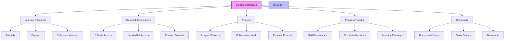
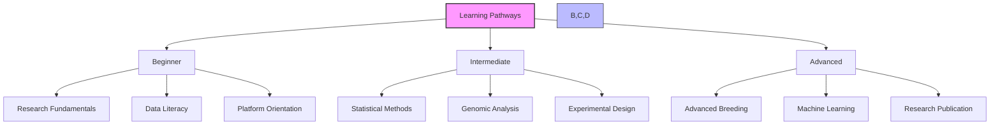
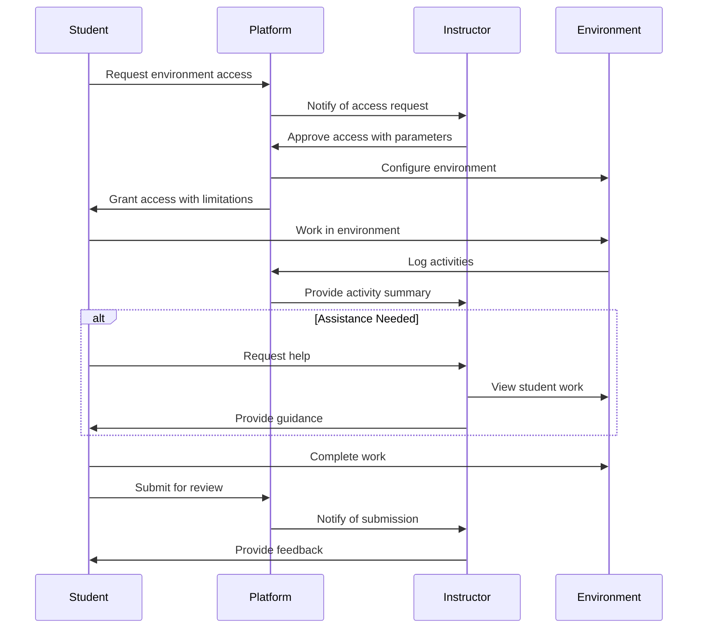
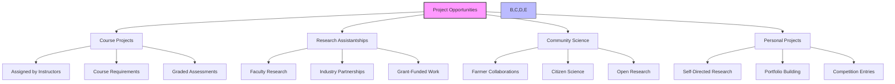
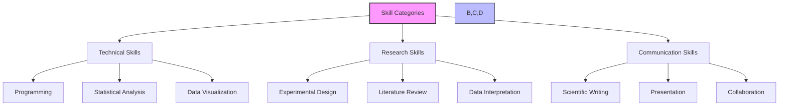
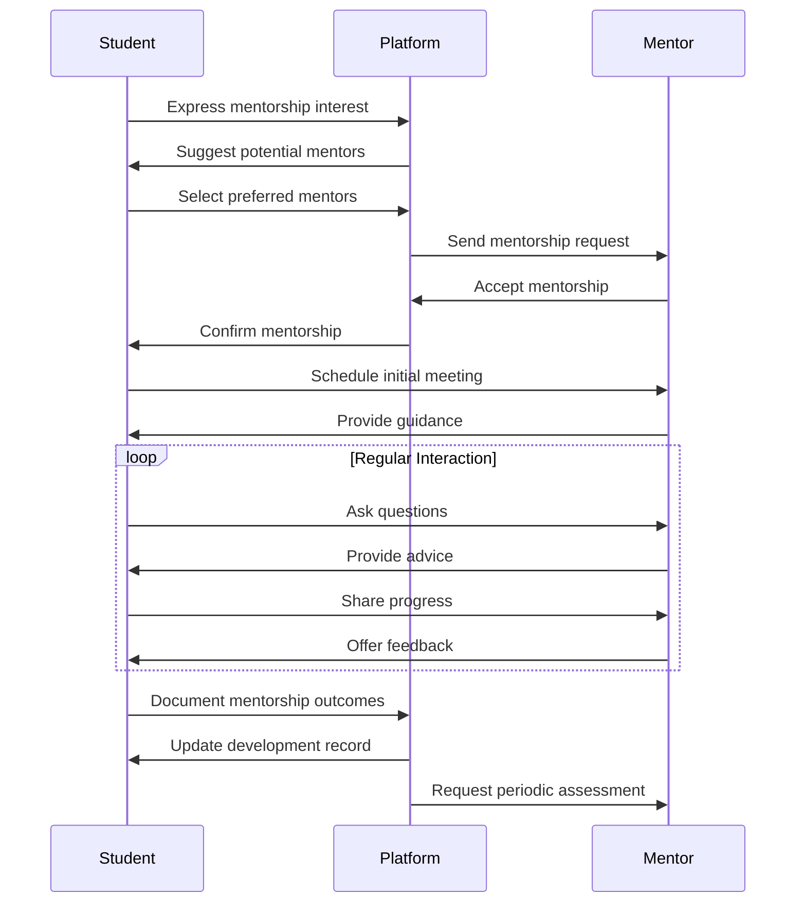

# Student Guide

## Introduction

Welcome to the Student's Guide for the Agricultural Research Platform. This guide is designed to help you leverage the platform's educational and research capabilities to enhance your learning experience in agricultural sciences, genomics, and related fields.

As a student, the platform provides you with tools to:
- Learn advanced research methodologies and tools
- Gain practical experience with real-world datasets
- Participate in ongoing research projects
- Access educational resources and tutorials
- Develop analytical skills using real-world data
- Collaborate with researchers and peers

## Student Dashboard Overview

Your personalized dashboard serves as the central hub for accessing all student-specific features and information.



### Accessing Your Dashboard

1. Log in to the Agricultural Research Platform
2. The Student Dashboard will appear as your home page
3. Customize your dashboard by clicking the "Customize" button in the top right corner
4. Drag and drop widgets to rearrange them based on your learning priorities
5. Click "Save Layout" to preserve your customizations

## Learning Resources

The platform provides a comprehensive set of educational resources to support your learning journey in agricultural research.

### Tutorials and Guided Learning



#### Accessing Tutorials

1. From your dashboard, click on "Learning Resources" > "Tutorials"
2. Browse tutorials by:
   - Topic (statistics, genomics, breeding, etc.)
   - Difficulty level (beginner, intermediate, advanced)
   - Format (text, video, interactive)
3. Click on a tutorial to begin
4. Track your progress as you complete each section
5. Earn badges and certificates for completed tutorials

#### Learning Pathways

Learning pathways provide structured sequences of tutorials and activities designed to build specific skill sets:

1. **Research Methodology Pathway**
   - Scientific method and hypothesis formulation
   - Experimental design principles
   - Data collection and management
   - Statistical analysis and interpretation
   - Research communication

2. **Plant Breeding Pathway**
   - Genetic principles and inheritance
   - Breeding methods and selection
   - Genomic tools and applications
   - Field trial design and analysis
   - Variety development and registration

3. **Data Science in Agriculture Pathway**
   - Programming fundamentals (R or Python)
   - Data manipulation and visualization
   - Statistical modeling
   - Machine learning applications
   - Big data in agricultural research

To enroll in a learning pathway:
1. Navigate to "Learning Resources" > "Learning Pathways"
2. Browse available pathways
3. Click "Enroll" on your chosen pathway
4. Track your progress through the pathway stages
5. Complete assessments to advance to the next level

### Interactive Courses

The platform offers structured courses with instructor guidance and peer interaction:

#### Course Features

1. **Scheduled Lessons**
   - Weekly modules with clear learning objectives
   - Mix of text, video, and interactive content
   - Practical exercises and assignments

2. **Instructor Support**
   - Expert-led instruction
   - Office hours for questions
   - Personalized feedback on assignments

3. **Peer Learning**
   - Discussion forums for each lesson
   - Group projects and activities
   - Peer review opportunities

#### Enrolling in Courses

1. Navigate to "Learning Resources" > "Courses"
2. Browse available courses
3. Review course details:
   - Syllabus and learning objectives
   - Time commitment and schedule
   - Prerequisites and requirements
4. Click "Enroll" to join the course
5. Add course deadlines to your calendar
6. Participate in orientation activities

### Reference Materials

The platform provides a comprehensive library of reference materials:

1. **Scientific Literature**
   - Access to key agricultural journals
   - Curated collections by topic
   - Simplified summaries for complex papers

2. **Textbooks and Manuals**
   - Digital textbooks on agricultural sciences
   - Technical manuals for research tools
   - Field guides and protocols

3. **Glossaries and Terminology**
   - Searchable agricultural terminology
   - Visual dictionaries
   - Concept maps and relationships

To access reference materials:
1. Navigate to "Learning Resources" > "Reference Library"
2. Use the search function or browse by category
3. Bookmark important resources for quick access
4. Create personal collections for specific topics or projects

## Research Environment Access

As a student, you have access to professional research environments with appropriate supervision and guidance.

### Supervised Research Environments



#### Accessing RStudio Environment

1. From your dashboard, click on "Research Environment" > "RStudio"
2. Select the appropriate configuration:
   - Student Basic: Standard configuration for coursework
   - Student Advanced: Enhanced resources for complex projects
   - Course-Specific: Preconfigured for specific course requirements
3. Request access with justification for your learning objectives
4. Once approved, launch the environment
5. Your work will be automatically saved to your student workspace

#### Accessing JupyterHub Environment

1. From your dashboard, click on "Research Environment" > "JupyterHub"
2. Select the appropriate configuration:
   - Python Basics: For introductory programming
   - Data Science: For statistical analysis and visualization
   - Course-Specific: Preconfigured for specific course requirements
3. Request access with justification for your learning objectives
4. Once approved, launch the environment
5. Your work will be automatically saved to your student workspace

### Practice Datasets

The platform provides curated datasets specifically designed for learning:

1. **Teaching Datasets**
   - Simplified versions of real research data
   - Clean, well-documented structures
   - Designed to demonstrate specific concepts

2. **Progression Datasets**
   - Series of related datasets with increasing complexity
   - Scaffolded learning challenges
   - Comprehensive documentation and guides

3. **Synthetic Datasets**
   - Generated data with known properties
   - Perfect for testing statistical methods
   - Controllable complexity and noise levels

To access practice datasets:
1. Navigate to "Research Environment" > "Practice Datasets"
2. Browse datasets by topic, complexity, or associated course
3. Click "Add to Workspace" to make the dataset available in your research environment
4. Access accompanying documentation and exercises

### Workspace Management

Your student workspace is where all your work is stored and organized:

1. **File Organization**
   - Default folders for courses, projects, and personal work
   - Version history for all files
   - Tagging and search capabilities

2. **Access Controls**
   - Share specific files or folders with instructors
   - Collaborate with classmates on group projects
   - Control visibility of your work

3. **Resource Limits**
   - Storage quotas based on your program
   - Computational resource allocations
   - Upgrade options for special projects

To manage your workspace:
1. Navigate to "Research Environment" > "My Workspace"
2. Use the file browser to organize your files
3. Right-click on files or folders for sharing options
4. Monitor your resource usage through the dashboard

## Project Participation

The platform enables you to participate in real research projects under appropriate supervision.

### Finding Projects



1. **Course Projects**
   - Assigned as part of your coursework
   - Clearly defined objectives and deliverables
   - Evaluated by instructors

2. **Research Assistantships**
   - Opportunities to join faculty research
   - Real-world research experience
   - Potential for publication contribution

3. **Community Science Projects**
   - Collaborative projects with farmers
   - Data collection and analysis for community benefit
   - Practical application of research skills

4. **Personal Research Projects**
   - Self-directed investigations
   - Portfolio development
   - Competition entries

To find project opportunities:
1. Navigate to "Projects" > "Opportunities"
2. Filter by your interests, skills, and availability
3. Review project details and requirements
4. Apply or express interest through the platform
5. Track application status and follow up as needed

### Project Workspace

When you join a project, you'll have access to a dedicated project workspace:

1. **Project Dashboard**
   - Overview of project objectives
   - Team members and roles
   - Timeline and milestones
   - Current status and next steps

2. **Shared Resources**
   - Project datasets
   - Analysis scripts and notebooks
   - Documentation and protocols
   - Reference materials

3. **Communication Tools**
   - Project discussion forum
   - Task assignments and tracking
   - Progress updates
   - Scheduled meetings

To access your project workspace:
1. Navigate to "Projects" > "My Projects"
2. Select the project you want to work on
3. Use the project navigation to access different sections
4. Contribute according to your assigned responsibilities

### Documenting Your Work

Proper documentation of your research work is essential for learning and collaboration:

1. **Research Notebooks**
   - Maintain detailed notes of your process
   - Document decisions and rationale
   - Record observations and insights
   - Link to relevant resources

2. **Analysis Documentation**
   - Comment your code thoroughly
   - Explain methodological choices
   - Document data transformations
   - Include validation steps

3. **Results Reporting**
   - Create clear visualizations
   - Summarize key findings
   - Acknowledge limitations
   - Suggest next steps

Best practices for documentation:
- Update your documentation as you work
- Use clear, concise language
- Include visual aids when helpful
- Consider your audience (instructors, peers, future self)

## Progress Tracking

The platform helps you track your learning progress and skill development.

### Skill Development Tracking



The platform tracks your skill development across multiple dimensions:

1. **Skill Assessment**
   - Initial self-assessment
   - Instructor evaluations
   - Performance on practical exercises
   - Peer feedback

2. **Skill Visualization**
   - Radar charts of skill proficiency
   - Progress timelines
   - Comparison to learning goals
   - Identification of growth areas

3. **Skill Recommendations**
   - Suggested resources for skill gaps
   - Personalized learning pathways
   - Practice opportunities
   - Mentor connections

To access your skill development tracking:
1. Navigate to "Progress Tracking" > "Skills Dashboard"
2. Review your current skill assessment
3. Set goals for skill development
4. Track progress over time
5. Access recommended resources for improvement

### Learning Portfolio

The platform helps you build a comprehensive learning portfolio:

1. **Work Samples**
   - Notable projects and assignments
   - Analysis examples
   - Research contributions
   - Creative solutions

2. **Achievements**
   - Completed courses and tutorials
   - Earned badges and certificates
   - Project milestones
   - Recognition and awards

3. **Reflections**
   - Learning journals
   - Project post-mortems
   - Growth documentation
   - Future goals

To manage your learning portfolio:
1. Navigate to "Progress Tracking" > "Portfolio"
2. Add items to your portfolio
3. Organize by skill area or chronology
4. Write reflections on key learning experiences
5. Export portfolio items for external use

## Community Engagement

The platform provides opportunities to engage with a community of learners and experts.

### Discussion Forums

Participate in topic-based discussion forums:

1. **Course Forums**
   - Discussions related to specific courses
   - Question and answer threads
   - Resource sharing
   - Assignment clarifications

2. **Interest Groups**
   - Communities around specific research areas
   - Latest developments and papers
   - Methodology discussions
   - Tool recommendations

3. **Career Development**
   - Internship and job opportunities
   - Resume and application advice
   - Interview preparation
   - Professional development resources

To participate in forums:
1. Navigate to "Community" > "Discussion Forums"
2. Browse forums by category or search for topics
3. Read existing threads before posting
4. Follow forum guidelines for constructive participation
5. Set notification preferences for topics of interest

### Study Groups

Form or join study groups for collaborative learning:

1. **Course Study Groups**
   - Work through course material together
   - Prepare for assessments
   - Clarify difficult concepts
   - Share notes and resources

2. **Project Teams**
   - Collaborate on group projects
   - Divide and coordinate tasks
   - Peer review work
   - Prepare joint presentations

3. **Interest-Based Groups**
   - Explore topics beyond coursework
   - Share relevant resources
   - Discuss recent developments
   - Plan related activities

To manage study groups:
1. Navigate to "Community" > "Study Groups"
2. Browse existing groups or create a new one
3. Request to join or invite others
4. Use group tools for scheduling and file sharing
5. Contribute to group activities and discussions

### Mentorship Connections

Connect with mentors for guidance and support:



1. **Finding a Mentor**
   - Browse mentor profiles
   - Filter by expertise and interests
   - Review availability and expectations
   - Request mentorship connection

2. **Working with a Mentor**
   - Set clear goals and expectations
   - Schedule regular check-ins
   - Prepare specific questions
   - Be receptive to feedback

3. **Peer Mentoring**
   - Offer help to junior students
   - Share your experiences
   - Provide constructive feedback
   - Develop leadership skills

To access mentorship features:
1. Navigate to "Community" > "Mentorship"
2. Complete your mentorship profile
3. Browse available mentors or mentees
4. Send connection requests with a brief introduction
5. Use the mentorship tools to schedule meetings and track progress

## Using Emilia AI for Learning

Emilia AI provides specialized assistance for students in agricultural sciences.

### Student-Specific AI Features

1. **Learning Support**
   - Concept explanations
   - Term definitions
   - Step-by-step problem solving
   - Learning resource recommendations

2. **Research Assistance**
   - Literature search guidance
   - Methodology suggestions
   - Data analysis help
   - Result interpretation

3. **Skill Development**
   - Programming assistance
   - Statistical guidance
   - Writing feedback
   - Study strategies

### Example AI Interactions

**Example 1: Concept Explanation**

```
Student: Can you explain heritability in simple terms? I'm confused about 
the difference between broad-sense and narrow-sense heritability.

Emilia AI: Let me explain heritability in simple terms:

Heritability measures how much of the variation in a trait within a population 
is due to genetic factors versus environmental factors.

Imagine you're looking at plant height in a field of corn:
- Some plants are taller than others
- This variation could be due to genetics (different genes)
- Or due to environment (some areas got more water or nutrients)
- Heritability tells us what percentage is due to genetics

The key difference between broad-sense and narrow-sense heritability:

Broad-sense heritability (H²):
- Includes ALL genetic factors contributing to variation
- This means dominant effects, recessive effects, epistasis (gene interactions), etc.
- Formula: H² = Total genetic variance / Total phenotypic variance
- Useful for understanding overall genetic influence

Narrow-sense heritability (h²):
- Only includes ADDITIVE genetic effects (those that can be passed directly to offspring)
- Excludes dominance and epistatic effects
- Formula: h² = Additive genetic variance / Total phenotypic variance
- More useful for predicting breeding outcomes

Why this matters: Narrow-sense heritability is more important for breeding 
because it tells you how much of the trait can be selected for and reliably 
passed to the next generation.

Would you like me to explain this with a specific example using plant height data?
```

**Example 2: Analysis Assistance**

```
Student: I'm trying to analyze my experiment data in R but I'm getting an error 
with the ANOVA. Here's my code:

model <- aov(yield ~ treatment, data = crop_data)

The error says "Error in aov(yield ~ treatment, data = crop_data) : 
object 'crop_data' not found"

Emilia AI: This error occurs because R can't find the 'crop_data' dataframe in 
your environment. Here are steps to troubleshoot and fix this:

1. First, check if the dataframe exists in your environment:
   ```r
   ls()  # This lists all objects in your environment
   ```

2. If 'crop_data' isn't listed, you need to:
   - Either load it from a file:
     ```r
     crop_data <- read.csv("your_file_path.csv")
     ```
   - Or check if you named it differently when importing

3. If you're working in RStudio, look at the "Environment" tab to see available objects

4. Verify your dataframe after loading:
   ```r
   head(crop_data)  # View first few rows
   str(crop_data)   # Check structure including variable types
   ```

5. Make sure 'yield' and 'treatment' columns exist:
   ```r
   names(crop_data)  # List column names
   ```

6. Once you've loaded the data correctly, try your ANOVA again:
   ```r
   model <- aov(yield ~ treatment, data = crop_data)
   summary(model)  # View ANOVA results
   ```

Would you like me to help you with the code to load your data file, or do you 
need assistance with interpreting the ANOVA results once you get it working?
```

### Best Practices for Using Emilia AI in Learning

1. **Active Learning**
   - Use AI to supplement, not replace, your own thinking
   - Ask for explanations, not just answers
   - Follow up with "why" and "how" questions
   - Apply concepts to new examples

2. **Effective Questioning**
   - Be specific about what you don't understand
   - Provide context about your current knowledge
   - Break complex questions into smaller parts
   - Share your current thinking for feedback

3. **Verify and Validate**
   - Cross-check AI explanations with course materials
   - Consult multiple sources for important concepts
   - Discuss AI responses with instructors when uncertain
   - Practice applying concepts independently

## Troubleshooting and Support

### Common Issues and Solutions

| Issue | Possible Solution |
|-------|------------------|
| Cannot access research environment | Check if you have requested and received approval, verify your course enrollment status |
| Missing course materials | Ensure you're properly enrolled, check notification settings, contact course instructor |
| Cannot submit assignments | Verify submission deadline hasn't passed, check file format requirements, clear browser cache |
| Study group tools not working | Ensure all members have accepted invitations, check permission settings, try a different browser |
| Emilia AI giving irrelevant responses | Be more specific in your questions, provide more context, break complex questions into parts |

### Getting Support

If you encounter issues not covered in this guide:

1. **In-App Help**: Click the "?" icon for contextual help
2. **Knowledge Base**: Search the student-specific articles at help.agriculturalresearch.org
3. **Student Forum**: Connect with other students at community.agriculturalresearch.org/students
4. **Support Ticket**: Submit a support request through "Help" > "Contact Support"
5. **Academic Support**: Contact your instructor or academic advisor for course-specific issues
6. **Technical Support**: Email student-support@agriculturalresearch.org for platform technical issues

## Next Steps

Now that you're familiar with the student-specific features, consider:

1. **Complete Your Profile**: Add your academic information and research interests
2. **Explore Learning Pathways**: Find structured learning sequences aligned with your goals
3. **Join Discussion Forums**: Connect with peers in your areas of interest
4. **Request Research Environment Access**: Set up your computational workspace
5. **Schedule a Orientation Session**: Sign up for a guided tour of student features

For more detailed information on specific features, refer to:
- [Learning Resources](student/learning-resources.md)
- [Research Environment Access](student/research-environment.md)
